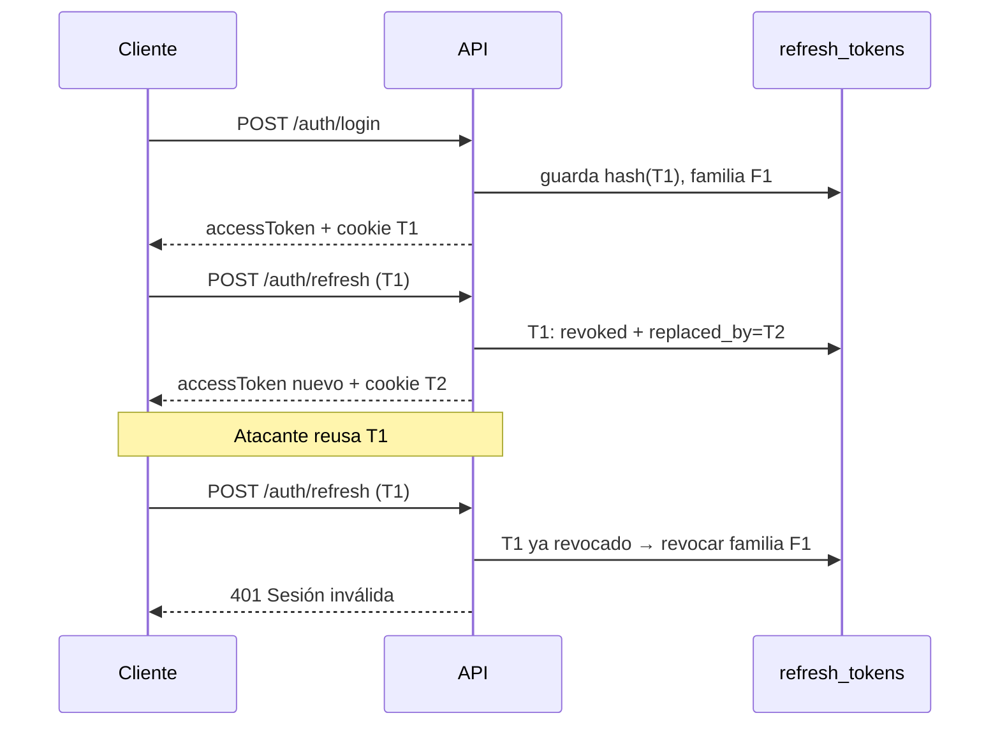

# Autenticación JWT - US-007

Sistema de autenticación con **access token JWT de corta vida** y **refresh token
opaco rotativo persistido en BD**, según los criterios de US-007 y el diseño de
arquitectura §8.2.

## 1. Diseño general

| | Access token | Refresh token |
| --- | --- | --- |
| Formato | JWT firmado (HS256) | Opaco: 256 bits aleatorios |
| Vida útil | 15 min (`JWT_ACCESS_EXPIRES`) | 7 días (`JWT_REFRESH_EXPIRES`) |
| Persistencia | Ninguna (stateless) | Tabla `refresh_tokens` (hash sha256) |
| Viaja en | Header `Authorization: Bearer` | Cookie httpOnly `refresh_token` |
| Revocable | No individualmente (por eso vive 15 min) | Sí, en cualquier momento (server-side) |

**Decisión de diseño:** el refresh token NO es un JWT. Su validez no vive en una
firma sino en su fila de la BD (`revoked_at`, `replaced_by`, `expires_at`), lo
que permite revocación server-side inmediata: logout real, cierre forzoso de
sesiones al cesar un empleado y detección de robo. Un refresh JWT stateless no
podría invalidarse antes de su expiración.

## 2. Payload del access token

```json
{
  "sub": "876cfc6c-...",          // user_id
  "email": "usuario@empresa.com",
  "permissions": ["colaborador:leer", "contrato:crear", "..."],
  "iat": 1754850000,
  "exp": 1754850900                // iat + 900s
}
```

Los permisos se resuelven en el login/refresh desde las tablas RBAC
(`user_roles → role_permissions → permissions`). Un cambio de permisos se
refleja en el siguiente refresh (máximo 15 minutos). US-008 consumirá este
array en el middleware `requirePermission`.

## 3. Rotación y familias de tokens

Cada login crea una **familia** (`token_family_id`) — una familia = una sesión
en un dispositivo. Cada `POST /auth/refresh`:

1. Emite un token nuevo **de la misma familia**.
2. Marca el anterior: `revoked_at = now()`, `replaced_by = <id del nuevo>`.

**Detección de reuso (robo):** si llega un refresh token ya revocado o ya
reemplazado, se asume compromiso y se revoca **la familia completa** → el
atacante y la víctima pierden la sesión → 401 y re-login.



## 4. Endpoints

### POST /api/auth/login

```json
// Request
{ "email": "usuario@empresa.com", "password": "********" }

// Response 200
{
  "success": true,
  "message": "Success",
  "data": { "accessToken": "eyJ...", "expiresIn": 900 }
}
```

Además setea la cookie del refresh token:
`refresh_token=<token>; Path=/api/auth; HttpOnly; SameSite=Strict; Max-Age=604800`
(+ `Secure` en producción).

| Error | HTTP | Detalle |
| --- | --- | --- |
| Credenciales inválidas | 401 | Mismo mensaje si el email no existe (anti-enumeración) |
| Cuenta bloqueada | 429 | 5 intentos fallidos → bloqueo 15 min (exponencial: 15/30/60… máx 24 h). Incluye `retryAfterSeconds` |
| Cuenta inactiva | 401 | Usuario desactivado |
| Body inválido | 422 | Validación Zod |

### POST /api/auth/refresh

Lee la cookie `refresh_token` (no requiere Bearer). Devuelve el mismo shape que
login y rota la cookie. 401 si el token no existe, está revocado, expiró o el
usuario ya no está activo.

### POST /api/auth/logout

Revoca la **familia completa** del refresh token de la cookie y la limpia.
Idempotente: responde 200 aunque no haya sesión.

### DELETE /api/users/:id/sessions

Requiere `Authorization: Bearer <accessToken>`. Revoca **todos** los refresh
tokens del usuario (todas sus sesiones/dispositivos).

```json
// Response 200
{ "success": true, "message": "Success", "data": { "revokedCount": 4 } }
```

| Error | HTTP |
| --- | --- |
| Sin bearer token | 401 |
| `:id` de otro usuario | 403 (hasta US-008; luego un admin con permiso podrá revocar a terceros) |

## 5. Middleware `authenticate`

`src/shared/middleware/authenticate.middleware.ts` — verifica el Bearer token y
expone la identidad al resto de la app:

```ts
req.auth = { userId, email, permissions };
```

401 si falta el header, el token expiró (`AccessTokenExpiredError`) o la firma
es inválida.

## 6. Variables de entorno

| Variable | Ejemplo | Notas |
| --- | --- | --- |
| `JWT_ACCESS_SECRET` | (secreto ≥ 32 chars) | Firma HS256 del access token |
| `JWT_ACCESS_EXPIRES` | `15m` | Acepta `s/m/h/d`; default 15m |
| `JWT_REFRESH_EXPIRES` | `7d` | Vida del refresh token y de su cookie |

No existe `JWT_REFRESH_SECRET`: el refresh token no es un JWT (ver §1).

## 7. Tests

```bash
pnpm test        # unitarios (dominio: entidad User, lockout)
pnpm test:e2e    # Supertest contra BD kontrak_test (12 escenarios US-007)
```

Los e2e requieren el contenedor `kontrak_postgres` levantado; las migraciones
se aplican solas (`global-setup.ts`).

## 8. Pendientes relacionados

- **US-008:** middleware `requirePermission(code)` que consuma
  `req.auth.permissions`; permitir a admins revocar sesiones de terceros.
- **`tokens_revoked_at` (users):** invalidación inmediata de access tokens
  vivos (baja la ventana de 15 min a 0 en casos graves).
- Dummy compare de bcrypt en login para igualar tiempos de respuesta
  (hardening anti-timing).
