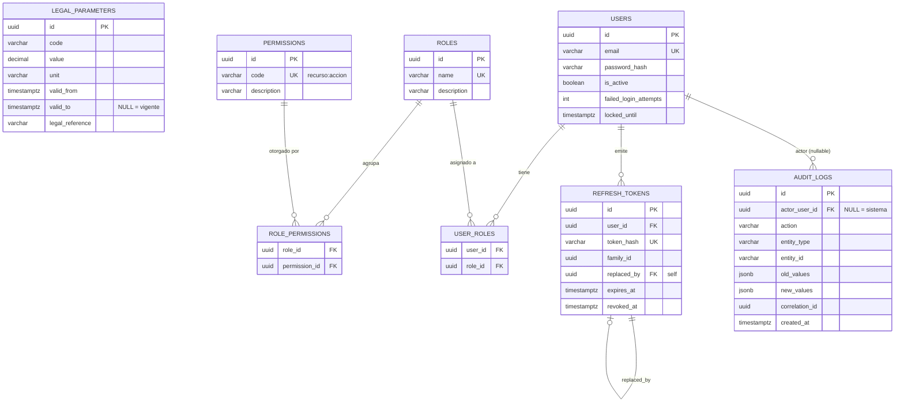

# Diseño de Base de Datos — Fase 0: Fundaciones (HRIS Perú)

> Empresa de estacionamientos, cientos de empleados.
> Stack: **PostgreSQL** + **Prisma 7** + **Node.js/TypeScript**.
>
> Este documento es el **único entregable**. Los modelos Prisma de la sección 4 son
> **sugerencias para que los transcribas tú mismo** a `prisma/schema.prisma`.
> Aquí NO se modifica ningún archivo del proyecto.

---

## 0. Alcance y convenciones

### 0.1 Tablas de la Fase 0 (nada más)

**Bloque 1 — Parámetros legales**
1. `legal_parameters`

**Bloque 2 — Auth y RBAC**
2. `users`
3. `roles`
4. `permissions`
5. `role_permissions` (pivot)
6. `user_roles` (pivot)
7. `refresh_tokens`

**Bloque 3 — Auditoría**
8. `audit_logs`

### 0.2 Convenciones técnicas (heredadas de tu `schema.prisma` actual)

| Aspecto | Convención adoptada |
|---|---|
| PK | `UUID` (columna `id`, `@db.Uuid`). Idealmente **UUID v7 generado en la app** (ver §7.6). |
| Nombres en BD | `snake_case` (tablas en plural, columnas con `@map`). |
| Nombres en Prisma | `camelCase`. |
| Timestamps | `timestamptz(6)` siempre (`created_at`, `updated_at`, `deleted_at`). |
| Dinero / tasas | `DECIMAL`, **nunca** `float`/`double`. |
| Soft delete | `deleted_at TIMESTAMPTZ NULL` donde aplique (retención legal 5 años). |
| Enums | Prisma `enum` con `@@map` a snake_case (patrón `document_type`, etc.). |

> **Desviación consciente respecto al schema actual:** tu modelo `User` existente tiene
> `employeeId` **NOT NULL** y sin RBAC. Este diseño lo **rediseña**: separa identidad de
> persona (vive en `employees`) de la cuenta de acceso (`users`), y deja el vínculo
> `user ↔ employee` para una fase posterior (ver §7.7). Deberás reemplazar el modelo `User`
> actual por el propuesto aquí.

---

## 1. Diagrama entidad-relación



**Notas de cardinalidad y de diseño:**
- La autorización **siempre** se resuelve por *permiso*, nunca por rol directo:
  `USER → USER_ROLES → ROLES → ROLE_PERMISSIONS → PERMISSIONS`.
- `legal_parameters` no tiene FKs: es una tabla de parámetros con **vigencias temporales**
  (intervalo semiabierto `[valid_from, valid_to)`).
- `audit_logs.actor_user_id` es una FK **débil/nullable**: acciones del sistema (jobs, seeds,
  procesos batch) no tienen actor humano. No se hace `ON DELETE CASCADE` (el log sobrevive
  al usuario).

---

## 2. DDL PostgreSQL completo

> El DDL se muestra tal como quedaría tras `prisma migrate` **más** el SQL manual de la §3.
> Sirve como referencia de la forma final de cada tabla. Los `id` se generan en la app
> (UUID v7); igualmente se deja `DEFAULT gen_random_uuid()` como red de seguridad.

### 2.1 `legal_parameters`

```sql
-- Requiere: CREATE EXTENSION IF NOT EXISTS btree_gist;  (ver §3)

CREATE TABLE legal_parameters (
    id              UUID          PRIMARY KEY DEFAULT gen_random_uuid(),
    code            VARCHAR(40)   NOT NULL,          -- RMV, UIT, ESSALUD_RATE, ONP_RATE...
    value           DECIMAL(14,6) NOT NULL,          -- montos y tasas; 6 decimales para %
    unit            VARCHAR(20)   NOT NULL,          -- 'PEN' | 'PERCENT' | 'FACTOR'
    valid_from      TIMESTAMPTZ   NOT NULL,
    valid_to        TIMESTAMPTZ   NULL,              -- NULL = vigente (intervalo abierto)
    legal_reference VARCHAR(200)  NOT NULL,          -- decreto que respalda el valor
    created_at      TIMESTAMPTZ   NOT NULL DEFAULT now(),
    updated_at      TIMESTAMPTZ   NOT NULL DEFAULT now(),

    -- valid_to, si existe, debe ser estrictamente mayor a valid_from
    CONSTRAINT ck_legal_parameters_valid_range
        CHECK (valid_to IS NULL OR valid_to > valid_from),

    -- Anti-solapamiento: para un mismo code, dos vigencias no pueden intersecarse.
    -- tstzrange con límites [inclusivo, exclusivo) => '[)'.
    CONSTRAINT ex_legal_parameters_no_overlap
        EXCLUDE USING gist (
            code WITH =,
            tstzrange(valid_from, valid_to, '[)') WITH &&
        )
);

COMMENT ON TABLE  legal_parameters IS
    'Parámetros legales peruanos con vigencia temporal semiabierta [valid_from, valid_to). NULL en valid_to = vigente.';
COMMENT ON COLUMN legal_parameters.value IS
    'DECIMAL. Montos en soles o tasas (ej. 0.090000 = 9%). Nunca float.';
COMMENT ON COLUMN legal_parameters.unit IS
    'PEN (monto en soles) | PERCENT (tasa 0..1) | FACTOR.';
COMMENT ON COLUMN legal_parameters.legal_reference IS
    'Norma que respalda el valor (D.S., Ley, RM). Obligatorio para trazabilidad legal.';

-- Índice para "parámetro vigente a fecha X" (ver §5.1).
-- El punto de consulta más frecuente es "hoy": incluir valid_to para permitir
-- resolución del rango sin acceder al heap innecesariamente.
CREATE INDEX ix_legal_parameters_code_vigencia
    ON legal_parameters (code, valid_from DESC);
```

> **Sobre `unit`:** las tasas se guardan como **factor** (`0.090000` = 9 %) para operar
> directo en cálculos de planilla. La UI se encarga de mostrar `9%`. Esto evita ambigüedad
> "¿9 o 0.09?" en el motor de nómina de fases futuras.

### 2.2 `users`

```sql
CREATE TABLE users (
    id                     UUID         PRIMARY KEY DEFAULT gen_random_uuid(),
    -- employee_id UUID NULL,  -- (opción diferida, ver §7.7)
    email                  VARCHAR(150) NOT NULL,
    password_hash          VARCHAR(255) NOT NULL,     -- argon2id (PHC string, ~96+ chars)
    is_active              BOOLEAN      NOT NULL DEFAULT true,
    failed_login_attempts  SMALLINT     NOT NULL DEFAULT 0,
    locked_until           TIMESTAMPTZ  NULL,          -- lockout temporal por fuerza bruta
    created_at             TIMESTAMPTZ  NOT NULL DEFAULT now(),
    updated_at             TIMESTAMPTZ  NOT NULL DEFAULT now(),
    deleted_at             TIMESTAMPTZ  NULL,          -- soft delete (retención 5 años)

    CONSTRAINT ck_users_failed_attempts_nonneg
        CHECK (failed_login_attempts >= 0)
);

-- Unicidad de email SOLO entre cuentas no borradas (permite reusar un email
-- tras un soft delete). Índice único parcial.
CREATE UNIQUE INDEX ux_users_email_active
    ON users (lower(email))
    WHERE deleted_at IS NULL;

COMMENT ON TABLE  users IS
    'Cuenta de acceso. NO contiene datos de persona (nombres/DNI viven en employees).';
COMMENT ON COLUMN users.password_hash IS 'Hash argon2id (PHC string). Nunca password en claro.';
COMMENT ON COLUMN users.locked_until IS 'Si > now(), la cuenta está bloqueada por intentos fallidos.';
```

> **`lower(email)` en el índice único:** los correos son case-insensitive en la práctica.
> Guardamos el valor original en la columna, pero la unicidad se evalúa en minúsculas.
> En Prisma esto exige `@@index`/SQL manual porque Prisma no expresa `lower()` ni el `WHERE`
> parcial en `@unique` (ver §3.5).

### 2.3 `roles`

```sql
CREATE TABLE roles (
    id          UUID         PRIMARY KEY DEFAULT gen_random_uuid(),
    name        VARCHAR(50)  NOT NULL,     -- ADMIN_RRHH, ANALISTA, SUPERVISOR...
    description VARCHAR(200) NULL,
    created_at  TIMESTAMPTZ  NOT NULL DEFAULT now(),
    updated_at  TIMESTAMPTZ  NOT NULL DEFAULT now(),

    CONSTRAINT ux_roles_name UNIQUE (name)
);

COMMENT ON TABLE roles IS 'Roles de negocio. La autorización se resuelve por permiso, no por rol.';
```

### 2.4 `permissions`

```sql
CREATE TABLE permissions (
    id          UUID         PRIMARY KEY DEFAULT gen_random_uuid(),
    code        VARCHAR(80)  NOT NULL,     -- formato recurso:accion  (legal_params:read)
    description VARCHAR(200) NULL,
    created_at  TIMESTAMPTZ  NOT NULL DEFAULT now(),
    updated_at  TIMESTAMPTZ  NOT NULL DEFAULT now(),

    CONSTRAINT ux_permissions_code UNIQUE (code),
    -- Fuerza el formato recurso:accion (minúsculas, snake, un solo ':').
    CONSTRAINT ck_permissions_code_format
        CHECK (code ~ '^[a-z][a-z0-9_]*:[a-z][a-z0-9_]*$')
);

COMMENT ON TABLE permissions IS 'Permisos granulares recurso:accion. Unidad atómica de autorización.';
```

### 2.5 `role_permissions` (pivot)

```sql
CREATE TABLE role_permissions (
    role_id       UUID NOT NULL REFERENCES roles(id)       ON DELETE CASCADE,
    permission_id UUID NOT NULL REFERENCES permissions(id) ON DELETE CASCADE,
    created_at    TIMESTAMPTZ NOT NULL DEFAULT now(),

    CONSTRAINT pk_role_permissions PRIMARY KEY (role_id, permission_id)
);

-- Para "¿qué roles otorgan el permiso X?" (revisión inversa / auditoría de acceso).
CREATE INDEX ix_role_permissions_permission ON role_permissions (permission_id);
```

### 2.6 `user_roles` (pivot)

```sql
CREATE TABLE user_roles (
    user_id     UUID NOT NULL REFERENCES users(id) ON DELETE CASCADE,
    role_id     UUID NOT NULL REFERENCES roles(id) ON DELETE CASCADE,
    assigned_at TIMESTAMPTZ NOT NULL DEFAULT now(),
    assigned_by UUID NULL REFERENCES users(id),   -- quién otorgó el rol (trazabilidad)

    CONSTRAINT pk_user_roles PRIMARY KEY (user_id, role_id)
);

-- Para "¿quiénes tienen el rol X?".
CREATE INDEX ix_user_roles_role ON user_roles (role_id);
```

### 2.7 `refresh_tokens`

```sql
CREATE TABLE refresh_tokens (
    id          UUID         PRIMARY KEY DEFAULT gen_random_uuid(),
    user_id     UUID         NOT NULL REFERENCES users(id) ON DELETE CASCADE,
    token_hash  VARCHAR(255) NOT NULL,             -- SHA-256 (hex) del token. NUNCA el token.
    family_id   UUID         NOT NULL,             -- misma cadena de rotación
    replaced_by UUID         NULL REFERENCES refresh_tokens(id), -- self-FK (siguiente token)
    expires_at  TIMESTAMPTZ  NOT NULL,
    revoked_at  TIMESTAMPTZ  NULL,                 -- NULL = activo
    ip          INET         NULL,
    user_agent  VARCHAR(400) NULL,
    created_at  TIMESTAMPTZ  NOT NULL DEFAULT now(),

    CONSTRAINT ux_refresh_tokens_hash UNIQUE (token_hash)
);

-- Búsqueda por hash en cada refresh (además del UNIQUE que ya crea índice).
-- Rotación / revocación por familia:
CREATE INDEX ix_refresh_tokens_family        ON refresh_tokens (family_id);
-- Tokens activos de un usuario (logout global, listar sesiones):
CREATE INDEX ix_refresh_tokens_user_active   ON refresh_tokens (user_id)
    WHERE revoked_at IS NULL;
-- Limpieza de expirados (job de mantenimiento):
CREATE INDEX ix_refresh_tokens_expires       ON refresh_tokens (expires_at);

COMMENT ON COLUMN refresh_tokens.token_hash IS
    'Hash del refresh token (SHA-256 hex). Robar la BD no permite reconstruir el token.';
COMMENT ON COLUMN refresh_tokens.family_id  IS
    'Detección de reuso OWASP: si se reusa un token ya rotado, se revoca toda la familia.';
COMMENT ON COLUMN refresh_tokens.replaced_by IS
    'Apunta al token que lo sustituyó al rotar. Su presencia + reuso = ataque.';
```

### 2.8 `audit_logs` (append-only)

```sql
CREATE TABLE audit_logs (
    id             UUID         PRIMARY KEY DEFAULT gen_random_uuid(),
    actor_user_id  UUID         NULL REFERENCES users(id), -- NULL = acción de sistema
    action         VARCHAR(60)  NOT NULL,   -- CREATE|UPDATE|DELETE|READ|LOGIN|EXPORT...
    entity_type    VARCHAR(80)  NOT NULL,   -- 'legal_parameter', 'employee', 'user'...
    entity_id      VARCHAR(64)  NULL,       -- id afectado (VARCHAR: soporta PKs no-UUID)
    old_values     JSONB        NULL,       -- estado previo (UPDATE/DELETE)
    new_values     JSONB        NULL,       -- estado nuevo (CREATE/UPDATE); en READ: filtros
    correlation_id UUID         NULL,       -- une eventos de un mismo request/transacción
    ip             INET         NULL,
    created_at     TIMESTAMPTZ  NOT NULL DEFAULT now()
    -- SIN updated_at ni deleted_at: es inmutable y no se borra jamás.
);

COMMENT ON TABLE audit_logs IS
    'Bitácora append-only. Se llena desde la capa de aplicación (no triggers). '
    'REVOKE UPDATE/DELETE al rol de la app (ver §3). Retención indefinida.';
COMMENT ON COLUMN audit_logs.action IS
    'Incluye READ para lecturas de datos sensibles (Ley 29733 de protección de datos personales).';

-- Historial por entidad (pantalla "ver auditoría de este registro"):
CREATE INDEX ix_audit_logs_entity  ON audit_logs (entity_type, entity_id, created_at DESC);
-- Actividad por actor (investigación / "qué hizo este usuario"):
CREATE INDEX ix_audit_logs_actor   ON audit_logs (actor_user_id, created_at DESC);
-- Rango temporal general y correlación de request:
CREATE INDEX ix_audit_logs_created ON audit_logs (created_at DESC);
CREATE INDEX ix_audit_logs_corr    ON audit_logs (correlation_id);
```

> **Auditoría de LECTURAS (Ley 29733):** cuando un usuario consulta datos personales
> sensibles (DNI, dirección, remuneraciones, etc.) se inserta un log con `action = 'READ'`.
> En ese caso `old_values`/`new_values` **no** llevan el dato leído (evitar duplicar PII en
> la bitácora); `new_values` guarda el *criterio* de la consulta (ej. `{"filtro":"employee_id=..."}`)
> y `entity_id` identifica el registro accedido.

---

## 3. SQL manual que Prisma no genera

Prisma **no** modela: extensiones, `EXCLUDE`, `CHECK` con expresiones/regex, índices únicos
parciales con `lower()`, `REVOKE`, ni `INET`/`CITEXT`. Se aplican con el flujo
`--create-only` (crear la migración vacía/parcial, editarla a mano, luego aplicarla).

### 3.1 Flujo `prisma migrate dev --create-only`

```bash
# 1) Escribe/ajusta los modelos en prisma/schema.prisma (sección 4).

# 2) Genera la migración SIN aplicarla (crea el archivo SQL para editarlo):
npx prisma migrate dev --name fase0_fundaciones --create-only

# 3) Edita el SQL generado en:
#    prisma/migrations/<timestamp>_fase0_fundaciones/migration.sql
#    y AÑADE al final los bloques 3.2 a 3.6.

# 4) Aplica la migración ya editada:
npx prisma migrate dev

# 5) Regenera el cliente (si hiciera falta):
npx prisma generate
```

> Para producción se usa `npx prisma migrate deploy` (aplica migraciones existentes sin
> intentar generar nuevas).

### 3.2 Extensión (obligatoria antes del `EXCLUDE`)

```sql
-- btree_gist permite combinar '=' (btree) con '&&' (gist) en un mismo EXCLUDE.
CREATE EXTENSION IF NOT EXISTS btree_gist;
```

### 3.3 Constraints de `legal_parameters` (CHECK + EXCLUDE)

```sql
ALTER TABLE legal_parameters
    ADD CONSTRAINT ck_legal_parameters_valid_range
        CHECK (valid_to IS NULL OR valid_to > valid_from);

ALTER TABLE legal_parameters
    ADD CONSTRAINT ex_legal_parameters_no_overlap
        EXCLUDE USING gist (
            code WITH =,
            tstzrange(valid_from, valid_to, '[)') WITH &&
        );
```

### 3.4 CHECK de formato de permisos

```sql
ALTER TABLE permissions
    ADD CONSTRAINT ck_permissions_code_format
        CHECK (code ~ '^[a-z][a-z0-9_]*:[a-z][a-z0-9_]*$');
```

### 3.5 Índice único parcial de `users.email`

```sql
-- Reemplaza al @unique simple que generaría Prisma. Si Prisma creó ux por @unique,
-- primero elimínalo:  DROP INDEX IF EXISTS users_email_key;
CREATE UNIQUE INDEX ux_users_email_active
    ON users (lower(email))
    WHERE deleted_at IS NULL;
```

### 3.6 Blindaje append-only de `audit_logs` (REVOKE)

```sql
-- Sustituye <app_role> por el rol/usuario con el que la aplicación se conecta
-- (NO el owner/superusuario de las migraciones).
REVOKE UPDATE, DELETE, TRUNCATE ON audit_logs FROM <app_role>;
GRANT  INSERT, SELECT           ON audit_logs TO   <app_role>;

-- (Opcional, defensa en profundidad) evitar que el rol de app altere la tabla:
-- REVOKE ALL ON audit_logs FROM <app_role>;
-- GRANT INSERT, SELECT ON audit_logs TO <app_role>;
```

> El rol de las **migraciones** conserva DDL (para poder particionar/rotar en el futuro).
> El rol de la **app** solo `INSERT`/`SELECT`. Así ni un bug ni una inyección pueden
> mutar o borrar la bitácora.

---

## 4. Modelos Prisma sugeridos (para transcribir)

> Respetan tus convenciones (`@db.Uuid`, `@map` snake_case, `Timestamptz(6)`, `@@map` plural).
> Lo que Prisma **no** puede expresar (EXCLUDE, CHECK regex, índice parcial con `lower()`,
> REVOKE) queda como comentario `///` y se aplica por SQL manual (§3).

```prisma
// ─────────────────────────── Bloque 1: Parámetros legales ───────────────────────────

/// Parámetros legales con vigencia temporal semiabierta [valid_from, valid_to).
/// SQL manual (§3.3): CHECK(valid_to > valid_from) + EXCLUDE anti-solapamiento (btree_gist).
model LegalParameter {
  id             String    @id @default(uuid()) @db.Uuid
  code           String    @db.VarChar(40)          // RMV, UIT, ESSALUD_RATE, ONP_RATE...
  value          Decimal   @db.Decimal(14, 6)
  unit           String    @db.VarChar(20)          // PEN | PERCENT | FACTOR
  validFrom      DateTime  @map("valid_from") @db.Timestamptz(6)
  validTo        DateTime? @map("valid_to")   @db.Timestamptz(6) // null = vigente
  legalReference String    @map("legal_reference") @db.VarChar(200)
  createdAt      DateTime  @default(now()) @map("created_at") @db.Timestamptz(6)
  updatedAt      DateTime  @default(now()) @updatedAt @map("updated_at") @db.Timestamptz(6)

  @@index([code, validFrom(sort: Desc)], map: "ix_legal_parameters_code_vigencia")
  @@map("legal_parameters")
}

// ─────────────────────────── Bloque 2: Auth y RBAC ───────────────────────────

/// Cuenta de acceso. Sin datos de persona (viven en employees).
/// SQL manual (§3.5): UNIQUE parcial ux_users_email_active sobre lower(email) WHERE deleted_at IS NULL.
model User {
  id                  String    @id @default(uuid()) @db.Uuid
  // employeeId       String?   @map("employee_id") @db.Uuid  // (opción diferida, ver §7.7)
  email               String    @db.VarChar(150)   // unicidad real por índice parcial (§3.5)
  passwordHash        String    @map("password_hash") @db.VarChar(255) // argon2id
  isActive            Boolean   @default(true) @map("is_active")
  failedLoginAttempts Int       @default(0) @map("failed_login_attempts") @db.SmallInt
  lockedUntil         DateTime? @map("locked_until") @db.Timestamptz(6)
  createdAt           DateTime  @default(now()) @map("created_at") @db.Timestamptz(6)
  updatedAt           DateTime  @default(now()) @updatedAt @map("updated_at") @db.Timestamptz(6)
  deletedAt           DateTime? @map("deleted_at") @db.Timestamptz(6)

  userRoles     UserRole[]
  refreshTokens RefreshToken[]
  auditLogs     AuditLog[]     @relation("AuditActor")
  rolesAssigned UserRole[]     @relation("RoleAssignedBy")

  @@map("users")
}

model Role {
  id          String   @id @default(uuid()) @db.Uuid
  name        String   @unique @db.VarChar(50)     // ADMIN_RRHH, ANALISTA, SUPERVISOR...
  description String?  @db.VarChar(200)
  createdAt   DateTime @default(now()) @map("created_at") @db.Timestamptz(6)
  updatedAt   DateTime @default(now()) @updatedAt @map("updated_at") @db.Timestamptz(6)

  rolePermissions RolePermission[]
  userRoles       UserRole[]

  @@map("roles")
}

/// SQL manual (§3.4): CHECK(code ~ '^[a-z][a-z0-9_]*:[a-z][a-z0-9_]*$').
model Permission {
  id          String   @id @default(uuid()) @db.Uuid
  code        String   @unique @db.VarChar(80)     // recurso:accion  (legal_params:read)
  description String?  @db.VarChar(200)
  createdAt   DateTime @default(now()) @map("created_at") @db.Timestamptz(6)
  updatedAt   DateTime @default(now()) @updatedAt @map("updated_at") @db.Timestamptz(6)

  rolePermissions RolePermission[]

  @@map("permissions")
}

model RolePermission {
  roleId       String   @map("role_id") @db.Uuid
  permissionId String   @map("permission_id") @db.Uuid
  createdAt    DateTime @default(now()) @map("created_at") @db.Timestamptz(6)

  role       Role       @relation(fields: [roleId], references: [id], onDelete: Cascade)
  permission Permission @relation(fields: [permissionId], references: [id], onDelete: Cascade)

  @@id([roleId, permissionId])
  @@index([permissionId], map: "ix_role_permissions_permission")
  @@map("role_permissions")
}

model UserRole {
  userId     String   @map("user_id") @db.Uuid
  roleId     String   @map("role_id") @db.Uuid
  assignedAt DateTime @default(now()) @map("assigned_at") @db.Timestamptz(6)
  assignedBy String?  @map("assigned_by") @db.Uuid

  user       User  @relation(fields: [userId], references: [id], onDelete: Cascade)
  role       Role  @relation(fields: [roleId], references: [id], onDelete: Cascade)
  assignedByUser User? @relation("RoleAssignedBy", fields: [assignedBy], references: [id])

  @@id([userId, roleId])
  @@index([roleId], map: "ix_user_roles_role")
  @@map("user_roles")
}

/// Rotación con detección de reuso (OWASP). Nunca se guarda el token en claro.
model RefreshToken {
  id         String    @id @default(uuid()) @db.Uuid
  userId     String    @map("user_id") @db.Uuid
  tokenHash  String    @unique @map("token_hash") @db.VarChar(255)
  familyId   String    @map("family_id") @db.Uuid
  replacedBy String?   @map("replaced_by") @db.Uuid
  expiresAt  DateTime  @map("expires_at") @db.Timestamptz(6)
  revokedAt  DateTime? @map("revoked_at") @db.Timestamptz(6)
  ip         String?   @db.Inet
  userAgent  String?   @map("user_agent") @db.VarChar(400)
  createdAt  DateTime  @default(now()) @map("created_at") @db.Timestamptz(6)

  user     User          @relation(fields: [userId], references: [id], onDelete: Cascade)
  replaces RefreshToken? @relation("TokenRotation", fields: [replacedBy], references: [id])
  replacedByToken RefreshToken[] @relation("TokenRotation")

  @@index([familyId], map: "ix_refresh_tokens_family")
  @@index([expiresAt], map: "ix_refresh_tokens_expires")
  // Índice parcial ix_refresh_tokens_user_active (WHERE revoked_at IS NULL) => SQL manual.
  @@map("refresh_tokens")
}

// ─────────────────────────── Bloque 3: Auditoría ───────────────────────────

/// Append-only. SQL manual (§3.6): REVOKE UPDATE/DELETE al rol de la app.
model AuditLog {
  id            String   @id @default(uuid()) @db.Uuid
  actorUserId   String?  @map("actor_user_id") @db.Uuid  // null = sistema
  action        String   @db.VarChar(60)
  entityType    String   @map("entity_type") @db.VarChar(80)
  entityId      String?  @map("entity_id") @db.VarChar(64)
  oldValues     Json?    @map("old_values") @db.JsonB
  newValues     Json?    @map("new_values") @db.JsonB
  correlationId String?  @map("correlation_id") @db.Uuid
  ip            String?  @db.Inet
  createdAt     DateTime @default(now()) @map("created_at") @db.Timestamptz(6)

  actor User? @relation("AuditActor", fields: [actorUserId], references: [id])

  @@index([entityType, entityId, createdAt(sort: Desc)], map: "ix_audit_logs_entity")
  @@index([actorUserId, createdAt(sort: Desc)], map: "ix_audit_logs_actor")
  @@index([createdAt(sort: Desc)], map: "ix_audit_logs_created")
  @@index([correlationId], map: "ix_audit_logs_corr")
  @@map("audit_logs")
}
```

> **Nota sobre `@default(uuid())`:** tu schema actual usa `@default(uuid())`, que en Prisma
> genera **UUID v4**. Si adoptas **UUID v7** generado en la app (recomendado, §7.6), pasa el
> `id` explícito desde el `create()` y deja el `DEFAULT gen_random_uuid()` en BD solo como
> respaldo. No mezcles ambos criterios sin decidirlo (ver trade-off §7.6).

---

## 5. Consultas críticas y su índice de soporte

### 5.1 Parámetro vigente a una fecha X

```sql
-- Usa ix_legal_parameters_code_vigencia (code, valid_from DESC).
SELECT id, code, value, unit, legal_reference, valid_from, valid_to
FROM legal_parameters
WHERE code = $1                                   -- p.ej. 'RMV'
  AND valid_from <= $2                            -- fecha X (por defecto now())
  AND (valid_to IS NULL OR valid_to > $2)         -- intervalo semiabierto [from, to)
ORDER BY valid_from DESC
LIMIT 1;
```

El `EXCLUDE` garantiza que a lo sumo una fila cumple; el `LIMIT 1 ORDER BY valid_from DESC`
es defensa adicional. El índice resuelve el filtro por `code` + orden por `valid_from`.

### 5.2 Rotación de refresh token (cada refresh)

```sql
-- 1) Localizar el token presentado (usa UNIQUE ux_refresh_tokens_hash).
SELECT id, user_id, family_id, expires_at, revoked_at, replaced_by
FROM refresh_tokens
WHERE token_hash = $1;   -- SHA-256(token_presentado)

-- 2a) Si está activo (revoked_at IS NULL, expires_at > now(), replaced_by IS NULL):
--     insertar el nuevo token de la MISMA familia y marcar el viejo como reemplazado.
UPDATE refresh_tokens
SET revoked_at = now(), replaced_by = $nuevoId
WHERE id = $viejoId;

INSERT INTO refresh_tokens (id, user_id, token_hash, family_id, expires_at, ip, user_agent)
VALUES ($nuevoId, $userId, $nuevoHash, $familyId, $exp, $ip, $ua);
```

### 5.3 Detección de reuso y revocación por familia (OWASP)

```sql
-- Si el token presentado YA fue rotado (revoked_at IS NOT NULL o replaced_by IS NOT NULL)
-- pero alguien lo vuelve a presentar => reuso => ataque. Revocar TODA la familia.
-- Usa ix_refresh_tokens_family (family_id).
UPDATE refresh_tokens
SET revoked_at = now()
WHERE family_id = $1
  AND revoked_at IS NULL;
```

### 5.4 Sesiones activas de un usuario / logout global

```sql
-- Usa índice parcial ix_refresh_tokens_user_active (WHERE revoked_at IS NULL).
SELECT id, ip, user_agent, created_at, expires_at
FROM refresh_tokens
WHERE user_id = $1 AND revoked_at IS NULL AND expires_at > now();

-- Logout global:
UPDATE refresh_tokens SET revoked_at = now()
WHERE user_id = $1 AND revoked_at IS NULL;
```

### 5.5 Permisos efectivos de un usuario (autorización)

```sql
-- Resolución SIEMPRE por permiso. Usa PKs de los pivots + ux_permissions_code.
SELECT DISTINCT p.code
FROM user_roles ur
JOIN role_permissions rp ON rp.role_id = ur.role_id
JOIN permissions p       ON p.id = rp.permission_id
WHERE ur.user_id = $1;
```

### 5.6 Historial de auditoría por entidad

```sql
-- Usa ix_audit_logs_entity (entity_type, entity_id, created_at DESC).
SELECT id, actor_user_id, action, old_values, new_values, correlation_id, ip, created_at
FROM audit_logs
WHERE entity_type = $1 AND entity_id = $2
ORDER BY created_at DESC
LIMIT 100;
```

### 5.7 Actividad por actor (investigación)

```sql
-- Usa ix_audit_logs_actor (actor_user_id, created_at DESC).
SELECT action, entity_type, entity_id, created_at, ip
FROM audit_logs
WHERE actor_user_id = $1
  AND created_at >= $2
ORDER BY created_at DESC;
```

---

## 6. Seeds

> ⚠️ **ADVERTENCIA LEGAL:** los valores de abajo son de ejemplo y deben **verificarse
> contra el decreto vigente** antes de sembrar en cualquier ambiente. Las cifras de RMV,
> UIT y las tasas de aportes cambian por norma; `legal_reference` es obligatorio y debe
> citar la norma exacta. Confirma vigencias antes de producción.

### 6.1 `legal_parameters` (valores peruanos de referencia)

```sql
-- Todas las tasas van como FACTOR (0.09 = 9%). Montos en PEN.
INSERT INTO legal_parameters (id, code, value, unit, valid_from, valid_to, legal_reference) VALUES
  (gen_random_uuid(), 'RMV',          1130.000000, 'PEN',     '2025-01-01 00:00:00-05', NULL,
     'D.S. 006-2024-TR — Remuneración Mínima Vital'),
  (gen_random_uuid(), 'UIT',          5350.000000, 'PEN',     '2025-01-01 00:00:00-05', '2026-01-01 00:00:00-05',
     'UIT 2025 (D.S. del MEF para el ejercicio 2025)'),
  (gen_random_uuid(), 'ESSALUD_RATE',    0.090000, 'PERCENT', '2025-01-01 00:00:00-05', NULL,
     'Ley 26790 — Aporte EsSalud 9% a cargo del EMPLEADOR'),
  (gen_random_uuid(), 'ONP_RATE',        0.130000, 'PERCENT', '2025-01-01 00:00:00-05', NULL,
     'D.L. 19990 — Aporte ONP/SNP 13% a cargo del TRABAJADOR');
```

Notas:
- **EsSalud 9 %**: aporte del **empleador** (no se descuenta al trabajador).
- **ONP 13 %**: aporte del **trabajador** (descuento en planilla).
- La UIT lleva `valid_to` explícito porque se fija por año; la RMV y tasas quedan abiertas
  (`NULL`) hasta que una norma las modifique.
- Las horas usan zona `-05` (America/Lima) para que `valid_from` sea el inicio real del día
  en Perú.

### 6.2 RBAC mínimo (rol ADMIN_RRHH con permisos básicos)

```sql
-- Roles
INSERT INTO roles (id, name, description) VALUES
  (gen_random_uuid(), 'ADMIN_RRHH', 'Administrador de Recursos Humanos: acceso total al módulo'),
  (gen_random_uuid(), 'ANALISTA',   'Analista de RRHH: gestión operativa'),
  (gen_random_uuid(), 'SUPERVISOR', 'Supervisor: lectura y aprobaciones');

-- Permisos básicos de la Fase 0 (formato recurso:accion)
INSERT INTO permissions (id, code, description) VALUES
  (gen_random_uuid(), 'legal_params:read',  'Ver parámetros legales'),
  (gen_random_uuid(), 'legal_params:write', 'Crear/editar parámetros legales'),
  (gen_random_uuid(), 'users:read',         'Ver usuarios'),
  (gen_random_uuid(), 'users:write',        'Crear/editar usuarios'),
  (gen_random_uuid(), 'roles:read',         'Ver roles y permisos'),
  (gen_random_uuid(), 'roles:write',        'Gestionar roles y permisos'),
  (gen_random_uuid(), 'audit:read',         'Consultar la bitácora de auditoría');

-- ADMIN_RRHH recibe TODOS los permisos existentes (patrón catch-all para el rol raíz).
INSERT INTO role_permissions (role_id, permission_id)
SELECT r.id, p.id
FROM roles r CROSS JOIN permissions p
WHERE r.name = 'ADMIN_RRHH';

-- Usuario administrador inicial (password_hash de ejemplo; reemplázalo por un argon2id real).
-- Genera el hash en la app: argon2.hash('<clave-segura>', { type: argon2.argon2id })
INSERT INTO users (id, email, password_hash, is_active)
VALUES (gen_random_uuid(), 'admin@empresa.pe',
        '$argon2id$v=19$m=65536,t=3,p=4$REEMPLAZAR_POR_HASH_REAL', true);

-- Asignar el rol ADMIN_RRHH al usuario inicial.
INSERT INTO user_roles (user_id, role_id)
SELECT u.id, r.id
FROM users u, roles r
WHERE u.email = 'admin@empresa.pe' AND r.name = 'ADMIN_RRHH';
```

> El seed en el proyecto conviene escribirlo en TypeScript (`prisma/seed.ts`) para generar
> el `password_hash` con argon2id y los UUID v7 en la app. El SQL de arriba es la referencia
> de datos.

---

## 7. Decisiones y trade-offs

### 7.1 Vigencias con intervalo semiabierto `[valid_from, valid_to)`
Evita el "problema del último segundo": con intervalos cerrados `[from, to]`, el instante
`valid_to` pertenecería a dos vigencias a la vez. Con `[from, to)` la fecha de corte de una
vigencia es exactamente el `valid_from` de la siguiente, sin huecos ni solapes. `tstzrange(...,'[)')`
modela esto de forma nativa.

### 7.2 `EXCLUDE` (GiST) en vez de índice único parcial
Un `UNIQUE` solo impide **duplicados exactos**; no detecta que dos rangos *distintos* se
**solapan**. La regla real es "para un mismo `code` no puede haber dos vigencias que se
intersequen en el tiempo", que es un solapamiento de rangos, no una igualdad. Eso solo se
expresa con `EXCLUDE USING gist (code WITH =, tstzrange(...) WITH &&)` (requiere `btree_gist`
para mezclar `=` de btree con `&&` de gist). La BD **garantiza** la invariante aunque la
app tenga un bug o haya inserciones concurrentes. Costo: la extensión y que Prisma no lo
modela (va por SQL manual).

### 7.3 Hash del refresh token (no el token en claro)
Se guarda `SHA-256(token)`, no el token. Si se filtra la BD, el atacante no puede reconstruir
tokens válidos (SHA-256 es unidireccional y el token tiene suficiente entropía, por lo que no
hace falta salt/argon2 aquí; sí se usa argon2id para *contraseñas*, que tienen baja entropía).
El `UNIQUE(token_hash)` permite localizar el token en O(1) al refrescar.

**Detección de reuso (OWASP Refresh Token Rotation):** cada refresh **rota** el token
(revoca el viejo, emite uno nuevo de la misma `family_id` y enlaza `replaced_by`). Si llega
un token que ya estaba `revoked`/`replaced`, significa que alguien robó y reusó un token
antiguo → se revoca **toda la familia** (`UPDATE ... WHERE family_id = ...`), cerrando la
sesión del legítimo y del atacante. `ix_refresh_tokens_family` soporta esa revocación masiva.

### 7.4 Auditoría append-only por aplicación (no por trigger)
- **Por aplicación**, no por trigger de BD, porque la capa de app tiene el contexto rico:
  `actor_user_id` (quién), `correlation_id` (qué request), `ip`, motivo de negocio, y sobre
  todo puede registrar **LECTURAS** (`action='READ'`) de datos sensibles para cumplir la
  **Ley 29733** — algo que un trigger `AFTER SELECT` no existe en PostgreSQL. Además evita
  lógica de negocio escondida en triggers difíciles de versionar.
- **Append-only reforzado en BD** con `REVOKE UPDATE, DELETE` al rol de la app: aunque la
  app se llene desde código, la inmutabilidad no depende de la disciplina del código sino de
  un permiso que el rol de aplicación simplemente no tiene. Defensa en profundidad.
- Contrapartida: si la app olvida escribir un log, no hay bitácora de ese evento (un trigger
  sí cubriría escrituras "olvidadas"). Se mitiga centralizando la auditoría en un middleware/
  interceptor único, no dispersa en cada caso de uso.

### 7.5 Particionamiento de `audit_logs` (decisión FUTURA, no ahora)
Con cientos de empleados y auditoría de lecturas, `audit_logs` crece rápido. Se **anticipa**
pero **no se implementa** en Fase 0: cuando el volumen lo exija, convertir a tabla
particionada por rango de `created_at` (mensual o trimestral) con `PARTITION BY RANGE`.
Beneficios futuros: `DROP PARTITION` para archivado eficiente, índices más pequeños, purga
por bloque. Se deja anotado porque migrar a particionada después implica recrear la tabla;
mantener hoy los índices sobre `created_at` facilita esa transición.

### 7.6 UUID v7 generado en la app
Tu schema usa `@default(uuid())` (**v4**, aleatorio). Para tablas con alta inserción
(`refresh_tokens`, `audit_logs`) los v4 fragmentan el índice de PK (inserciones aleatorias en
el B-tree). **UUID v7** es *time-ordered*: las inserciones van casi al final del índice, con
mucho menos *page split* y mejor localidad. Recomendación: generar el `id` en la app
(`uuidv7()`) y pasarlo explícito en `create()`. Mantener `DEFAULT gen_random_uuid()` en BD
solo como red de seguridad. Trade-off: hay que ser consistente (o siempre app, o siempre BD)
para no mezclar v4 y v7 sin querer; y `gen_random_uuid()` nativo de PostgreSQL genera v4, así
que el v7 debe venir sí o sí de la app.

### 7.7 Opción `employee_id` en `users` (diferida)
Se deja **comentada** (`// employeeId String? @db.Uuid`) y se decide en fase posterior.

**Pros de incluirla ya (nullable):**
- Enlaza la cuenta con su ficha de trabajador desde el inicio; consultas "usuario → empleado"
  directas.
- Nullable admite cuentas sin empleado (admin de sistema, integraciones, service accounts).

**Contras / por qué diferirla:**
- Introduce dependencia `users → employees` que acopla el módulo de Auth al de personas antes
  de tiempo; en Fase 0 Auth debe poder existir y probarse aislado.
- La cardinalidad real (¿1:1?, ¿un empleado con varias cuentas?, ¿unique?) aún no está
  cerrada; fijarla ahora arriesga una migración de corrección después.
- La separación estricta "cuenta ≠ persona" es más limpia para RBAC y para no filtrar PII a
  la capa de identidad.

**Recomendación:** dejarla comentada en Fase 0 y añadirla en la fase que integre Auth con
`employees`, definiendo ahí la cardinalidad y si es `UNIQUE`.

### 7.8 Índice único parcial en `users.email`
`UNIQUE(lower(email)) WHERE deleted_at IS NULL`: los correos son case-insensitive y, con soft
delete, un email "liberado" por una cuenta borrada debe poder reutilizarse. Un `@unique`
plano de Prisma no admite ni `lower()` ni el `WHERE`, por eso va por SQL manual y en el
modelo el campo `email` **no** lleva `@unique` (la unicidad la impone el índice parcial).

### 7.9 Otras decisiones menores
- **`ip` como `INET`** (no `VARCHAR`): valida el formato y permite consultas por rango de red.
  Prisma lo soporta con `@db.Inet`.
- **`entity_id` como `VARCHAR(64)`** en `audit_logs`: aunque hoy las PKs son UUID, se auditan
  entidades heterogéneas; VARCHAR evita acoplar la bitácora a un tipo de PK concreto.
- **Tasas como FACTOR** (`0.09`) y no como porcentaje entero: el motor de planilla opera
  directo sin dividir entre 100, reduciendo errores de escala.
- **`DECIMAL(14,6)`** en `legal_parameters.value`: cabe tanto un monto grande (UIT/RMV) como
  una tasa con precisión (0.090000), en una sola columna polimórfica gobernada por `unit`.

---

## 8. Checklist de aplicación (orden recomendado)

1. Transcribir los modelos de §4 a `prisma/schema.prisma` (reemplazando el `User` actual).
2. `npx prisma migrate dev --name fase0_fundaciones --create-only`.
3. Editar el `migration.sql`: añadir §3.2 (extensión) al **inicio** y §3.3–§3.6 al **final**.
4. `npx prisma migrate dev` para aplicar.
5. Crear el **rol de aplicación** en PostgreSQL y ejecutar §3.6 (`REVOKE` sobre `audit_logs`)
   con ese rol como destino.
6. Cargar seeds (§6) — preferentemente vía `prisma/seed.ts` para hashear con argon2id y
   generar UUID v7.
7. Verificar constraints: intentar insertar dos vigencias solapadas del mismo `code` debe
   fallar por el `EXCLUDE`; un `UPDATE`/`DELETE` sobre `audit_logs` con el rol de app debe
   ser denegado.
```
