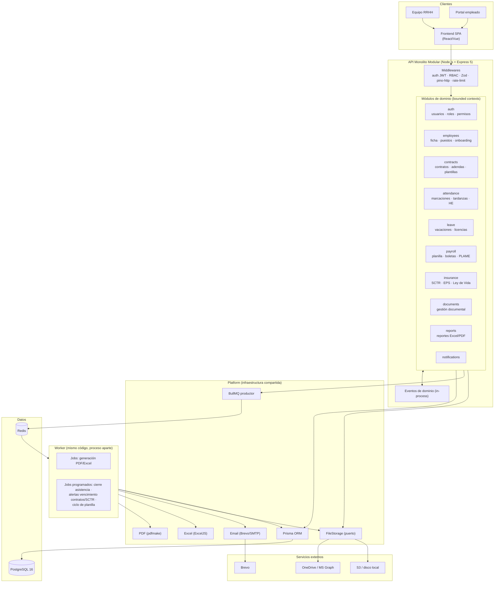

# Kontrak → Sistema de Recursos Humanos (HRIS) — Análisis y Planificación Completa

**Proyecto:** `kontrak-backend`
**Fecha:** 2026-07-07
**Elaborado con los agentes de `.claude/agents`:** `backend-developer` (análisis de código), `database-administrator` + `sql-pro` (diseño de BD), `microservices-architect` + `project-manager` (arquitectura y plan)

---

## Resumen ejecutivo

- **Qué es hoy:** un generador automático de contratos laborales, adendas y reportes Excel (SCTR, Vida Ley, fotochecks, cuentas sueldo) que lee Excels desde OneDrive, genera PDFs con Puppeteer y notifica por email. **No tiene base de datos, ni autenticación, ni tests.**
- **Qué será:** un HRIS completo para Perú — empleados, contratos, asistencia, vacaciones, planilla (AFP/ONP, CTS, gratificaciones, 5.ª categoría, PLAME), seguros SCTR/EPS/Vida Ley, usuarios/roles y reportes.
- **Arquitectura recomendada:** **monolito modular hexagonal** (NO microservicios) sobre **Express 5 + TypeScript**, con módulos de dominio como *bounded contexts*.
- **Base de datos recomendada:** **PostgreSQL 16** con **Prisma** como ORM. ~60 tablas en 10 módulos (DDL de las tablas núcleo incluido en la Parte II), incluyendo el **Motor de Generación Documental** (plantillas versionadas, correlativos, hash) y la **gestión del ciclo de vida contractual** (renovaciones, desnaturalización, ceses).
- **Stack complementario:** Zod (ya en uso), JWT + RBAC, BullMQ + Redis para jobs pesados (PDFs/reportes), pdfmake (completar migración desde Puppeteer), Vitest + Supertest + Testcontainers, OpenAPI generado desde Zod, Docker + GitHub Actions.
- **Roadmap:** 7 fases, ~9–11 meses para 1 desarrollador, empezando por fundaciones (BD + auth + Docker + CI) y migrando primero la funcionalidad existente de contratos.
- **Riesgos P0 detectados en el código actual:** PII y firmas manuscritas reales versionadas en el repo, API sin autenticación, fuga de procesos Chromium, y borrado del Excel original del usuario ante cualquier error.

## Índice

- **PARTE I — Análisis técnico del backend actual**: propósito, estructura, flujo completo, patrones, dependencias, endpoints, fortalezas, deuda técnica y recomendaciones priorizadas (P0/P1/P2).
- **PARTE II — Diseño de base de datos del HRIS**: motor y ORM, ~60 tablas en 10 módulos, DDL PostgreSQL de las tablas núcleo, diagrama ER, normativa laboral peruana, índices, auditoría y estrategia de migraciones.
- **PARTE III — Arquitectura, stack y plan de implementación**: monolito modular vs microservicios, estructura hexagonal objetivo, mapeo del código actual, stack completo justificado, diagrama de arquitectura, módulos y endpoints, aspectos transversales, roadmap por fases y riesgos.

---


# PARTE I — Análisis Técnico del Backend Actual

*Elaborado con el agente `backend-developer` (.claude/agents)*

## 1. Descripción general y propósito del sistema

**Kontrak Backend** es un servicio en **TypeScript + Express 5** que automatiza de punta a punta la generación de documentación laboral para una empresa (aparentemente ligada a "Apparka"/gestión de personal de playas de estacionamiento, a juzgar por `LOGO_APPARKA`/`DATA_APPARKA` en `src/shared/constants/signatures.ts`). No tiene base de datos: todo el estado vive en OneDrive (Microsoft Graph) como sistema de archivos remoto.

El flujo de negocio central es:

1. Un usuario de negocio sube un Excel a una carpeta de OneDrive ("subir excel").
2. Un **scheduler** (`node-cron`) revisa esa carpeta cada minuto.
3. El archivo se valida, se descarga, se parsea (ExcelJS) y se clasifica (contratos vs. adendas).
4. Se generan en paralelo distintos artefactos: contratos PDF (Puppeteer + Handlebars), anexos, cartas de "no sujeto a control", reportes Excel (SCTR, SCTR-APE/Vida Ley grupal, Vida Ley, Fotocheck/Card-ID, Seguro FOLA) y actualización de una plantilla `.xlsm` de apertura de cuentas sueldo (vía macro Excel, `xlsx-populate`).
5. Los resultados se suben de nuevo a carpetas específicas de OneDrive.
6. Se notifica por correo (Brevo) tanto al usuario que subió el archivo (éxito/errores de validación) como a destinatarios fijos del equipo de RRHH/seguros (reportes SCTR).
7. Si todo el archivo se procesó con éxito, el Excel original se elimina de OneDrive; si falló, también se elimina pero se notifica el motivo (política discutible, ver sección 8).

Adicionalmente expone una **API HTTP** paralela (sin autenticación) para generar/descargar manualmente PDFs y reportes Excel bajo demanda (subida directa de Excel o de JSON de empleados), pensada aparentemente para un frontend.

## 2. Estructura de carpetas y responsabilidad por capa

```
src/
├── api/                 → Capa HTTP (Express): controllers, routes, middlewares
├── config/               → Config centralizada, CORS, DI container (ServiceContainer)
├── core/
│   ├── orchestration/    → Orquestador principal + políticas de procesamiento
│   ├── processors/       → "Strategy" por tipo de documento/reporte
│   └── notifications/    → Servicio + plantillas HTML de notificación por email
├── domain/
│   ├── contracts/        → Generación de PDFs (plantillas Handlebars, servicios, validadores Zod)
│   └── excel/            → Parseo/validación/generación de Excel (empleados, adendas, SCTR, etc.)
├── infrastructure/
│   ├── onedrive/         → Cliente Graph, adapter de storage, scheduler, validadores de archivo
│   ├── email/            → Brevo, Graph Mail, nodemailer (no usado)
│   └── browser/          → Singleton de Puppeteer (BrowserManager)
├── services/             → app.ts (bootstrap Express) + file-storage.service.ts (FS local temp)
├── shared/               → constants, utils (logger, AppError, catch-error), tipos compartidos
└── index.ts / server.ts  → Punto de entrada y wrapper de `app.listen`
```

Responsabilidades:
- **`api/`**: capa de transporte HTTP; controladores delgados que delegan en servicios de dominio (`src/api/controllers/*.ts`).
- **`core/orchestration/`**: coordina el pipeline completo de un archivo (validar → descargar → parsear → procesar → subir → notificar → política de borrado). Es el corazón del sistema (`src/core/orchestration/file-processing.orchestrator.ts`).
- **`core/processors/`**: cada uno encapsula la lógica de un tipo de salida (contrato, SCTR, SCTR-APE, Vida Ley, Fotocheck, Seguro FOLA, cuenta sueldo, adenda), implementando una interfaz común `ContractProcessor`.
- **`domain/contracts/`**: generación real de PDF vía Puppeteer + plantillas Handlebars gigantes (`templates.ts`, 3367 líneas) y funciones de armado (`contracts.ts`).
- **`domain/excel/`**: parseo genérico de Excel con mapeo de encabezados tolerante a alias (`excel-headers.validator.ts`), validación de filas con Zod (`validation.service.ts`), generación de reportes Excel/CSV (`excel-generator.service.ts`).
- **`infrastructure/onedrive/`**: adapter concreto de storage (`OneDriveStorageAdapter`) que implementa la interfaz `FileStorageService`, cliente singleton de Microsoft Graph (`OneDriveProvider`), scheduler (`OneDriveScheduler`) y validadores de archivo (Strategy: `ExcelFileValidator`, más un `CompositeValidator` sin uso real).
- **`infrastructure/email/`**: dos implementaciones de envío (Brevo API y Microsoft Graph `sendMail`), más una tercera vía `nodemailer` que no se usa en ningún flujo real.
- **`config/service.container.ts`**: contenedor de dependencias singleton, muy limitado (solo 4 servicios).
- **`services/app.ts`**: construcción de la app Express (nombre confuso, ver sección 8).

## 3. Flujo de procesamiento completo

**Arranque** (`src/index.ts`):
1. `createApp()` (en `src/services/app.ts`) construye Express (morgan, JSON/urlencoded, CORS, rutas `/api`, 404, `errorHandler`).
2. `Server(app).listen(port)` levanta HTTP.
3. `new OneDriveScheduler().start()` arranca el cron **en paralelo**, independiente del servidor HTTP.

**Scheduler** (`src/infrastructure/onedrive/scheduler/onedrive.scheduler.ts`):
- Cron por defecto `*/1 * * * *` (cada minuto, TZ `America/Lima`), con un flag `isProcessing` para evitar solapamiento.
- El comentario del código dice "horario: de lunes a viernes de 8 a 23 horas" pero la expresión cron real es 24/7 cada minuto — el comentario no coincide con la implementación.
- Llama a `OneDriveServices.vigilarYProcesar()`.

**`OneDriveServices.vigilarYProcesar()`** (`src/infrastructure/onedrive/services/onedrive.service.ts:72-109`):
1. Obtiene el browser singleton (`BrowserManager.getInstance().getBrowser()`) **antes** de saber si hay archivos que procesar (líneas 76-77) — esto lanza Chromium incluso cuando no hay nada que hacer.
2. Lista archivos en la carpeta `"subir excel"` vía Graph API.
3. Si no hay archivos, retorna (pero el browser ya fue lanzado).
4. Por cada archivo, construye `FileToProcess` y delega en `FileProcessingOrchestrator.processFile(...)`.
5. En el `finally`, cierra el browser (`closeBrowser()`) — es decir, en cada tick del cron se abre y cierra un Chromium completo, incluso sin archivos.

**Orquestador** (`src/core/orchestration/file-processing.orchestrator.ts`):
1. **Validar** metadata (extensión, tamaño, no-temporal) con `FileValidator` (líneas 114-134). Si falla: notifica por email y **elimina el archivo de OneDrive**.
2. **Descargar** como stream y convertir a buffer (líneas 137-146).
3. **Detectar tipo** de Excel (`contracts` vs `addendum`) inspeccionando encabezados (`excelService.detectExcelType`).
4. Si es adenda → rama `processAddendumFile` (parseo, generación de PDFs de adenda en batches de 20, subida a `ADENDAS/{DE SUPLENCIA|POR INICIO O INCREMENTO...}`, notificación).
5. Si es contrato → parsea una sola vez el Excel y ejecuta **7 procesadores en paralelo** con `Promise.all` (línea 174-182): `ExcelToContractProcessor`, `SctrReportProcessor`, `SctrReportApeProcessor`, `LawlifeReportProcessor`, `CardIdReportProcessor`, `InsurancesFolaProcessor`, `SalaryAccountProcessor`.
6. Combina resultados y sube cada archivo generado a la subcarpeta que corresponda según `documentType` (contratos, anexos, tratamiento de datos, sctr-reports, sctr-ape-reports, lawlife-reports, card-id-reports, insurances-fola, no-subject-to-control) — switch en líneas 220-262.
7. Envía por email los reportes SCTR y SCTR-APE (adjuntos) a destinatarios **hardcodeados** (`raul@prodequa.com`, `kevindev2026@outlook.com`, líneas 475-476 y 494-495), ignorando las variables de entorno `SCTR_EMAIL_TO`/`SCTR_EMAIL_CC` que sí existen en `.env` pero no se leen en ningún archivo del código.
8. Aplica la **política de borrado** (`DefaultProcessingPolicy`): elimina el archivo original de OneDrive solo si el 100% de los items tuvo éxito.
9. Envía notificación de éxito con contadores por tipo de contrato al creador del archivo.
10. Si hay excepción no controlada: intenta detectar errores de validación (`AppError.data.validationErrors`) para notificar, y **siempre elimina el archivo original** (línea 362) — incluso ante errores inesperados no relacionados con validación (bug de robustez, ver sección 8).

**Procesadores registrados** (`src/core/processors/`): `ExcelToContractProcessor` (contratos/anexos/tratamiento de datos/carta no sujeto a control), `SctrReportProcessor`, `SctrReportApeProcessor`, `LawlifeReportProcessor`, `CardIdReportProcessor`, `InsurancesFolaProcessor`, `SalaryAccountProcessor` (llena plantilla `.xlsm` descargada de OneDrive), `AddendumContractProcessor`.

**Notificaciones** (`src/core/notifications/services/email-notification.service.ts`): usa siempre `BrevoEmailService` con `from` hardcodeado (`raul.g.quispe@gmail.com`), con tres plantillas HTML (éxito, error de validación de filas, error de validación de archivo).

**Flujo HTTP paralelo** (no pasa por el orquestador ni el scheduler): endpoints de `api/routes` permiten subir un Excel manualmente y generar/descargar los mismos artefactos de forma síncrona bajo demanda (ver sección 6).

## 4. Patrones de diseño detectados y evaluación

| Patrón | Dónde | Evaluación |
|---|---|---|
| **Orchestrator** | `FileProcessingOrchestrator` | Bien identificado como coordinador puro que delega en dependencias inyectadas por constructor. Sin embargo, el archivo (569 líneas) mezcla demasiadas responsabilidades: enrutamiento a carpetas de destino, streaming, envío de emails y armado de estadísticas — viola SRP y dificulta testear. |
| **Strategy** | `ContractProcessor` + implementaciones (`SctrReportProcessor`, `LawlifeReportProcessor`, etc.) | Bien aplicado: interfaz común (`process`, `processEmployees?`, `processAddendums?`), clase base `BaseProcessor` con helpers (`filterEmployees`, `logProcessing`). La interfaz usa métodos **opcionales** (`?`) lo que permite que la mayoría de implementaciones dejen `process()` sin implementar (`throw new Error('Method not implemented.')` en `base.processor.ts:16` y `addendum-contract.processort.ts:21-26`) — indica que la interfaz no está bien segregada (ISP violado; convendría dos interfaces separadas: una para Excel→reporte y otra para adenda). |
| **Adapter** | `OneDriveStorageAdapter implements FileStorageService` | Correcto: aísla Microsoft Graph detrás de una interfaz de storage genérica (`src/infrastructure/onedrive/storage/interfaces/file-storage.service.interface.ts`), permitiendo en teoría sustituir el proveedor de almacenamiento. |
| **Singleton** | `OneDriveProvider.getClient()`, `BrowserManager.getInstance()`, `ServiceContainer.getInstance()` | Correcto para el cliente Graph y (en teoría) para Puppeteer. Pero el singleton de `BrowserManager` **no se usa consistentemente**: `ContractController.previewContractPdf`, `ContractService.downloadZipStream` e `ImageGeneratorService.excelToImage` lanzan su propio `puppeteer.launch(...)` ad-hoc en cada request en lugar de reutilizar `BrowserManager`, duplicando la lógica de flags (`--no-sandbox`) en 4 lugares distintos y anulando el beneficio del singleton. |
| **Policy** | `ProcessingPolicy` / `DefaultProcessingPolicy` | Buena idea (decisión de borrado/reintento/notificación desacoplada), pero `shouldRetry`/`getMaxRetries` nunca se invocan desde el orquestador — no hay reintentos reales; es un patrón declarado pero no conectado end-to-end. |
| **Composite** | `CompositeValidator` (`src/infrastructure/onedrive/validators/implementations/composite.validator.ts`) | Implementado correctamente pero **muerto**: no se instancia en ningún punto del código (`onedrive.service.ts` usa directamente `new ExcelFileValidator()`). |
| **DI Container (rudimentario)** | `ServiceContainer` (`src/config/service.container.ts`) | Muy básico (solo 4 servicios, sin resolución de grafo de dependencias, sin scopes). Convive con inyección manual por constructor en casi todas las demás clases (`new ExcelGeneratorServices()`, `new PDFGeneratorService()` repetidos en cada controller/service) — no hay un criterio único de composición de dependencias en todo el proyecto. |
| **Factory** | `ProcessingResultFactory`, `ValidationResultFactory` | Correctos y simples, buena práctica. |

## 5. Stack tecnológico y dependencias

**Runtime**: Node.js 18+/TS 5.9, Express 5, sin base de datos ni ORM.

**Dependencias relevantes usadas**:
- `@azure/identity` + `@microsoft/microsoft-graph-client` → integración OneDrive/Outlook.
- `exceljs` → lectura/escritura de Excel (contratos, SCTR, etc.).
- `xlsx-populate` → única librería usada para llenar la plantilla macro `.xlsm` (preserva macros; ExcelJS no puede).
- `puppeteer` + `handlebars` → generación de PDFs vía HTML→PDF.
- `@getbrevo/brevo` → envío transaccional de correos (proveedor activo).
- `zod` → validación de filas de Excel (`employee.validator.ts`, `addendum.validator.ts`).
- `node-cron` → scheduler.
- `pino`/`pino-pretty` → logging estructurado.
- `archiver` → generación de ZIP en `ContractService.downloadZipStream`.
- `multer` → subida de archivos en endpoints HTTP.

**Dependencias declaradas pero no usadas / duplicadas** (confirmado por búsqueda en `src/`):
- **`pdfkit`** (^0.17.2) — no hay ningún import en `src/`. Dependencia muerta.
- **`pdf-lib`** (^1.17.1) — no hay ningún import en `src/`. Dependencia muerta.
- **`jsonwebtoken`** (^9.0.2) — no hay ningún import; no existe capa de autenticación. Dependencia muerta y engañosa (sugiere que hubo/hay planes de auth que nunca se implementaron).
- **`bcryptjs`** (^3.0.3) — no hay ningún import. Dependencia muerta, mismo comentario que arriba.
- **`nodemailer`** (^7.0.12) — sólo se usa en `src/infrastructure/email/email-transporter.ts` y `email.config.ts`, que a su vez **no son importados por ningún otro archivo** (verificado; ni `EmailNotificationService` ni el orquestador los usan, ambos usan `BrevoEmailService`). Es infraestructura muerta, y además `email.config.ts` tiene credenciales de ejemplo hardcodeadas (`your-email@example.com`/`your-password`) que quedarían activas si alguna vez se instancia.
- **`GraphEmailService`** (`src/infrastructure/email/services/graph-email.service.ts`) — implementación completa de envío vía Graph `sendMail`, pero tampoco se usa en ningún flujo (ni `ServiceContainer` ni el orquestador la referencian); es una tercera vía de email totalmente redundante con Brevo.
- **`@types/pdfmake`** (devDependency) sin `pdfmake` en dependencias runtime — resto de una migración a `pdfmake` documentada en `docs/migration_to_pdfmake.md` que fue iniciada (existe `src/domain/contracts/templates/contractsv2.ts`, **0 bytes**, sin trackear en git) y abandonada a medio camino.
- Tres motores de PDF conviven en el `package.json` (`puppeteer`, `pdfkit`, `pdf-lib`) pero solo Puppeteer se usa realmente — sobrecoste de instalación (Puppeteer descarga un Chromium completo) y superficie de ataque/mantenimiento innecesaria por los otros dos.

**Testing**: no hay ningún framework de test instalado (`"test": "echo \"Error: no test specified\" && exit 1"` en `package.json:7`). El script `"test:onedrive": "ts-node src/module/test/index.test.ts"` referencia una ruta (`src/module/test/`) que **no existe** en el repositorio — script roto. `tsconfig.json` excluye `tests` e incluye `test/*.*.ts`, ninguno de los cuales existe físicamente.

## 6. Endpoints HTTP expuestos

Prefijo base: `/api` (montado en `src/services/app.ts:36`). Sin autenticación/autorización en ningún endpoint, sin rate limiting, sin Helmet/CSP.

| Método | Ruta | Controlador | Middlewares | Descripción |
|---|---|---|---|---|
| GET | `/` | inline en `app.ts` | — | Health/landing con metadata de la API |
| GET | `/api/health` | inline en `routes/index.ts` | — | Health check |
| POST | `/api/contracts/download-zip` | `ContractController.downloadZip` | `schemaValidatorMiddleware(EmployeeBatchSchema)` | Genera ZIP con contratos+anexos+tratamiento de datos de un lote de empleados (JSON) |
| POST | `/api/contracts/preview` | `ContractController.previewContractPdf` | — (sin validación de esquema) | Genera PDF de un solo empleado y lo transmite inline |
| POST | `/api/excel/upload` | `ExcelController.readDataFromExcel` | `excelUpload.single('excel')` (Multer, memoria) | Sube Excel de empleados, lo parsea/valida y devuelve JSON |
| GET | `/api/excel/excel-to-image` | `ExcelController.excelToImage` | — | Genera un PNG tabular a partir de un JSON de empleados (vía query/body no validado) |
| POST | `/api/excel/download-lawlife` | `ExcelController.generateExcelLawLife` | `schemaValidatorMiddleware(EmployeeBatchSchema)` | Descarga Excel Vida Ley |
| POST | `/api/excel/download-sctr` | `ExcelController.generateExcelSCTR` | `schemaValidatorMiddleware(EmployeeBatchSchema)` | Descarga Excel SCTR |
| POST | `/api/excel/download-photocheck` | `ExcelController.generateExcelCardID` | `schemaValidatorMiddleware(EmployeeBatchSchema)` | Descarga CSV de fotocheck |
| POST | `/api/addendum/upload` | `AddendumController.processExcelToAddendumData` | `excelUpload.single('excel')` | Sube Excel de adendas y devuelve JSON parseado |

Middlewares transversales: `error-handle.middleware.ts` (mapea `AppError`→JSON con `statusCode`, resto→500 genérico), `error-handler-multer.middleware.ts` (traduce errores de Multer), `schema-validator.middleware.ts` (Zod sobre body/params/query), `upload.middleware.ts` (whitelist de extensión+mimetype, límite 10MB, 1 archivo).

Nótese que `router.use(ErrorHandleMulter)` se declara **después** de las rutas en cada archivo de rutas (`contract.routes.ts:17`, `excel.route.ts:32`, `addendum.route.ts:14`) — funciona porque Express ejecuta middlewares de error solo cuando se les pasa un error via `next(err)`, pero la ubicación entre las rutas (en vez de agruparlo al final del router raíz) es inconsistente y fácil de romper al añadir nuevas rutas después.

## 7. Puntos fuertes del código

- **Separación por capas clara y consistente** (`api` / `core` / `domain` / `infrastructure` / `shared`), fácil de navegar y con nombres de archivo predecibles.
- **Orquestador + Strategy bien pensados conceptualmente**: agregar un nuevo tipo de reporte implica crear un nuevo `*.processor.ts` e inyectarlo, sin tocar el resto del pipeline.
- **Validación de entrada robusta en el parseo de Excel**: normalización de encabezados tolerante a acentos/mayúsculas/alias (`excel-headers.validator.ts`), detección y limpieza de formatos de moneda peruana (`S/.`, comas), fechas Excel seriales, DNIs con padding, mensajes de error por fila/campo (`validation.service.ts`).
- **Uso de Zod** para reglas de negocio declarativas y mensajes de error localizados en español, con normalización de sinónimos de `contractType` (`employee.validator.ts:13-27`).
- **Logging estructurado con Pino** (JSON en producción, pretty en desarrollo) en casi todos los puntos de decisión, útil para depurar un proceso batch desatendido.
- **Manejo centralizado de errores HTTP** con `AppError` tipado por `HttpStatusCode` y un `errorHandler` único que evita filtrar detalles internos al cliente en el caso `AppError`.
- **Procesamiento por lotes/paralelo consciente de recursos**: `chunk()` + `Promise.all` en tandas de 3 (`ExcelToContractProcessor.BATCH_SIZE`) para no saturar Puppeteer con cientos de páginas simultáneas.
- **Idempotencia parcial de subida a OneDrive**: uso de `@microsoft.graph.conflictBehavior=replace` al subir archivos (`onedrive-storage.adapter.ts:123`).
- Documentación interna abundante (`docs/*.md`) que muestra intención de mejora continua (migración a pdfmake, guía de refactor, notificaciones).

## 8. Problemas, deuda técnica y riesgos concretos

### Seguridad (alto impacto)
- **Ningún endpoint HTTP tiene autenticación ni autorización.** Cualquiera con acceso de red puede invocar `/api/contracts/download-zip`, `/api/excel/upload`, etc. y generar/descargar documentación laboral con datos de empleados. `jsonwebtoken` y `bcryptjs` están instalados pero **no se usan en ningún archivo** — sugiere que la protección estaba planificada y quedó pendiente.
- **PII (datos personales sensibles) hardcodeada en el repositorio de código fuente**: `src/domain/contracts/constants/constants.ts` contiene DNI y nombres completos reales de dos firmantes (`DNI_EMPLOYEE_PRIMARY = '42933662'`, `FULL_NAME_PRIMARY_EMPLOYEE = 'CATHERINE SUSAN CHANG LÓPEZ'`, etc.), y `src/shared/constants/signatures.ts` (8 líneas pero >25.000 tokens) embebe **imágenes de firmas manuscritas reales en base64** directamente en el código versionado. Si el repositorio se filtra o se hace público, esto permite falsificar documentos legales con la firma real de los representantes.
- **CORS** (`src/config/cors.config.ts:5-7`) cae a un fallback `['http://localhost:5173']` si `CORS_ORIGINS` no está seteado, lo cual es razonable, pero no hay ninguna otra cabecera de seguridad (no hay `helmet`, no hay CSP, no hay rate limiting) en `src/services/app.ts`, exponiendo los endpoints de subida/generación a abuso (cada llamada lanza un proceso Chromium completo).
- **Sin rate limiting** en endpoints que son intrínsecamente costosos (lanzan Puppeteer, generan ZIP, procesan Excel) — riesgo de DoS trivial.
- Emails destino/CC de reportes SCTR **hardcodeados** en `file-processing.orchestrator.ts:475-476,494-495` (`raul@prodequa.com`, `kevindev2026@outlook.com`) en vez de leer `SCTR_EMAIL_TO`/`SCTR_EMAIL_CC`, que sí existen en `.env` pero no se referencian en ningún archivo `.ts`. Esto obliga a modificar y redeployar código para cambiar un destinatario de negocio, y hace casi imposible reutilizar el sistema para otro cliente/entorno.
- `from: 'raul.g.quispe@gmail.com'` hardcodeado en `email-notification.service.ts` (líneas 22, 35, 48) y en `brevo-email.service.ts:22` — remitente personal de un desarrollador embebido como remitente institucional de la app.

### Fiabilidad / manejo de errores
- **Fuga de proceso Chromium**: `ContractController.previewContractPdf` (`src/api/controllers/contract.controller.ts:31-48`) llama a `puppeteer.launch(...)` pero **nunca invoca `browser.close()`**. Cada request a `POST /api/contracts/preview` deja un proceso Chromium huérfano en el servidor — fuga de memoria/procesos garantizada bajo uso normal.
- **Política de borrado agresiva ante error genérico**: en el `catch` general de `processFile` (`file-processing.orchestrator.ts:350-369`), el archivo original de OneDrive **se elimina siempre** (línea 362), incluso si el error no tiene relación con el contenido del Excel (p. ej. un fallo transitorio de red al subir a OneDrive, un timeout de Puppeteer, o un error de configuración). No hay distinción entre "el archivo es inválido, bórralo" y "hubo un error transitorio del sistema, reintenta" — se pierde el archivo original del usuario sin posibilidad de reintento automático.
- El patrón `ProcessingPolicy` define `shouldRetry`/`getMaxRetries` pero el orquestador **nunca los llama** — no existen reintentos reales pese a que la abstracción sugiere que sí.
- El scheduler lanza y cierra un browser Puppeteer completo **en cada tick de 1 minuto, incluso sin archivos que procesar** (`onedrive.service.ts:76-77` antes de comprobar `files.length === 0` en la línea 79) — coste de CPU/memoria innecesario 1440 veces al día.
- Múltiples instancias de Puppeteer ad-hoc no gestionadas por `BrowserManager`: `ContractService.downloadZipStream` (`contract.service.ts:35-38`, con cierre correcto en `finally`), `ImageGeneratorService.excelToImage` (`image-generator.service.ts:7-10`, con cierre correcto) y el ya mencionado `ContractController.previewContractPdf` (sin cierre). Inconsistencia de lifecycle management del recurso más caro del sistema.
- `AddendumContractProcessor.process()` y `BaseProcessor.process()` lanzan `throw new Error('Method not implemented.')` — la interfaz `ContractProcessor` obliga a implementar un método que la mayoría de clases no soportan realmente, síntoma de una interfaz mal segregada (`contract-processor.interface.ts:42-69`).

### Testing y calidad
- **Cero tests automatizados** en todo el proyecto. `package.json:7` define `"test": "echo \"Error: no test specified\" && exit 1"`. El script `"test:onedrive"` (`package.json:8`) apunta a `src/module/test/index.test.ts`, ruta **inexistente**.
- `tsconfig.json` referencia carpetas de test (`exclude: ["tests"]`, `include: ["test/*.*.ts"]`) que tampoco existen — configuración obsoleta/copiada de otro proyecto sin limpiar.
- Sin CI (no hay workflows de GitHub Actions visibles en el repo), aunque sí hay Husky + lint-staged para pre-commit (ESLint + Prettier), lo cual mitiga parcialmente errores de estilo pero no de lógica.

### Persistencia / estado
- **No hay base de datos**: el estado del sistema (qué se procesó, cuándo, con qué resultado) vive solo en logs de Pino (efímeros) y en el propio árbol de carpetas de OneDrive. No hay auditoría consultable, no hay forma de reintentar un archivo fallido salvo volver a subirlo manualmente, no hay historial de notificaciones enviadas ni de errores de validación pasados.
- `src/services/file-storage.service.ts` usa el filesystem local (`config.paths.temp`) para sesiones de preview de PDF (`createSessionFolder`, `getPdfByDNI`), pero no hay ningún mecanismo de limpieza/TTL visible para esas carpetas temporales (la variable `FILE_CLEANUP_TIMEOUT` existe en `.env.example` pero no se usa en ningún `.ts`) — riesgo de acumulación indefinida de PDFs con datos personales en disco.

### Duplicación / archivos obsoletos (deuda técnica directa)
- `src/app.ts` fue **eliminado** (`git status: D src/app.ts`) y reemplazado por `src/services/app.ts` (nuevo, sin trackear) — el nombre `services/app.ts` es confuso porque "app.ts" no es un "service" de dominio, sino el bootstrap de Express; convendría un `src/http/app.ts` o mantenerlo en la raíz de `src/`.
- `src/infrastructure/browser/browser-config.ts` fue **eliminado** (0 bytes en el diff) sin que quede claro si su lógica migró íntegramente a `browser-manager.ts` — verificar que no se perdió configuración (p. ej. `executablePath` para producción/Docker).
- `src/domain/contracts/templates/contractsv2.ts` existe (sin trackear en git) con **0 bytes** — resto abandonado del intento de migración a `pdfmake` descrito en `docs/migration_to_pdfmake.md`. Debe eliminarse o completarse; tal como está, es un archivo fantasma que puede confundir a quien continúe el refactor.
- `src/domain/contracts/templates/templates.ts` tiene **3367 líneas**, todo strings HTML gigantes (Handlebars) para 8 tipos de documento — altamente difícil de mantener, revisar en PR o testear visualmente; cualquier cambio de estilo/maquetación implica editar un string HTML de cientos de líneas sin ningún tipo de linting/preview automatizado.
- `CompositeValidator` (`src/infrastructure/onedrive/validators/implementations/composite.validator.ts`) está completamente implementado pero **no se usa en ningún punto real** del código (solo se re-exporta desde `validators/index.ts`); solo `ExcelFileValidator` se instancia directamente en `onedrive.service.ts:45,53`. Es código muerto que aparenta ser parte del diseño pero no aporta valor actual.
- `GraphEmailService`, `email-transporter.ts` y `email.config.ts` (con credenciales de ejemplo hardcodeadas: `your-email@example.com` / `your-password`) son infraestructura de email completamente redundante y no utilizada (`BrevoEmailService` es el único canal real, referenciado desde `ServiceContainer` y el orquestador).
- Import muerto/curioso `import { error } from 'console';` en `src/domain/contracts/validators/employee.validator.ts:1`, sin uso real en el archivo (resto de debugging).
- Assets binarios de negocio versionados directamente en `src/assets/` (`Correspondencia para contratos (2).xlsx`, `2.1 Adendas de contratos SUPLENCIA (1).doc`, `Plantilla_Aperturas_CuentaSueldoyCTS 1.xlsm`) mezclados con código fuente — deberían vivir fuera del repo de código (OneDrive, storage de plantillas) o al menos en una carpeta `resources/` claramente separada y documentada, no en `src/`.

### Configuración
- `src/config/index.ts` no valida ni falla rápido si faltan variables críticas de Azure/OneDrive/Brevo al arrancar — `validateConfig()` existe pero solo loguea `env/port/host`; nunca se invoca desde `index.ts`. Si falta `AZURE_TENANT_ID`, el error solo aparece la primera vez que se instancia `OneDriveProvider` (dentro del primer tick del cron), no al arrancar el proceso.
- `config.limits.maxEmployees` (`MAX_EMPLOYEES` en `.env`) está definido pero no se usa en ningún validador o controlador — no hay tope real de empleados por archivo, pese a que existe la intención declarada.
- Doble definición de límite de tamaño de archivo: `upload.middleware.ts` usa `config.limits.maxFileSize` (Multer) y `ExcelFileValidator` tiene su propio `DEFAULT_CONFIG.maxSizeBytes = 10MB` fijo por código en vez de leer también de `config` — dos fuentes de verdad para el mismo límite de negocio.

## 9. Recomendaciones priorizadas

**P0 – Crítico (seguridad / integridad de datos)**
1. Eliminar del repositorio y de la historia de git las PII hardcodeadas (`constants.ts`, `signatures.ts`) y moverlas a un almacén seguro (variable de entorno cifrada, Key Vault/Secrets Manager, o al menos un archivo fuera de git cargado en runtime). Rotar/considerar comprometidas las firmas si el repo tuvo o tendrá acceso externo.
2. Añadir autenticación/autorización a todos los endpoints HTTP (API key simple para consumo interno como mínimo, o JWT ya que la dependencia está instalada) y helmet + rate limiting básico.
3. Corregir la fuga de browser en `ContractController.previewContractPdf` (agregar `try/finally` con `browser.close()`, e idealmente reusar `BrowserManager`).
4. Mover los destinatarios hardcodeados de email (`raul@prodequa.com`, `kevindev2026@outlook.com`, `raul.g.quispe@gmail.com`) a las variables de entorno ya existentes (`SCTR_EMAIL_TO`, `SCTR_EMAIL_CC`, `NOTIFICATION_EMAIL`, `senderEmail`) que hoy están definidas en `.env` pero ignoradas por el código.

**P1 – Alto (fiabilidad del pipeline batch)**
5. Unificar toda creación de Puppeteer detrás de `BrowserManager` (controller, `ContractService`, `ImageGeneratorService`) para tener un único punto de control de lifecycle y poder migrar a un pool si se requiere concurrencia real.
6. Evitar lanzar el browser en el scheduler antes de comprobar si hay archivos (`onedrive.service.ts`), y considerar mantener el browser vivo entre ticks en lugar de abrir/cerrar cada minuto.
7. Revisar la política de borrado en errores genéricos: distinguir errores de validación de negocio (borrar) de errores de infraestructura transitorios (mover a una carpeta "reintentar" o dejar el archivo intacto y solo notificar), conectando de verdad `shouldRetry`/`getMaxRetries` de `ProcessingPolicy`.
8. Añadir un mecanismo mínimo de persistencia de auditoría (aunque sea un archivo JSON/Excel de log en OneDrive, o SQLite embebido) para poder reconstruir qué se procesó, cuándo y con qué resultado, sin depender solo de logs efímeros de Pino.

**P2 – Medio (deuda técnica / mantenibilidad)**
9. Depurar `package.json`: remover `pdfkit`, `pdf-lib`, `jsonwebtoken`, `bcryptjs`, `nodemailer` (o justificar su permanencia si hay planes concretos a corto plazo), y decidir de una vez si se continúa o se descarta la migración a `pdfmake` (eliminar `contractsv2.ts` vacío y `docs/migration_to_pdfmake.md` si se descarta, o retomarla si se confirma).
10. Eliminar `GraphEmailService`, `email-transporter.ts`, `email.config.ts` si Brevo queda como único proveedor, o documentar explícitamente cuál es el canal de fallback y cuándo se activa.
11. Retirar `CompositeValidator` si no se usará, o adoptarlo reemplazando la instanciación directa de `ExcelFileValidator` en `onedrive.service.ts` para dejar el patrón realmente operativo.
12. Dividir `templates.ts` (3367 líneas) en archivos por documento (`contract-full-time.template.ts`, `addendum-suplencia.template.ts`, etc.) y considerar extraer el HTML a archivos `.hbs` cargados con `fs.readFile`, en vez de strings TypeScript gigantes.
13. Renombrar `src/services/app.ts` a algo como `src/http/app.ts` o `src/bootstrap/app.ts` para evitar confusión con "servicios de dominio", y mover los binarios de `src/assets/*.xlsx/.doc/.xlsm` fuera del árbol `src/` (o a un `resources/` documentado, con `.gitignore` si son solo de referencia local).
14. Introducir un framework de testing (Vitest/Jest) empezando por los módulos más críticos y aislados (validators de Zod, `excel-headers.validator.ts`, `ValidationService`, `ProcessingResultFactory`) antes de abordar tests de integración del orquestador; corregir o eliminar el script `test:onedrive` roto y limpiar las referencias a `tests`/`test/` en `tsconfig.json`.
15. Invocar `validateConfig()` al inicio de `index.ts` y hacer que falle rápido (fail-fast) si faltan variables críticas de Azure/Brevo, en lugar de descubrirlo recién en el primer tick del cron.

---

# PARTE II — Diseño de Base de Datos del HRIS (Perú)

*Elaborado con los agentes `database-administrator` + `sql-pro` (.claude/agents)*

## 0. Contexto y alcance

El backend actual (TypeScript/Express) procesa Excels de empleados desde OneDrive y genera contratos PDF (PLANILLA, SUBSIDIO/suplencia, PART TIME, APE, PRACTICANTE), adendas (POR INICIO O INCREMENTO DE ACTIVIDAD, DE SUPLENCIA) y reportes (SCTR con niveles de riesgo ALTO/BAJO por cargo, seguros, cuentas sueldo/CTS), **sin persistencia**. Este diseño convierte ese flujo en un HRIS completo: el Excel pasa de ser "la fuente de verdad" a ser un **canal de importación** hacia una base de datos relacional que gobierna empleados, contratos, asistencia, planilla y seguros bajo normativa laboral peruana.

---

## 1. Motor de base de datos y ORM

### 1.1 Motor recomendado: **PostgreSQL 16+**

| Criterio | PostgreSQL | MySQL 8 | SQL Server / Oracle | MongoDB |
|---|---|---|---|---|
| Integridad transaccional (planillas = dinero) | Excelente (MVCC, DDL transaccional) | Buena | Excelente | Débil para relacional |
| Tipos avanzados (`NUMERIC`, `DATERANGE`, `JSONB`, `ENUM`, arrays) | Sí, nativo | Parcial (JSON sí, ranges no) | Parcial | N/A |
| Restricciones de exclusión (evitar contratos/vacaciones solapadas) | `EXCLUDE USING gist` nativo | No (lógica en app) | No nativo | No |
| Row-Level Security (multi-empresa, confidencialidad salarial) | Nativo | No | Sí (licencia) | Parcial |
| Funciones ventana / CTE recursivos (organigramas, acumulados de planilla) | Completo | Completo desde 8.0 | Completo | Agregaciones |
| Particionamiento declarativo (marcaciones, auditoría) | Nativo | Nativo | Sí | Sharding |
| Costo / licencia | Gratis, open source | Gratis (Oracle-owned) | Costoso | Gratis/Atlas |
| Ecosistema TypeScript/Node | Excelente (`pg`, Prisma, Drizzle) | Excelente | Bueno | Bueno |

**Justificación para un HRIS:**

1. **Un HRIS es dinero + fechas + vigencias.** Planillas, CTS, gratificaciones y quinta categoría exigen `NUMERIC(12,2)` exacto y transacciones estrictas. PostgreSQL, con MVCC y DDL transaccional, permite que una migración fallida haga rollback completo — crítico cuando el esquema evoluciona junto con la normativa SUNAT.
2. **Vigencias temporales nativas.** Contratos, adendas, afiliaciones AFP, pólizas SCTR y vacaciones son intervalos `[desde, hasta)`. Con `daterange` + `EXCLUDE USING gist` la base de datos **garantiza** que un empleado no tenga dos contratos vigentes solapados o dos afiliaciones previsionales simultáneas — imposible de garantizar solo en la capa de aplicación con concurrencia.
3. **`JSONB` para el snapshot de generación de documentos.** Hoy el sistema genera PDFs desde datos de Excel; al persistir, conviene guardar el *snapshot* exacto de variables usadas en cada contrato/adenda generada (inmutable, auditable) sin crear 40 columnas.
4. **RLS y seguridad.** Los sueldos son el dato más sensible de la empresa; Row-Level Security permite que el rol "jefe de área" solo vea su división directamente a nivel de motor.
5. **Particionamiento declarativo** para `attendance_records` (marcaciones diarias, millones de filas/año) y `audit_logs` por rango mensual.

MySQL 8 sería aceptable, pero pierde exclusion constraints, ranges, RLS y `RETURNING`; SQL Server/Oracle agregan costo de licencia sin beneficio para este tamaño; MongoDB es mala opción para un dominio profundamente relacional y transaccional como planillas.

### 1.2 ORM recomendado: **Prisma** (con `prisma migrate`)

| Criterio | Prisma | TypeORM | Drizzle |
|---|---|---|---|
| Type-safety end-to-end | Excelente (cliente generado) | Media (decoradores, `any` frecuente) | Excelente |
| Migraciones | `prisma migrate` declarativo + SQL editable | Frágiles (synchronize peligroso) | `drizzle-kit` sólido |
| Curva de aprendizaje / productividad | Baja / alta | Media | Media (piensas en SQL) |
| Soporte SQL crudo tipado | `$queryRaw` + typedSQL | Sí | Nativo (es SQL-first) |
| Features PG avanzadas (ranges, exclusion, partial idx) | Vía migraciones SQL manuales | Limitado | Vía SQL en migraciones |
| Madurez / comunidad / documentación | Muy alta | Alta pero en declive | Alta y creciendo |

**Justificación:** el equipo ya trabaja en TypeScript con arquitectura por dominios; Prisma da el mejor equilibrio **productividad + seguridad de tipos + migraciones versionadas**, con `schema.prisma` como documentación viva del modelo. Las piezas que Prisma no modela nativamente (`EXCLUDE`, índices parciales, triggers de auditoría, particiones) se agregan como **SQL manual dentro de las propias migraciones de Prisma** (`prisma migrate dev --create-only` → editar el `.sql`), práctica estándar y bien soportada.

> Alternativa válida: **Drizzle** si el equipo prefiere control SQL total y bundles ligeros. **Evitar TypeORM** para proyectos nuevos (mantenimiento irregular, migraciones frágiles).

Complementos: `pg` + PgBouncer (pooling), `pg_dump`/WAL-G (backups PITR), extensión `btree_gist` (requerida para los `EXCLUDE`), `pgcrypto` o `gen_random_uuid()` (UUIDs).

---

## 2. Modelo de datos — tablas por módulo

Convenciones globales: PK `id UUID DEFAULT gen_random_uuid()`; nombres `snake_case` en plural; dinero `NUMERIC(12,2)`; toda tabla lleva columnas de auditoría (`created_at`, `updated_at`, `created_by`, `updated_by`) y las maestras/transaccionales llevan soft-delete (`deleted_at`); catálogos usan `code` único legible.

### Módulo 1 — Organización
| Tabla | Propósito |
|---|---|
| `companies` | Empresas/razones sociales (RUC). Multi-empresa desde el día 1 |
| `branches` | Sedes / sub-divisiones / **playas de estacionamiento** (el `subDivisionOrParking` actual) |
| `divisions` | Divisiones/áreas (el `division` actual), jerarquía opcional |
| `positions` | Puestos/cargos con **nivel de riesgo SCTR** (hoy hardcodeado en `positions.ts`) |
| `cost_centers` | Centros de costo para planilla (opcional) |
| `ubigeo` | Catálogo INEI departamento/provincia/distrito (reemplaza texto libre) |

### Módulo 2 — Empleados
| Tabla | Propósito |
|---|---|
| `employees` | Datos personales, documento identidad, dirección, banco |
| `employee_documents` | Archivos del legajo (DNI escaneado, antecedentes, CV…) |
| `emergency_contacts` | Contactos de emergencia |
| `employee_dependents` | Derechohabientes (hijos/cónyuge → asignación familiar, EPS, T-Registro) |
| `employee_bank_accounts` | Cuentas sueldo y CTS por banco/moneda (hoy: Excel de aperturas) |
| `employee_education` | Formación académica (opcional) |

### Módulo 3 — Gestión de contratos y renovaciones ⭐
| Tabla | Propósito |
|---|---|
| `contract_types` | Catálogo parametrizable: indeterminado, plazo fijo (modalidades D.Leg. 728: inicio/incremento de actividad, necesidad de mercado, ocasional, suplencia, emergencia, obra/servicio, intermitente, temporada), part-time, prácticas, regímenes especiales |
| `contracts` | Contrato con vigencia, sueldo, puesto, sede, periodo de prueba, datos de suplencia; máquina de estados BORRADOR→GENERADO→FIRMADO→VIGENTE→POR_VENCER→RENOVADO/VENCIDO/RESUELTO |
| `contract_renewals` | Eventos de renovación: enlaza contrato origen → contrato/adenda resultante, con acumulado de meses de la cadena para el **control de desnaturalización** (SUNAFIL) |
| `contract_addendums` | Adendas (prórroga, incremento actividad, suplencia, cambio de sueldo/puesto/jornada) que enlazan al contrato base |
| `contract_terminations` | Cese/terminación: motivo tipificado, fecha, preaviso, link a liquidación de beneficios sociales y documentación de baja |
| `job_histories` | Historial laboral consolidado (puesto/sede/sueldo con vigencias) |

> Las plantillas de contratos/adendas ya no tienen tabla propia (`contract_templates` se elimina del diseño): las absorbe el **Motor de Generación Documental** (Módulo 10), que generaliza plantillas versionadas para *todo* documento laboral.

### Módulo 4 — Asistencia y tiempo
| Tabla | Propósito |
|---|---|
| `work_schedules` + `work_schedule_details` | Turnos/horarios semanales |
| `employee_schedules` | Asignación horario↔empleado con vigencia |
| `attendance_records` | Marcaciones diarias (particionada por mes) |
| `leave_types` | Catálogo: vacaciones, descanso médico (subsidio EsSalud — origen del contrato SUBSIDIO), licencia con/sin goce, maternidad/paternidad, permisos |
| `leave_requests` | Solicitudes con flujo de aprobación |
| `vacation_periods` | Récord vacacional peruano (30 días por año de servicio: ganados/gozados/vendidos) |
| `holidays` | Feriados nacionales/regionales |

### Módulo 5 — Nómina / Planilla
| Tabla | Propósito |
|---|---|
| `payroll_concepts` | Catálogo de conceptos (ingresos/descuentos/aportes) con código SUNAT PLAME |
| `payroll_periods` | Periodos (mensual, gratificación jul/dic, CTS may/nov, liquidación) |
| `payrolls` | Cabecera de planilla por periodo/empresa |
| `payslips` | Boleta por empleado (netos, días laborados/subsidiados) |
| `payslip_details` | Detalle boleta × concepto (monto, base, es_remunerativo) |
| `pension_systems` / `afp_rates` | AFP (Integra, Prima, Profuturo, Habitat) y ONP; comisiones flujo/mixta, prima seguro, topes — versionadas por vigencia |
| `employee_pension_affiliations` | Afiliación del empleado (CUSPP), con vigencia |
| `income_tax_withholdings` | Retención renta 5.ª categoría: proyección anual, retenciones acumuladas |
| `cts_deposits` | Depósitos CTS semestrales por banco |
| `payroll_loans` / `payroll_loan_installments` | Adelantos/préstamos y cuotas (opcional) |

### Módulo 6 — Seguros
| Tabla | Propósito |
|---|---|
| `insurance_providers` | Aseguradoras (Pacífico, Rímac, Mapfre, La Positiva…) |
| `insurance_policies` | Pólizas: **SCTR** (pensión+salud), **Vida Ley** (D.Leg. 688), **EPS** |
| `employee_insurances` | Inclusión/exclusión de empleados en pólizas con vigencia |
| `sctr_declarations` | Declaraciones mensuales SCTR enviadas (hoy: Excel + email a aseguradora) |

### Módulo 7 — Reclutamiento (opcional, fase 2)
| Tabla | Propósito |
|---|---|
| `job_openings` | Vacantes por puesto/sede |
| `candidates` | Postulantes |
| `applications` | Postulación vacante↔candidato con etapa/estado |
| `interviews` | Entrevistas y evaluaciones |

### Módulo 8 — Evaluación de desempeño (opcional, fase 2)
| Tabla | Propósito |
|---|---|
| `evaluation_cycles` | Ciclos (anual/semestral) |
| `evaluation_templates` / `evaluation_criteria` | Formularios y competencias |
| `evaluations` / `evaluation_results` | Evaluación por empleado, puntajes, feedback |
| `goals` | Objetivos individuales (OKR/KPI) |

### Módulo 9 — Seguridad y auditoría
| Tabla | Propósito |
|---|---|
| `users` | Usuarios del sistema (vinculables a `employees`) |
| `roles` / `permissions` / `role_permissions` / `user_roles` | RBAC |
| `audit_logs` | Auditoría de cambios (particionada por mes) |
| `refresh_tokens` / `password_resets` | Sesiones y recuperación |

### Módulo 10 — Motor de Generación Documental ⭐⭐ (núcleo diferenciador) + importaciones
| Tabla | Propósito |
|---|---|
| `document_types` | Catálogo: CONTRATO, RENOVACION, ADENDA, MEMORANDO, CARTA_AMONESTACION, CARTA_PREAVISO, CONSTANCIA, CERTIFICADO_TRABAJO, CARTA_CESE, LIQUIDACION, BOLETA_VACACIONES, AUTORIZACION…; define prefijo de correlativo y si exige firma/cargo |
| `document_templates` | Plantilla lógica (del sistema o personalizada por empresa), vinculada a un tipo de documento y opcionalmente a un `contract_type` |
| `template_versions` | Cada edición crea una versión nueva e **inmutable**; el documento emitido referencia la versión exacta (reproducibilidad legal). Reemplaza `templates.ts` hardcodeado |
| `template_variables` | Catálogo tipado de variables ({{empleado.nombres}}, {{contrato.fechaInicio}}…) con origen, formato y obligatoriedad — alimenta el Binding Resolver y el futuro editor |
| `document_number_sequences` | Contador transaccional por (empresa, tipo de documento, año) → correlativo sin huecos, ej. `MEM-2026-000123` |
| `generated_documents` | Todo documento emitido: correlativo, hash SHA-256, versión de plantilla usada, estado (GENERADO→PENDIENTE_FIRMA→FIRMADO→RECIBIDO/ANULADO), cargo de recepción, snapshot JSONB y referencia de storage |
| `import_batches` / `import_batch_rows` | Trazabilidad de cada Excel importado, fila por fila, con errores de validación (reemplaza el flujo efímero actual) |
| `email_logs` | Envíos (SCTR a aseguradora, contratos a firma) |

---

## 3. DDL PostgreSQL — tablas núcleo

```sql
-- =====================================================================
-- HRIS KONTRAK — Esquema núcleo (PostgreSQL 16+)
-- =====================================================================
CREATE EXTENSION IF NOT EXISTS btree_gist;   -- para EXCLUDE con UUID + rango
CREATE EXTENSION IF NOT EXISTS pg_trgm;      -- búsqueda por nombre

-- ---------- Tipos ENUM ----------
CREATE TYPE document_type   AS ENUM ('DNI','CE','PASAPORTE','PTP');
CREATE TYPE sex_type        AS ENUM ('MASCULINO','FEMENINO');
CREATE TYPE marital_status  AS ENUM ('SOLTERO','CASADO','CONVIVIENTE','DIVORCIADO','VIUDO');
CREATE TYPE employee_status AS ENUM ('ACTIVO','CESADO','SUSPENDIDO','VACACIONES','SUBSIDIADO');
CREATE TYPE risk_level      AS ENUM ('ALTO','BAJO');            -- SCTR (positions.ts)
CREATE TYPE contract_status AS ENUM ('BORRADOR','GENERADO','FIRMADO','VIGENTE','POR_VENCER','VENCIDO','RESUELTO','RENOVADO');
                                     -- POR_VENCER lo fija el job diario de alertas (30/15/7 días antes de end_date)
CREATE TYPE addendum_kind   AS ENUM ('PRORROGA','INCREMENTO_ACTIVIDAD','SUPLENCIA','CAMBIO_REMUNERACION','CAMBIO_PUESTO','CAMBIO_JORNADA','OTRO');
CREATE TYPE termination_reason AS ENUM ('RENUNCIA','VENCIMIENTO_PLAZO','MUTUO_DISENSO','DESPIDO_JUSTA_CAUSA',
                                        'PERIODO_PRUEBA','JUBILACION','FALLECIMIENTO','INVALIDEZ','OTRO');
CREATE TYPE generated_doc_status AS ENUM ('GENERADO','PENDIENTE_FIRMA','FIRMADO','RECIBIDO','ANULADO');
CREATE TYPE pension_kind    AS ENUM ('AFP','ONP','SIN_REGIMEN');
CREATE TYPE afp_commission  AS ENUM ('FLUJO','MIXTA');
CREATE TYPE concept_kind    AS ENUM ('INGRESO','DESCUENTO','APORTE_EMPLEADOR');
CREATE TYPE payroll_kind    AS ENUM ('MENSUAL','GRATIFICACION','CTS','LIQUIDACION','LOCACION');
CREATE TYPE payroll_status  AS ENUM ('ABIERTA','CALCULADA','APROBADA','PAGADA','DECLARADA','CERRADA');
CREATE TYPE insurance_kind  AS ENUM ('SCTR_SALUD','SCTR_PENSION','VIDA_LEY','EPS','ONCOLOGICO');
CREATE TYPE leave_status    AS ENUM ('PENDIENTE','APROBADO','RECHAZADO','CANCELADO');
CREATE TYPE bank_account_kind AS ENUM ('SUELDO','CTS');

-- ---------- 1. companies ----------
CREATE TABLE companies (
    id              UUID PRIMARY KEY DEFAULT gen_random_uuid(),
    ruc             CHAR(11) NOT NULL UNIQUE
                    CHECK (ruc ~ '^(10|15|17|20)\d{9}$'),        -- RUC SUNAT
    legal_name      VARCHAR(200) NOT NULL,                        -- razón social
    trade_name      VARCHAR(200),                                 -- nombre comercial
    address         VARCHAR(300),
    ubigeo_id       CHAR(6) REFERENCES ubigeo(id),
    legal_rep_name  VARCHAR(200),                                 -- representante legal (firma contratos)
    legal_rep_doc   VARCHAR(15),
    industry_code   VARCHAR(10),                                  -- CIIU (tasa SCTR)
    is_micro_small  BOOLEAN NOT NULL DEFAULT FALSE,               -- REMYPE: cambia CTS/gratif./vacaciones
    created_at      TIMESTAMPTZ NOT NULL DEFAULT now(),
    updated_at      TIMESTAMPTZ NOT NULL DEFAULT now(),
    created_by      UUID REFERENCES users(id),
    updated_by      UUID REFERENCES users(id),
    deleted_at      TIMESTAMPTZ
);

-- ---------- 2. branches (sedes / playas de estacionamiento) ----------
CREATE TABLE branches (
    id              UUID PRIMARY KEY DEFAULT gen_random_uuid(),
    company_id      UUID NOT NULL REFERENCES companies(id),
    code            VARCHAR(20) NOT NULL,
    name            VARCHAR(150) NOT NULL,          -- ej. 'PLAYA LARCOMAR' (subDivisionOrParking)
    kind            VARCHAR(30) NOT NULL DEFAULT 'PLAYA',  -- PLAYA | OFICINA | ALMACEN...
    address         VARCHAR(300),
    ubigeo_id       CHAR(6) REFERENCES ubigeo(id),
    sunat_establishment_code VARCHAR(4),            -- anexo T-Registro
    is_active       BOOLEAN NOT NULL DEFAULT TRUE,
    created_at      TIMESTAMPTZ NOT NULL DEFAULT now(),
    updated_at      TIMESTAMPTZ NOT NULL DEFAULT now(),
    created_by      UUID REFERENCES users(id),
    updated_by      UUID REFERENCES users(id),
    deleted_at      TIMESTAMPTZ,
    UNIQUE (company_id, code)
);

-- ---------- 3. divisions (áreas) ----------
CREATE TABLE divisions (
    id              UUID PRIMARY KEY DEFAULT gen_random_uuid(),
    company_id      UUID NOT NULL REFERENCES companies(id),
    parent_id       UUID REFERENCES divisions(id),   -- jerarquía (CTE recursivo p/ organigrama)
    code            VARCHAR(20) NOT NULL,
    name            VARCHAR(150) NOT NULL,           -- ej. 'ESTACIONAMIENTOS' (division actual)
    manager_employee_id UUID REFERENCES employees(id),
    is_active       BOOLEAN NOT NULL DEFAULT TRUE,
    created_at      TIMESTAMPTZ NOT NULL DEFAULT now(),
    updated_at      TIMESTAMPTZ NOT NULL DEFAULT now(),
    created_by      UUID REFERENCES users(id),
    updated_by      UUID REFERENCES users(id),
    deleted_at      TIMESTAMPTZ,
    UNIQUE (company_id, code)
);

-- ---------- 4. positions (cargos + riesgo SCTR) ----------
-- Reemplaza el Record hardcodeado SCTR_RISK_LEVELS de positions.ts
CREATE TABLE positions (
    id              UUID PRIMARY KEY DEFAULT gen_random_uuid(),
    company_id      UUID NOT NULL REFERENCES companies(id),
    code            VARCHAR(20) NOT NULL,
    name            VARCHAR(150) NOT NULL,           -- 'VALET', 'ANFITRION(A)', ...
    canonical_name  VARCHAR(150),                    -- normaliza variantes ('ANFITRION(A) PT' -> 'ANFITRION')
    division_id     UUID REFERENCES divisions(id),
    sctr_risk_level risk_level NOT NULL DEFAULT 'BAJO',
    requires_sctr   BOOLEAN NOT NULL DEFAULT FALSE,
    min_salary      NUMERIC(12,2),
    max_salary      NUMERIC(12,2),
    sunat_occupation_code VARCHAR(6),                -- código ocupación PLAME
    is_active       BOOLEAN NOT NULL DEFAULT TRUE,
    created_at      TIMESTAMPTZ NOT NULL DEFAULT now(),
    updated_at      TIMESTAMPTZ NOT NULL DEFAULT now(),
    created_by      UUID REFERENCES users(id),
    updated_by      UUID REFERENCES users(id),
    deleted_at      TIMESTAMPTZ,
    UNIQUE (company_id, name),
    CHECK (min_salary IS NULL OR max_salary IS NULL OR min_salary <= max_salary)
);

-- ---------- 5. ubigeo (catálogo INEI) ----------
CREATE TABLE ubigeo (
    id          CHAR(6) PRIMARY KEY,      -- '150101' = Lima/Lima/Lima
    department  VARCHAR(60) NOT NULL,
    province    VARCHAR(60) NOT NULL,
    district    VARCHAR(60) NOT NULL
);

-- ---------- 6. employees ----------
CREATE TABLE employees (
    id                  UUID PRIMARY KEY DEFAULT gen_random_uuid(),
    company_id          UUID NOT NULL REFERENCES companies(id),
    employee_code       VARCHAR(20),                      -- código interno de planilla
    document_type       document_type NOT NULL DEFAULT 'DNI',
    document_number     VARCHAR(15) NOT NULL,
    first_names         VARCHAR(100) NOT NULL,            -- name
    last_name_father    VARCHAR(60)  NOT NULL,            -- lastNameFather
    last_name_mother    VARCHAR(60)  NOT NULL,            -- lastNameMother
    full_name           VARCHAR(220) GENERATED ALWAYS AS
                        (first_names || ' ' || last_name_father || ' ' || last_name_mother) STORED,
    sex                 sex_type,
    birth_date          DATE,
    marital_status      marital_status,
    nationality         VARCHAR(40) DEFAULT 'PERUANA',
    email               VARCHAR(150),
    personal_email      VARCHAR(150),
    phone               VARCHAR(20),
    address             VARCHAR(300),
    ubigeo_id           CHAR(6) REFERENCES ubigeo(id),    -- reemplaza province/district/department texto libre
    hire_date           DATE NOT NULL,                    -- entryDate (primer ingreso)
    termination_date    DATE,
    status              employee_status NOT NULL DEFAULT 'ACTIVO',
    has_children_under18 BOOLEAN NOT NULL DEFAULT FALSE,  -- asignación familiar (10% RMV)
    essalud_life_ins    BOOLEAN NOT NULL DEFAULT FALSE,   -- +Vida Seguro de Accidentes
    photo_url           VARCHAR(500),
    created_at          TIMESTAMPTZ NOT NULL DEFAULT now(),
    updated_at          TIMESTAMPTZ NOT NULL DEFAULT now(),
    created_by          UUID REFERENCES users(id),
    updated_by          UUID REFERENCES users(id),
    deleted_at          TIMESTAMPTZ,
    CHECK (document_type <> 'DNI' OR document_number ~ '^\d{8}$'),
    CHECK (termination_date IS NULL OR termination_date >= hire_date)
);
-- Unicidad de documento por empresa, respetando soft-delete:
CREATE UNIQUE INDEX ux_employees_doc
    ON employees (company_id, document_type, document_number)
    WHERE deleted_at IS NULL;

-- ---------- 7. contract_types ----------
CREATE TABLE contract_types (
    id              UUID PRIMARY KEY DEFAULT gen_random_uuid(),
    code            VARCHAR(30) NOT NULL UNIQUE,   -- 'INDETERMINADO','SUPLENCIA','PART_TIME',...
    name            VARCHAR(150) NOT NULL,
    legal_basis     VARCHAR(200),                  -- 'D.Leg. 728 art. 61' (suplencia)
    sunat_plame_code VARCHAR(4),                   -- tipo contrato T-Registro (Tabla 8 SUNAT)
    is_fixed_term   BOOLEAN NOT NULL DEFAULT TRUE, -- exige end_date
    max_duration_months SMALLINT,                  -- ej. inicio/incremento actividad: 36
    requires_replacement BOOLEAN NOT NULL DEFAULT FALSE, -- suplencia
    is_part_time    BOOLEAN NOT NULL DEFAULT FALSE,      -- <4h/día: sin CTS ni indemnización
    is_active       BOOLEAN NOT NULL DEFAULT TRUE,
    created_at      TIMESTAMPTZ NOT NULL DEFAULT now(),
    updated_at      TIMESTAMPTZ NOT NULL DEFAULT now()
);

-- ---------- 8. contracts ----------
CREATE TABLE contracts (
    id                  UUID PRIMARY KEY DEFAULT gen_random_uuid(),
    employee_id         UUID NOT NULL REFERENCES employees(id),
    company_id          UUID NOT NULL REFERENCES companies(id),
    contract_type_id    UUID NOT NULL REFERENCES contract_types(id),
    position_id         UUID NOT NULL REFERENCES positions(id),
    branch_id           UUID NOT NULL REFERENCES branches(id),      -- playa/sede
    division_id         UUID REFERENCES divisions(id),
    template_id         UUID REFERENCES document_templates(id),     -- plantilla del motor documental
    start_date          DATE NOT NULL,                              -- entryDate
    end_date            DATE,                                       -- NULL = indeterminado
    salary              NUMERIC(12,2) NOT NULL CHECK (salary >= 0),
    salary_in_words     VARCHAR(250),                               -- generado, no del Excel
    currency            CHAR(3) NOT NULL DEFAULT 'PEN',
    weekly_hours        NUMERIC(4,1) NOT NULL DEFAULT 48,           -- part-time < 24 (4h x 6d)
    working_condition   VARCHAR(50),                                -- workingCondition
    probation_months    SMALLINT NOT NULL DEFAULT 3
                        CHECK (probation_months BETWEEN 0 AND 12),  -- 3/6/12 según cargo
    -- fin del periodo de prueba = start_date + probation_months (el job diario alerta su vencimiento)
    -- Suplencia (contract SUBSIDIO actual):
    replaced_employee_id UUID REFERENCES employees(id),             -- replacementFor
    replacement_reason  VARCHAR(300),                               -- reasonForSubstitution
    status              contract_status NOT NULL DEFAULT 'BORRADOR',
    signed_at           TIMESTAMPTZ,
    parent_contract_id  UUID REFERENCES contracts(id),              -- cadena de renovaciones
    generation_snapshot JSONB,                                      -- variables exactas usadas en el PDF
    created_at          TIMESTAMPTZ NOT NULL DEFAULT now(),
    updated_at          TIMESTAMPTZ NOT NULL DEFAULT now(),
    created_by          UUID REFERENCES users(id),
    updated_by          UUID REFERENCES users(id),
    deleted_at          TIMESTAMPTZ,
    CHECK (end_date IS NULL OR end_date >= start_date),
    CHECK (replaced_employee_id IS NULL OR replaced_employee_id <> employee_id),
    -- Un empleado no puede tener dos contratos vigentes solapados:
    CONSTRAINT ex_contracts_no_overlap EXCLUDE USING gist (
        employee_id WITH =,
        daterange(start_date, COALESCE(end_date,'infinity'::date),'[]') WITH &&
    ) WHERE (status IN ('FIRMADO','VIGENTE','POR_VENCER') AND deleted_at IS NULL)
);

-- ---------- 9. contract_addendums ----------
CREATE TABLE contract_addendums (
    id                  UUID PRIMARY KEY DEFAULT gen_random_uuid(),
    contract_id         UUID NOT NULL REFERENCES contracts(id),
    kind                addendum_kind NOT NULL,      -- INCREMENTO_ACTIVIDAD | SUPLENCIA | ...
    sequence_number     SMALLINT NOT NULL DEFAULT 1, -- 1.ª, 2.ª adenda del contrato
    start_date          DATE NOT NULL,               -- startAddendum
    end_date            DATE NOT NULL,               -- endAddendum
    new_salary          NUMERIC(12,2),               -- NULL = sin cambio
    new_position_id     UUID REFERENCES positions(id),
    new_branch_id       UUID REFERENCES branches(id),
    new_weekly_hours    NUMERIC(4,1),                -- cambio de jornada
    replaced_employee_id UUID REFERENCES employees(id),
    template_id         UUID REFERENCES document_templates(id),
    status              contract_status NOT NULL DEFAULT 'BORRADOR',
    signed_at           TIMESTAMPTZ,
    generation_snapshot JSONB,
    created_at          TIMESTAMPTZ NOT NULL DEFAULT now(),
    updated_at          TIMESTAMPTZ NOT NULL DEFAULT now(),
    created_by          UUID REFERENCES users(id),
    updated_by          UUID REFERENCES users(id),
    deleted_at          TIMESTAMPTZ,
    UNIQUE (contract_id, sequence_number),
    CHECK (end_date >= start_date)
);

-- ---------- 10. contract_renewals (cadena de renovaciones) ----------
-- Registra cada evento de renovación y el acumulado de la cadena para el
-- CONTROL DE DESNATURALIZACIÓN: exceder el plazo máximo del contrato modal
-- (contract_types.max_duration_months) lo convierte en indeterminado — riesgo SUNAFIL.
CREATE TABLE contract_renewals (
    id                  UUID PRIMARY KEY DEFAULT gen_random_uuid(),
    source_contract_id  UUID NOT NULL REFERENCES contracts(id),   -- contrato que vence
    result_contract_id  UUID REFERENCES contracts(id),            -- renovación como contrato nuevo…
    result_addendum_id  UUID REFERENCES contract_addendums(id),   -- …o como adenda de prórroga
    renewal_number      SMALLINT NOT NULL DEFAULT 1,              -- n.º de renovación en la cadena
    accumulated_months  NUMERIC(5,1),                             -- meses acumulados de la cadena al renovar
    exceeded_legal_limit BOOLEAN NOT NULL DEFAULT FALSE,          -- superó max_duration_months
    override_reason     VARCHAR(300),                             -- justificación si se renovó pese a la advertencia
    approved_by         UUID REFERENCES users(id),                -- quien confirmó explícitamente
    created_at          TIMESTAMPTZ NOT NULL DEFAULT now(),
    created_by          UUID REFERENCES users(id),
    CHECK (result_contract_id IS NOT NULL OR result_addendum_id IS NOT NULL),
    -- Si excedió el límite legal, la decisión debe estar justificada y firmada:
    CHECK (NOT exceeded_legal_limit OR (override_reason IS NOT NULL AND approved_by IS NOT NULL))
);

-- ---------- 11. contract_terminations (cese) ----------
CREATE TABLE contract_terminations (
    id                  UUID PRIMARY KEY DEFAULT gen_random_uuid(),
    contract_id         UUID NOT NULL UNIQUE REFERENCES contracts(id),
    reason              termination_reason NOT NULL,
    reason_detail       VARCHAR(300),
    termination_date    DATE NOT NULL,
    notice_date         DATE,                                     -- fecha de preaviso (carta)
    settlement_payslip_id UUID REFERENCES payslips(id),           -- liquidación de beneficios sociales
    notice_document_id  UUID REFERENCES generated_documents(id),  -- carta de preaviso/cese emitida
    created_at          TIMESTAMPTZ NOT NULL DEFAULT now(),
    created_by          UUID REFERENCES users(id)
);

-- ---------- 12. Motor de Generación Documental ----------
-- Generaliza las plantillas de contratos a CUALQUIER documento laboral
-- (contrato, adenda, memorando, carta, constancia, certificado…).
-- Pipeline: plantilla activa → Binding Resolver (valida template_variables)
--           → render pdfmake → correlativo → storage + SHA-256 → registro/auditoría.
-- Ver Parte III §4.8.

CREATE TABLE document_types (
    id              UUID PRIMARY KEY DEFAULT gen_random_uuid(),
    code            VARCHAR(30) NOT NULL UNIQUE,   -- 'CONTRATO','ADENDA','MEMORANDO','CONSTANCIA','CERTIFICADO_TRABAJO','CARTA_PREAVISO',…
    name            VARCHAR(150) NOT NULL,
    number_prefix   VARCHAR(10) NOT NULL,          -- 'CT','AD','MEM','CONST'… → 'MEM-2026-000123'
    requires_signature BOOLEAN NOT NULL DEFAULT FALSE,      -- pasa por PENDIENTE_FIRMA
    requires_acknowledgment BOOLEAN NOT NULL DEFAULT FALSE, -- exige cargo de recepción del colaborador
    is_active       BOOLEAN NOT NULL DEFAULT TRUE
);

CREATE TABLE document_templates (
    id              UUID PRIMARY KEY DEFAULT gen_random_uuid(),
    company_id      UUID REFERENCES companies(id),        -- NULL = plantilla estándar del sistema
    document_type_id UUID NOT NULL REFERENCES document_types(id),
    contract_type_id UUID REFERENCES contract_types(id),  -- solo aplica a CONTRATO/ADENDA
    code            VARCHAR(40) NOT NULL,                 -- 'CONTRATO_SUPLENCIA'
    name            VARCHAR(150) NOT NULL,
    is_active       BOOLEAN NOT NULL DEFAULT TRUE,
    created_at      TIMESTAMPTZ NOT NULL DEFAULT now(),
    updated_at      TIMESTAMPTZ NOT NULL DEFAULT now(),
    created_by      UUID REFERENCES users(id),
    UNIQUE (company_id, code)
);

-- Cada edición crea una versión nueva e INMUTABLE (reproducibilidad legal;
-- nunca UPDATE sobre body de una versión emitida):
CREATE TABLE template_versions (
    id              UUID PRIMARY KEY DEFAULT gen_random_uuid(),
    template_id     UUID NOT NULL REFERENCES document_templates(id),
    version         SMALLINT NOT NULL,
    body            JSONB NOT NULL,   -- docDefinition de pdfmake con placeholders {{…}} (JSON puro,
                                      -- sin eval ni código arbitrario → sin riesgo de inyección)
    print_css       TEXT,             -- presentación separada del contenido (si se usa render HTML alterno)
    changelog       VARCHAR(300),
    is_current      BOOLEAN NOT NULL DEFAULT FALSE,
    created_at      TIMESTAMPTZ NOT NULL DEFAULT now(),
    created_by      UUID REFERENCES users(id),
    UNIQUE (template_id, version)
);
-- Una sola versión activa por plantilla:
CREATE UNIQUE INDEX ux_template_current ON template_versions (template_id) WHERE is_current;

-- Catálogo TIPADO de variables: alimenta al Binding Resolver (bloquea si falta
-- una requerida) y al futuro editor WYSIWYG (evita variables inexistentes):
CREATE TABLE template_variables (
    id              UUID PRIMARY KEY DEFAULT gen_random_uuid(),
    template_id     UUID NOT NULL REFERENCES document_templates(id),
    name            VARCHAR(80) NOT NULL,          -- 'empleado.nombres','contrato.fechaInicio','empresa.ruc'
    data_type       VARCHAR(20) NOT NULL,          -- TEXTO | FECHA | MONEDA | NUMERO | BOOLEANO
    source          VARCHAR(120),                  -- 'employees.first_names','contracts.start_date',…
    format          VARCHAR(40),                   -- 'DD/MM/YYYY','S/ #,##0.00','EN_LETRAS',…
    is_required     BOOLEAN NOT NULL DEFAULT TRUE,
    UNIQUE (template_id, name)
);

-- Numeración correlativa SIN huecos por (empresa, tipo, año). NO usar SEQUENCE
-- (deja huecos en rollback): se incrementa con UPDATE … RETURNING dentro de la
-- MISMA transacción que inserta el documento — el lock de fila serializa la
-- concurrencia y un rollback devuelve el número junto con todo lo demás.
CREATE TABLE document_number_sequences (
    company_id       UUID NOT NULL REFERENCES companies(id),
    document_type_id UUID NOT NULL REFERENCES document_types(id),
    year             SMALLINT NOT NULL,
    last_number      INTEGER NOT NULL DEFAULT 0,
    PRIMARY KEY (company_id, document_type_id, year)
);

-- ---------- 13. pension: sistemas y afiliaciones ----------
CREATE TABLE pension_systems (
    id              UUID PRIMARY KEY DEFAULT gen_random_uuid(),
    kind            pension_kind NOT NULL,       -- AFP | ONP
    code            VARCHAR(20) NOT NULL UNIQUE, -- 'ONP','AFP_INTEGRA','AFP_PRIMA','AFP_PROFUTURO','AFP_HABITAT'
    name            VARCHAR(100) NOT NULL,
    is_active       BOOLEAN NOT NULL DEFAULT TRUE
);

CREATE TABLE afp_rates (                         -- tasas versionadas por vigencia (cambian por devengue)
    id                  UUID PRIMARY KEY DEFAULT gen_random_uuid(),
    pension_system_id   UUID NOT NULL REFERENCES pension_systems(id),
    valid_from          DATE NOT NULL,
    valid_to            DATE,
    contribution_pct    NUMERIC(6,4) NOT NULL,   -- aporte obligatorio 10% (AFP) / 13% (ONP)
    insurance_pct       NUMERIC(6,4) NOT NULL DEFAULT 0,  -- prima de seguro AFP (~1.7-2%)
    commission_flow_pct NUMERIC(6,4) NOT NULL DEFAULT 0,  -- comisión sobre flujo
    commission_mixed_pct NUMERIC(6,4) NOT NULL DEFAULT 0, -- comisión mixta (sobre flujo)
    insurable_salary_cap NUMERIC(12,2),                   -- tope remuneración asegurable
    UNIQUE (pension_system_id, valid_from)
);

CREATE TABLE employee_pension_affiliations (
    id                  UUID PRIMARY KEY DEFAULT gen_random_uuid(),
    employee_id         UUID NOT NULL REFERENCES employees(id),
    pension_system_id   UUID NOT NULL REFERENCES pension_systems(id),
    cuspp               VARCHAR(12),             -- código único SPP (solo AFP)
    commission_kind     afp_commission,          -- FLUJO | MIXTA (solo AFP)
    affiliation_date    DATE,
    valid_from          DATE NOT NULL,
    valid_to            DATE,                    -- NULL = vigente (traspasos crean nueva fila)
    created_at          TIMESTAMPTZ NOT NULL DEFAULT now(),
    updated_at          TIMESTAMPTZ NOT NULL DEFAULT now(),
    created_by          UUID REFERENCES users(id),
    -- Una sola afiliación vigente a la vez:
    CONSTRAINT ex_pension_no_overlap EXCLUDE USING gist (
        employee_id WITH =,
        daterange(valid_from, COALESCE(valid_to,'infinity'::date),'[]') WITH &&
    )
);

-- ---------- 14. payroll: conceptos, periodos, boletas ----------
CREATE TABLE payroll_concepts (
    id              UUID PRIMARY KEY DEFAULT gen_random_uuid(),
    company_id      UUID REFERENCES companies(id),   -- NULL = concepto estándar del sistema
    code            VARCHAR(20) NOT NULL,            -- 'SUELDO_BASICO','ASIG_FAM','HHEE_25',...
    name            VARCHAR(150) NOT NULL,
    kind            concept_kind NOT NULL,           -- INGRESO | DESCUENTO | APORTE_EMPLEADOR
    sunat_plame_code VARCHAR(6),                     -- código concepto PLAME (Tabla 22)
    is_remunerative BOOLEAN NOT NULL DEFAULT TRUE,   -- computa para CTS/gratif./AFP
    affects_cts     BOOLEAN NOT NULL DEFAULT TRUE,
    affects_gratification BOOLEAN NOT NULL DEFAULT TRUE,
    affects_pension BOOLEAN NOT NULL DEFAULT TRUE,
    affects_income_tax BOOLEAN NOT NULL DEFAULT TRUE, -- 5.ª categoría
    formula         TEXT,                             -- expresión de cálculo opcional
    is_active       BOOLEAN NOT NULL DEFAULT TRUE,
    UNIQUE (company_id, code)
);

CREATE TABLE payroll_periods (
    id              UUID PRIMARY KEY DEFAULT gen_random_uuid(),
    company_id      UUID NOT NULL REFERENCES companies(id),
    kind            payroll_kind NOT NULL,           -- MENSUAL | GRATIFICACION | CTS | LIQUIDACION
    year            SMALLINT NOT NULL,
    month           SMALLINT NOT NULL CHECK (month BETWEEN 1 AND 12),
    start_date      DATE NOT NULL,
    end_date        DATE NOT NULL,
    status          payroll_status NOT NULL DEFAULT 'ABIERTA',
    plame_sent_at   TIMESTAMPTZ,                     -- declaración PLAME
    created_at      TIMESTAMPTZ NOT NULL DEFAULT now(),
    updated_at      TIMESTAMPTZ NOT NULL DEFAULT now(),
    created_by      UUID REFERENCES users(id),
    UNIQUE (company_id, kind, year, month)
);

CREATE TABLE payslips (
    id                  UUID PRIMARY KEY DEFAULT gen_random_uuid(),
    payroll_period_id   UUID NOT NULL REFERENCES payroll_periods(id),
    employee_id         UUID NOT NULL REFERENCES employees(id),
    contract_id         UUID NOT NULL REFERENCES contracts(id),
    days_worked         NUMERIC(4,1) NOT NULL DEFAULT 30,
    days_subsidized     NUMERIC(4,1) NOT NULL DEFAULT 0,   -- descanso médico (suplencias)
    days_absent         NUMERIC(4,1) NOT NULL DEFAULT 0,
    overtime_hours      NUMERIC(6,2) NOT NULL DEFAULT 0,
    gross_income        NUMERIC(12,2) NOT NULL DEFAULT 0,
    total_deductions    NUMERIC(12,2) NOT NULL DEFAULT 0,
    employer_contributions NUMERIC(12,2) NOT NULL DEFAULT 0, -- EsSalud 9%, SCTR...
    net_pay             NUMERIC(12,2) NOT NULL DEFAULT 0,
    pension_snapshot    JSONB,        -- sistema/tasas aplicadas (inmutable histórico)
    document_id         UUID REFERENCES generated_documents(id),  -- PDF boleta
    created_at          TIMESTAMPTZ NOT NULL DEFAULT now(),
    updated_at          TIMESTAMPTZ NOT NULL DEFAULT now(),
    UNIQUE (payroll_period_id, employee_id),
    CHECK (net_pay = gross_income - total_deductions)
);

CREATE TABLE payslip_details (
    id              UUID PRIMARY KEY DEFAULT gen_random_uuid(),
    payslip_id      UUID NOT NULL REFERENCES payslips(id) ON DELETE CASCADE,
    concept_id      UUID NOT NULL REFERENCES payroll_concepts(id),
    amount          NUMERIC(12,2) NOT NULL,
    base_amount     NUMERIC(12,2),               -- base de cálculo
    rate_applied    NUMERIC(8,4),                -- % aplicado (AFP, EsSalud...)
    notes           VARCHAR(200),
    UNIQUE (payslip_id, concept_id)
);

-- ---------- 15. seguros: pólizas y coberturas ----------
CREATE TABLE insurance_policies (
    id              UUID PRIMARY KEY DEFAULT gen_random_uuid(),
    company_id      UUID NOT NULL REFERENCES companies(id),
    provider_id     UUID NOT NULL REFERENCES insurance_providers(id),
    kind            insurance_kind NOT NULL,     -- SCTR_SALUD | SCTR_PENSION | VIDA_LEY | EPS
    policy_number   VARCHAR(50) NOT NULL,
    start_date      DATE NOT NULL,
    end_date        DATE,
    premium_rate_pct NUMERIC(6,4),               -- tasa sobre planilla asegurable
    is_active       BOOLEAN NOT NULL DEFAULT TRUE,
    created_at      TIMESTAMPTZ NOT NULL DEFAULT now(),
    updated_at      TIMESTAMPTZ NOT NULL DEFAULT now(),
    created_by      UUID REFERENCES users(id),
    UNIQUE (provider_id, policy_number)
);

CREATE TABLE employee_insurances (
    id              UUID PRIMARY KEY DEFAULT gen_random_uuid(),
    employee_id     UUID NOT NULL REFERENCES employees(id),
    policy_id       UUID NOT NULL REFERENCES insurance_policies(id),
    start_date      DATE NOT NULL,               -- inclusión (hoy: reporte SCTR + email)
    end_date        DATE,                        -- exclusión
    declared_salary NUMERIC(12,2),
    declaration_id  UUID REFERENCES sctr_declarations(id),
    created_at      TIMESTAMPTZ NOT NULL DEFAULT now(),
    created_by      UUID REFERENCES users(id),
    CONSTRAINT ex_insurance_no_overlap EXCLUDE USING gist (
        employee_id WITH =, policy_id WITH =,
        daterange(start_date, COALESCE(end_date,'infinity'::date),'[]') WITH &&
    )
);

-- ---------- 16. users + RBAC ----------
CREATE TABLE users (
    id              UUID PRIMARY KEY DEFAULT gen_random_uuid(),
    employee_id     UUID UNIQUE REFERENCES employees(id),  -- NULL = usuario externo/sistema
    email           VARCHAR(150) NOT NULL UNIQUE,
    password_hash   VARCHAR(255) NOT NULL,                 -- argon2id/bcrypt
    is_active       BOOLEAN NOT NULL DEFAULT TRUE,
    last_login_at   TIMESTAMPTZ,
    failed_attempts SMALLINT NOT NULL DEFAULT 0,
    created_at      TIMESTAMPTZ NOT NULL DEFAULT now(),
    updated_at      TIMESTAMPTZ NOT NULL DEFAULT now(),
    deleted_at      TIMESTAMPTZ
);

CREATE TABLE roles (
    id          UUID PRIMARY KEY DEFAULT gen_random_uuid(),
    code        VARCHAR(30) NOT NULL UNIQUE,  -- 'ADMIN','RRHH','PLANILLAS','JEFE_AREA','EMPLEADO'
    name        VARCHAR(100) NOT NULL,
    created_at  TIMESTAMPTZ NOT NULL DEFAULT now()
);
CREATE TABLE permissions (
    id          UUID PRIMARY KEY DEFAULT gen_random_uuid(),
    code        VARCHAR(60) NOT NULL UNIQUE,  -- 'contracts:create','payroll:approve'
    module      VARCHAR(30) NOT NULL
);
CREATE TABLE role_permissions (
    role_id       UUID NOT NULL REFERENCES roles(id) ON DELETE CASCADE,
    permission_id UUID NOT NULL REFERENCES permissions(id) ON DELETE CASCADE,
    PRIMARY KEY (role_id, permission_id)
);
CREATE TABLE user_roles (
    user_id     UUID NOT NULL REFERENCES users(id) ON DELETE CASCADE,
    role_id     UUID NOT NULL REFERENCES roles(id) ON DELETE CASCADE,
    company_id  UUID REFERENCES companies(id),    -- rol acotado por empresa (multi-tenant)
    PRIMARY KEY (user_id, role_id)
);

-- ---------- 17. generated_documents (salida del motor documental) ----------
CREATE TABLE generated_documents (
    id              UUID PRIMARY KEY DEFAULT gen_random_uuid(),
    company_id      UUID NOT NULL REFERENCES companies(id),
    document_type_id UUID REFERENCES document_types(id),        -- NULL para reportes/Excel fuera del motor
    template_version_id UUID REFERENCES template_versions(id),  -- versión EXACTA usada (reproducibilidad legal)
    document_number VARCHAR(30),                 -- correlativo 'MEM-2026-000123' (inmutable, sin huecos)
    kind            VARCHAR(30) NOT NULL,        -- CONTRATO|ADENDA|BOLETA|REPORTE_SCTR|CUENTA_SUELDO|...
    entity_table    VARCHAR(40),                 -- 'contracts','payslips'... (referencia polimórfica controlada)
    entity_id       UUID,
    employee_id     UUID REFERENCES employees(id),
    file_name       VARCHAR(255) NOT NULL,
    mime_type       VARCHAR(100) NOT NULL,
    size_bytes      BIGINT,
    sha256          CHAR(64),                    -- integridad / verificación (metadato legal del PDF)
    storage_provider VARCHAR(20) NOT NULL DEFAULT 'ONEDRIVE',  -- puerto FileStorage (S3/R2 futuro sin tocar código)
    storage_path    VARCHAR(600) NOT NULL,       -- driveItem id / ruta OneDrive
    generation_snapshot JSONB,                   -- valores exactos resueltos por el Binding Resolver
    status          generated_doc_status NOT NULL DEFAULT 'GENERADO',
    signed_at       TIMESTAMPTZ,
    acknowledged_at TIMESTAMPTZ,                 -- cargo de recepción del colaborador
    acknowledgment_channel VARCHAR(30),          -- FISICO | EMAIL | PLATAFORMA
    supersedes_document_id UUID REFERENCES generated_documents(id), -- FIRMADO no se edita: se emite
                                                 -- un documento nuevo (rectificación/adenda) enlazado
    created_at      TIMESTAMPTZ NOT NULL DEFAULT now(),
    created_by      UUID REFERENCES users(id)
);
-- Correlativo único por empresa (los que no pasan por el motor van sin número):
CREATE UNIQUE INDEX ux_gendocs_number ON generated_documents (company_id, document_number)
    WHERE document_number IS NOT NULL;

-- ---------- 18. audit_logs (particionada) ----------
CREATE TABLE audit_logs (
    id          BIGINT GENERATED ALWAYS AS IDENTITY,
    occurred_at TIMESTAMPTZ NOT NULL DEFAULT now(),
    user_id     UUID,
    action      VARCHAR(10) NOT NULL,     -- INSERT|UPDATE|DELETE|LOGIN|EXPORT
    table_name  VARCHAR(63) NOT NULL,
    record_id   UUID,
    old_data    JSONB,
    new_data    JSONB,
    ip_address  INET,
    PRIMARY KEY (id, occurred_at)
) PARTITION BY RANGE (occurred_at);
CREATE TABLE audit_logs_2026_07 PARTITION OF audit_logs
    FOR VALUES FROM ('2026-07-01') TO ('2026-08-01');
-- (crear particiones mensuales por job / pg_partman)
```

> Nota de orden de creación: `ubigeo`, `users`, `insurance_providers`, `sctr_declarations`, `generated_documents` y `contract_terminations` (que referencia `payslips` y `generated_documents`, creadas después) participan en FKs cruzadas; en las migraciones reales se crean primero las tablas sin dependencias y las FKs circulares se agregan con `ALTER TABLE ... ADD CONSTRAINT` al final. Igual pasa con `contracts.template_id → document_templates`: las tablas del motor documental (sección 12) deben existir antes que `contracts`, o la FK se agrega al final.

---

## 4. Tablas secundarias (descripción resumida)

### Empleados
| Tabla | Columnas clave | Notas |
|---|---|---|
| `employee_documents` | `id` PK, `employee_id` FK, `document_kind` (DNI_SCAN, ANTECEDENTES, CV, CERT_ESTUDIOS…), `file_name`, `storage_path`, `expires_at`, auditoría | Legajo digital; `expires_at` para alertas (carnet extranjería) |
| `emergency_contacts` | `id`, `employee_id` FK, `full_name`, `relationship`, `phone`, `address` | 1..N por empleado |
| `employee_dependents` | `id`, `employee_id` FK, `document_type/number`, `full_name`, `birth_date`, `relationship` (HIJO, CONYUGE, CONCUBINO), `is_essalud_registered` | Alimenta asignación familiar y T-Registro derechohabientes |
| `employee_bank_accounts` | `id`, `employee_id` FK, `kind` (`SUELDO`/`CTS`), `bank_code` (BCP, BBVA, Interbank, Scotiabank), `account_number`, `cci` CHAR(20), `currency`, `valid_from/to` | Reemplaza el Excel `Plantilla_Aperturas_CuentaSueldoyCTS`; único vigente por `kind` |

### Contratos / historial
| Tabla | Columnas clave | Notas |
|---|---|---|
| `job_histories` | `id`, `employee_id` FK, `position_id`, `branch_id`, `division_id`, `salary`, `valid_from`, `valid_to`, `source` (CONTRATO/ADENDA/AJUSTE), `source_id` | Vista materializada o tabla alimentada por trigger; responde "¿cuál era su puesto/sueldo el 15/03?" |

### Asistencia
| Tabla | Columnas clave | Notas |
|---|---|---|
| `work_schedules` | `id`, `company_id`, `code`, `name`, `is_rotative` | Turnos (playas 24/7) |
| `work_schedule_details` | `schedule_id` FK, `weekday` 0-6, `start_time TIME`, `end_time TIME`, `break_minutes`, `is_rest_day` | Cruza medianoche: `end_time < start_time` |
| `employee_schedules` | `employee_id`, `schedule_id`, `valid_from/to` | EXCLUDE anti-solape |
| `attendance_records` | `id BIGINT`, `employee_id`, `work_date DATE`, `check_in/out TIMESTAMPTZ`, `worked_minutes`, `overtime_minutes`, `is_late`, `source` (BIOMETRICO/APP/MANUAL) | **Particionada por mes**; UNIQUE (`employee_id`,`work_date`) |
| `leave_types` | `id`, `code` (VACACIONES, DESCANSO_MEDICO, LIC_SIN_GOCE, MATERNIDAD 98d, PATERNIDAD 10d…), `is_paid`, `is_subsidized_essalud`, `max_days` | Descanso médico >20 días = subsidio EsSalud → dispara contrato de **suplencia** |
| `leave_requests` | `id`, `employee_id`, `leave_type_id`, `start_date`, `end_date`, `status` `leave_status`, `approved_by` FK users, `cite_code` (CITT EsSalud) | EXCLUDE anti-solape de ausencias aprobadas |
| `vacation_periods` | `id`, `employee_id`, `period_start/end` (año de servicio), `days_earned` 30, `days_taken`, `days_sold` (máx 15, "venta de vacaciones"), `days_pending` | Récord vacacional obligatorio |
| `holidays` | `id`, `holiday_date`, `name`, `scope` (NACIONAL/REGIONAL), `ubigeo_dept` | Cálculo de sobretasa 100% feriado |

### Nómina complementaria
| Tabla | Columnas clave | Notas |
|---|---|---|
| `income_tax_withholdings` | `id`, `employee_id`, `year`, `month`, `projected_annual_income`, `uit_value`, `deduction_7uit`, `annual_tax_projected`, `withheld_month`, `withheld_accumulated` | Renta 5.ª categoría (procedimiento art. 40 Rgto. LIR); UIT versionada por año |
| `cts_deposits` | `id`, `employee_id`, `period` (MAYO/NOVIEMBRE + año), `computable_salary`, `sixth_gratification`, `months/days_computed`, `amount`, `bank_account_id` FK, `deposited_at`, `document_id` | Depósitos semestrales; genera constancia PDF |
| `payroll_loans` / `payroll_loan_installments` | préstamo: `employee_id`, `principal`, `installments_count`; cuota: `due_period_id`, `amount`, `paid` | Descuento automático en boleta |

### Seguros complementarios
| Tabla | Columnas clave | Notas |
|---|---|---|
| `insurance_providers` | `id`, `ruc`, `name`, `contact_email` | Destinatario del email SCTR actual |
| `sctr_declarations` | `id`, `policy_id` FK, `period_year/month`, `employees_count`, `total_declared_salary`, `document_id` FK (Excel generado), `email_log_id`, `status` | Persiste lo que hoy es "generar Excel + enviar correo" |

### Reclutamiento (fase 2)
| Tabla | Columnas clave |
|---|---|
| `job_openings` | `position_id`, `branch_id`, `vacancies`, `status`, `opened_at/closed_at` |
| `candidates` | `document_number`, `full_name`, `email`, `phone`, `cv_document_id` |
| `applications` | `job_opening_id`, `candidate_id`, `stage` (POSTULADO→ENTREVISTA→OFERTA→CONTRATADO), UNIQUE (opening, candidate) |
| `interviews` | `application_id`, `interviewer_user_id`, `scheduled_at`, `score`, `feedback` |

### Desempeño (fase 2)
| Tabla | Columnas clave |
|---|---|
| `evaluation_cycles` | `company_id`, `name`, `start/end`, `status` |
| `evaluation_templates` / `evaluation_criteria` | plantilla + criterios con `weight_pct` (Σ=100) |
| `evaluations` | `cycle_id`, `employee_id`, `evaluator_id`, `total_score`, `status` |
| `evaluation_results` | `evaluation_id`, `criterion_id`, `score`, `comments` |
| `goals` | `employee_id`, `cycle_id`, `description`, `target`, `progress_pct` |

### Importaciones y correo
| Tabla | Columnas clave | Notas |
|---|---|---|
| `import_batches` | `id`, `source` (ONEDRIVE/UPLOAD), `file_name`, `sha256`, `kind` (CONTRATOS/ADENDAS/SCTR), `total_rows`, `ok_rows`, `error_rows`, `status`, `created_by` | Reemplaza el pipeline efímero del orquestador actual |
| `import_batch_rows` | `batch_id` FK, `row_number`, `raw_data JSONB`, `errors JSONB`, `employee_id` FK nullable, `contract_id` FK nullable | Guarda los `ValidationError {row, field, message}` actuales |
| `email_logs` | `id`, `kind`, `to_addresses`, `subject`, `attachments JSONB`, `status`, `sent_at`, `error` | Trazabilidad del envío SCTR |
| `refresh_tokens` / `password_resets` | `user_id`, `token_hash`, `expires_at`, `revoked_at` | Sesiones JWT |

---

## 5. Diagrama entidad-relación (núcleo)

```mermaid
erDiagram
    companies ||--o{ branches : "tiene"
    companies ||--o{ divisions : "tiene"
    companies ||--o{ positions : "define"
    companies ||--o{ employees : "emplea"
    companies ||--o{ payroll_periods : "abre"
    companies ||--o{ insurance_policies : "contrata"

    ubigeo ||--o{ employees : "domicilio"

    employees ||--o{ contracts : "firma"
    employees ||--o{ emergency_contacts : "declara"
    employees ||--o{ employee_dependents : "registra"
    employees ||--o{ employee_bank_accounts : "posee"
    employees ||--o{ employee_pension_affiliations : "afiliado"
    employees ||--o{ employee_insurances : "cubierto por"
    employees ||--o{ leave_requests : "solicita"
    employees ||--o{ vacation_periods : "acumula"
    employees ||--o{ payslips : "recibe"
    employees ||--o| users : "accede como"

    contract_types ||--o{ contracts : "clasifica"
    positions ||--o{ contracts : "para puesto"
    branches ||--o{ contracts : "en sede"
    contracts ||--o{ contract_addendums : "modificado por"
    contracts ||--o{ contract_renewals : "renovado por"
    contracts ||--o| contract_terminations : "cesado por"
    contracts ||--o{ payslips : "sustenta"
    employees ||--o{ contracts : "suplido por (replaced_employee)"

    document_types ||--o{ document_templates : "clasifica"
    document_types ||--o{ document_number_sequences : "correlativo"
    document_templates ||--o{ template_versions : "versiona"
    document_templates ||--o{ template_variables : "declara"
    document_templates ||--o{ contracts : "plantilla de"
    template_versions ||--o{ generated_documents : "emitido con"

    pension_systems ||--o{ afp_rates : "tasa vigente"
    pension_systems ||--o{ employee_pension_affiliations : "regimen"

    payroll_periods ||--o{ payslips : "contiene"
    payslips ||--o{ payslip_details : "detalla"
    payroll_concepts ||--o{ payslip_details : "concepto"

    insurance_providers ||--o{ insurance_policies : "emite"
    insurance_policies ||--o{ employee_insurances : "cubre"
    insurance_policies ||--o{ sctr_declarations : "declara mensual"

    users ||--o{ user_roles : "asignado"
    roles ||--o{ user_roles : ""
    roles ||--o{ role_permissions : ""
    permissions ||--o{ role_permissions : ""

    contracts ||--o{ generated_documents : "PDF"
    payslips ||--o{ generated_documents : "boleta PDF"
    sctr_declarations ||--o{ generated_documents : "excel SCTR"
    users ||--o{ audit_logs : "genera"
```



---

## 6. Consideraciones específicas de Perú

1. **Identidad:** `document_type` ENUM (DNI 8 dígitos con CHECK, CE hasta 12, Pasaporte, PTP). Nunca `INT` para DNI: hay DNIs con cero inicial. RUC empresa `CHAR(11)` con CHECK de prefijo `10|15|17|20`.
2. **Ubigeo INEI:** los campos libres `department/province/district` actuales se normalizan a la tabla `ubigeo` (código de 6 dígitos), imprescindible para T-Registro y PLAME.
3. **Régimen pensionario AFP/ONP:** modelado con `pension_systems` + `afp_rates` **versionadas por vigencia** (las comisiones AFP cambian; la boleta histórica debe reproducirse con la tasa del devengue → `pension_snapshot JSONB` en `payslips`). CUSPP y tipo de comisión (flujo/mixta) en la afiliación. ONP = 13% sin tope; AFP = 10% + prima (con tope asegurable) + comisión.
4. **CTS:** depósitos semestrales (mayo/noviembre) en `cts_deposits`, cuenta específica en `employee_bank_accounts (kind='CTS')`. Base: sueldo computable + 1/6 de gratificación. Part-time (<4h/día) **no** genera CTS → flag `is_part_time` en `contract_types`. REMYPE (flag `is_micro_small` en `companies`): pequeña empresa = 15 días/año, microempresa = sin CTS.
5. **Gratificaciones:** periodos `payroll_kind='GRATIFICACION'` (julio/diciembre) + **bonificación extraordinaria 9%** (Ley 30334, EsSalud no descontado) como concepto no remunerativo (`is_remunerative=false`).
6. **Asignación familiar:** 10% de la RMV si `has_children_under18` (sustentado en `employee_dependents`). RMV y UIT como valores versionados por vigencia (tabla de parámetros o estilo `afp_rates`).
7. **Quinta categoría:** `income_tax_withholdings` implementa la proyección anual (deducción 7 UIT, tramos 8/14/17/20/30%) con UIT del año; recálculo mensual.
8. **SUNAT PLAME / T-Registro:** códigos SUNAT en catálogos — `contract_types.sunat_plame_code` (Tabla 8: tipo de contrato), `payroll_concepts.sunat_plame_code` (Tabla 22: conceptos), `positions.sunat_occupation_code`, `branches.sunat_establishment_code` (anexos T-Registro). Con esto la exportación PLAME es un `SELECT`, no un desarrollo aparte.
9. **Tipos de contrato peruanos (D.Leg. 728):** catálogo `contract_types` con Indeterminado (`is_fixed_term=false`), Inicio/Incremento de actividad (máx 36 meses — hoy la adenda "POR INICIO O INCREMENTO DE ACTIVIDAD"), Necesidades de mercado, **Suplencia** (`requires_replacement=true` → `replaced_employee_id` + `replacement_reason`, hoy el contrato "SUBSIDIO"), Part-time (`is_part_time=true`, `weekly_hours<24`), Prácticas pre/profesionales (Ley 28518, hoy "PRACTICANTE"/"APE"). `max_duration_months` permite alertar exceso de plazo (riesgo de desnaturalización → indeterminado). **Regla de dominio destacada:** al aproximarse el vencimiento de un contrato modal, el sistema calcula el tiempo acumulado de la cadena (`parent_contract_id` + `contract_renewals.accumulated_months`) y **bloquea/advierte** si una renovación adicional superaría el límite legal, exigiendo confirmación explícita (`override_reason` + `approved_by`) que queda en auditoría — cumplimiento clave ante SUNAFIL.
10. **SCTR:** obligatorio por actividad de riesgo (Ley 26790); el mapa `SCTR_RISK_LEVELS` migra a `positions.sctr_risk_level` + `requires_sctr`. Las variantes de cargo ('ANFITRION(A) PT', 'ANFITRION(A) R'…) se normalizan vía `canonical_name`. Dos coberturas (salud y pensión) = dos pólizas en `insurance_policies`; declaración mensual persistida en `sctr_declarations`.
11. **Vida Ley (D.Leg. 688):** obligatorio desde el día 1 de labores — modelado como `insurance_kind='VIDA_LEY'`; los `employee_dependents` sirven de beneficiarios.
12. **Subsidios EsSalud:** descanso médico >20 días/año pasa a subsidio (CITT en `leave_requests.cite_code`); `payslips.days_subsidized` lo separa del sueldo — y es el disparador natural del contrato de suplencia que el sistema ya genera.

---

## 7. Índices, soft-delete, auditoría y migraciones

### 7.1 Índices recomendados (además de PKs/UNIQUEs)

```sql
-- Búsqueda de empleados (pantalla principal RRHH)
CREATE INDEX ix_employees_company_status ON employees (company_id, status) WHERE deleted_at IS NULL;
CREATE INDEX ix_employees_fullname_trgm  ON employees USING gin (full_name gin_trgm_ops);

-- Contratos: vencimientos próximos (alertas de renovación) — índice parcial
CREATE INDEX ix_contracts_expiring ON contracts (end_date)
    WHERE status IN ('VIGENTE','POR_VENCER') AND end_date IS NOT NULL AND deleted_at IS NULL;
CREATE INDEX ix_contracts_employee ON contracts (employee_id, start_date DESC);
CREATE INDEX ix_addendums_contract ON contract_addendums (contract_id, sequence_number);

-- Planilla: acceso por periodo (covering para totales)
CREATE INDEX ix_payslips_period ON payslips (payroll_period_id) INCLUDE (net_pay, gross_income);
CREATE INDEX ix_payslip_details_concept ON payslip_details (concept_id);

-- Asistencia (en cada partición): UNIQUE (employee_id, work_date) ya cubre la consulta principal
CREATE INDEX ix_attendance_date ON attendance_records (work_date);

-- Ausencias por rango (calendario de equipo)
CREATE INDEX ix_leaves_range ON leave_requests USING gist (employee_id, daterange(start_date, end_date, '[]'))
    WHERE status = 'APROBADO';

-- Seguros vigentes por póliza (declaración mensual SCTR)
CREATE INDEX ix_emp_insurance_policy ON employee_insurances (policy_id) WHERE end_date IS NULL;

-- Documentos por entidad y auditoría por registro
CREATE INDEX ix_gendocs_entity ON generated_documents (entity_table, entity_id);
CREATE INDEX ix_audit_record   ON audit_logs (table_name, record_id, occurred_at DESC);
CREATE INDEX ix_audit_user     ON audit_logs (user_id, occurred_at DESC);
```

Reglas seguidas: índices **parciales** para estados "vigente/activo" (pequeños y calientes), GIN+trgm para búsqueda por nombre, GiST para rangos, `INCLUDE` para consultas de agregación de planilla, y ningún índice sobre columnas de baja selectividad aisladas.

### 7.2 Soft-delete
- `deleted_at TIMESTAMPTZ NULL` en maestras y transaccionales editables (`employees`, `contracts`, `positions`, `branches`...). **No** en: `audit_logs`, `payslip_details`, `generated_documents`, `cts_deposits` (inmutables por naturaleza legal — se anulan con estado, no se borran).
- Unicidad compatible con soft-delete mediante **índices únicos parciales** (`WHERE deleted_at IS NULL`), como `ux_employees_doc`.
- En Prisma: middleware/extensión de cliente que inyecta `deleted_at IS NULL` por defecto, más vistas `v_active_*` para reporting.
- Ojo legal: los documentos laborales en Perú deben conservarse (planillas: hasta 5 años tras el cese según D.L. 25988; recomendable más); soft-delete + auditoría cubren ese requisito.

### 7.3 Auditoría
- Columnas estándar en todas las tablas de negocio: `created_at`, `updated_at` (trigger `BEFORE UPDATE` que fija `updated_at = now()`), `created_by`, `updated_by` (FK a `users`).
- **Trigger genérico de auditoría** a `audit_logs` (old/new en JSONB) sobre las tablas sensibles: `employees`, `contracts`, `contract_addendums`, `payslips`, `payroll_periods`, `employee_bank_accounts`, `user_roles`. El `user_id` de la app se propaga con `SET LOCAL app.current_user_id = '<uuid>'` por transacción y el trigger lo lee con `current_setting('app.current_user_id', true)`.
- `audit_logs` particionada mensualmente (retención: archivar >24 meses a almacenamiento frío).
- Los **snapshots JSONB** (`generation_snapshot`, `pension_snapshot`) garantizan reproducibilidad legal de PDFs y boletas aunque cambien plantillas o tasas.

### 7.4 Estrategia de migraciones
1. **Herramienta:** `prisma migrate` — carpeta `prisma/migrations/` versionada en git; SQL manual (EXCLUDE, triggers, particiones, índices GIN/GiST) añadido con `--create-only` antes de aplicar. CI ejecuta `prisma migrate deploy` (nunca `db push` fuera de dev).
2. **Reglas operativas:** migraciones *forward-only* + script de rollback documentado; cambios destructivos en dos fases (expand → migrate data → contract) para zero-downtime; `CREATE INDEX CONCURRENTLY` en producción (fuera de la transacción de la migración).
3. **Seed inicial:** `ubigeo` (INEI), `contract_types`, `document_types` (catálogo inicial: contrato, adenda, memorando, constancia, certificado, cartas…), **migración de las plantillas hardcodeadas de `templates.ts` a `document_templates`/`template_versions`** (el conocimiento legal acumulado pasa a ser datos), `pension_systems` + `afp_rates` vigentes, `payroll_concepts` estándar con códigos PLAME, `roles`/`permissions`, `holidays` del año, y **migración del catálogo `SCTR_RISK_LEVELS`** (positions.ts) a `positions`.
4. **Plan de adopción desde el sistema actual (sin big bang):**
   - *Fase 1:* crear BD; el flujo Excel actual **escribe** en `import_batches` → `employees`/`contracts` y registra PDFs en `generated_documents` (el Excel sigue siendo la entrada, la BD pasa a ser la verdad).
   - *Fase 2:* CRUD de empleados/contratos + generación de documentos desde BD; el Excel queda como importador masivo.
   - *Fase 3:* asistencia y seguros (declaración SCTR desde BD).
   - *Fase 4:* planilla completa (conceptos, boletas, PLAME, CTS, gratificaciones, 5.ª).
   - *Fase 5 (opcional):* reclutamiento y desempeño.
5. **Backups:** `pg_dump` diario + WAL archiving (PITR, RPO < 5 min) con restauración probada mensualmente; entorno staging con datos enmascarados (sueldos/DNI) para probar cada migración antes de producción.

---

**Resumen ejecutivo del diseño:** PostgreSQL 16 + Prisma; ~60 tablas en 10 módulos (núcleo con DDL completo, incluidos el ciclo de vida contractual — renovaciones, desnaturalización, ceses — y el Motor de Generación Documental con plantillas versionadas, variables tipadas, correlativos sin huecos y hash SHA-256); integridad temporal garantizada por el motor (EXCLUDE sobre rangos para contratos, afiliaciones, seguros y ausencias); catálogos con códigos SUNAT para que PLAME/T-Registro sean exportables por consulta; normativa peruana modelada explícitamente (suplencia con `replaced_employee_id`, SCTR por riesgo del puesto, CTS/gratificaciones/asignación familiar/5.ª categoría, REMYPE); soft-delete con índices únicos parciales, auditoría por triggers con particiones mensuales, y adopción en 5 fases que reutiliza el pipeline Excel/OneDrive existente como capa de importación (`import_batches`).

---

# PARTE III — Arquitectura, Stack y Plan de Implementación

*Elaborado con los agentes `microservices-architect` + `project-manager` (.claude/agents)*

**Contexto del equipo:** 1 desarrollador (equipo pequeño a futuro).
**Estado actual:** Generador de contratos PDF y reportes Excel desde OneDrive, con envío de emails. Sin base de datos, sin autenticación real, sin tests.

---

## 1. Decisión de arquitectura: Monolito Modular vs Microservicios

### 1.1 Recomendación

> **Monolito modular con arquitectura hexagonal por módulos de dominio, en un solo proceso Node.js, con una sola base de datos PostgreSQL.**

### 1.2 Justificación honesta

Aunque la metodología del arquitecto de microservicios aporta principios valiosos (límites de dominio claros, API-first, diseño stateless, observabilidad), aplicar microservicios *literalmente* a este proyecto sería un error. La evaluación:

| Criterio | Microservicios | Monolito modular | Veredicto |
|---|---|---|---|
| Tamaño del equipo | Requiere equipos por servicio | 1 dev lo opera completo | **Monolito.** Los microservicios resuelven un problema organizacional (Ley de Conway) que no tienes. |
| Escala esperada | Miles de req/s, escalado independiente | HRIS interno: decenas/cientos de usuarios | **Monolito.** Un HRIS para una o pocas empresas nunca justificará escalado por servicio. |
| Costo operacional | K8s/mesh, service discovery, tracing distribuido, N pipelines | 1 contenedor + 1 BD + Redis | **Monolito.** Cada servicio extra es un servidor más que TÚ mantienes a las 2 a.m. |
| Consistencia de datos | Sagas, eventual consistency, outbox pattern | Transacciones ACID nativas | **Monolito.** Planilla y asistencia EXIGEN consistencia fuerte; las sagas distribuidas son el peor lugar para calcular sueldos. |
| Velocidad de entrega (1 dev) | Muy lenta: contratos, versionado de APIs internas | Rápida: refactors cross-módulo en un solo repo/deploy | **Monolito.** |
| Debugging | Tracing distribuido obligatorio | Un stack trace, un log | **Monolito.** |

**Lo que SÍ tomamos de la disciplina de microservicios** (esto es lo importante):

- **Límites de dominio explícitos**: cada módulo del HRIS será un *bounded context* con su carpeta, sus tablas "propias" y su API pública interna. Otros módulos no tocan sus tablas directamente.
- **Comunicación por contratos**: los módulos se hablan por interfaces/servicios exportados o eventos de dominio in-process, nunca importando repositorios ajenos.
- **Asincronía donde corresponde**: generación de PDFs, reportes pesados y emails van a colas (BullMQ), como si fueran "workers" — el único punto donde este sistema realmente necesita desacoplarse.
- **Stateless + config externalizada + health checks + Docker**: el monolito se construye "cloud-native ready".

**Resultado:** si algún día el negocio crece (multiempresa real, alto volumen), los módulos con límites limpios se pueden extraer a servicios. Esa opción se gana con disciplina, no con Kubernetes prematuro. *"Microservicios es un premio que se gana, no un punto de partida"* aplica al 100% aquí.

### 1.3 Arquitectura recomendada: hexagonal por módulos de dominio

Estructura objetivo:

```text
src/
  modules/                      # Bounded contexts — el corazón del sistema
    employees/
      domain/                   # Entidades, value objects, reglas de negocio puras
      application/              # Casos de uso (services), DTOs, puertos (interfaces)
      infrastructure/           # Repositorios Prisma, adaptadores externos
      api/                      # Rutas, controladores, schemas Zod del módulo
      index.ts                  # API pública del módulo (lo ÚNICO importable desde fuera)
    contracts/                  # ← aquí migra lo existente (templates, processors de contrato)
    attendance/
    leave/                      # vacaciones y ausencias
    payroll/
    insurance/                  # SCTR / EPS / Ley de Vida (processors existentes)
    documents/                  # gestión documental + motor de generación documental (plantillas, correlativos, PDFs)
    auth/                       # usuarios, roles, permisos
    reports/
    notifications/              # ← core/notifications actual
  platform/                     # Infraestructura compartida (antes infrastructure/)
    database/                   # Cliente Prisma, migraciones, transacciones
    storage/                    # Puerto FileStorage + adaptadores OneDrive/S3/local
    queue/                      # BullMQ: colas, workers, scheduler
    email/                      # ← infrastructure/email actual
    pdf/                        # ← browser/ + pdf-generator (ciclo de vida Puppeteer/pdfmake)
    logger/                     # Pino
    http/                       # Servidor Express, middlewares globales, error handler
  shared/                       # Tipos, utils, errores base, result types (se mantiene)
  config/                       # Env validado con Zod (se mantiene)
  index.ts                      # Composición: registra módulos, arranca server y workers
```

Reglas de dependencia (las que convierten "carpetas" en "arquitectura"):

1. `domain` no importa nada de fuera del módulo (ni Prisma, ni Express, ni Graph).
2. `application` define **puertos** (interfaces: `EmployeeRepository`, `FileStorage`, `PdfRenderer`); `infrastructure` los implementa.
3. Un módulo solo importa de otro módulo a través de su `index.ts` (API pública) — se hace cumplir con `eslint-plugin-boundaries` o `dependency-cruiser` en CI.
4. `platform` no conoce los módulos; los módulos sí conocen `platform`.
5. Efectos secundarios cross-módulo (ej. "empleado cesado → cancelar SCTR → notificar") via eventos de dominio in-process (un `EventEmitter` tipado o los eventos de BullMQ), no llamadas encadenadas dentro de la misma transacción cuando no es necesario.

### 1.4 Mapeo de lo existente → arquitectura objetivo

Lo actual **no se tira**; es la semilla de tres módulos:

| Hoy | Destino | Notas |
|---|---|---|
| `core/orchestration/file-processing.orchestrator.ts` | `modules/documents/application/` + jobs BullMQ | El orquestador se descompone: la detección/validación de archivos queda como caso de uso; la ejecución de processors pasa a ser jobs encolados. |
| `core/processors/excel-to-contract.processor.ts`, `addendum-contract.processort.ts` | `modules/contracts/application/` | Cada processor se convierte en un caso de uso del módulo contratos. Renombrar el typo `processort`. |
| `core/processors/sctr-report*.ts`, `insurances-fola`, `lawlife-report` | `modules/insurance/application/` | Son claramente el dominio de seguros. |
| `core/processors/salary-account.processor.ts`, `card-id-report.processor.ts` | `modules/employees/` o `modules/reports/` | Cuentas sueldo y fotochecks son procesos de onboarding de empleado. |
| `domain/contracts/templates/templates.ts` (3,050 líneas) | `modules/contracts/domain/templates/` particionado por tipo de contrato | Dividir en un archivo por plantilla + registro de plantillas. La migración a pdfmake ya documentada en `docs/migration_to_pdfmake.md` encaja aquí. |
| `domain/excel/*` (parsers, validators, headers) | `shared/excel/` o `platform/excel/` | Es capacidad técnica transversal (parsear/validar Excel), no un dominio de negocio. |
| `infrastructure/onedrive/*` | `platform/storage/adapters/onedrive/` | Detrás del puerto `FileStorage`. El scheduler de OneDrive migra a jobs repetibles de BullMQ. |
| `infrastructure/email/*`, `core/notifications/*` | `platform/email/` + `modules/notifications/` | El transporte (Brevo/Nodemailer) es platform; las plantillas y reglas de a quién notificar son módulo. |
| `infrastructure/browser/` + `pdf-generator.service.ts` | `platform/pdf/` | Un solo ciclo de vida de browser compartido (o eliminarlo al completar migración a pdfmake). |
| `api/controllers`, `api/routes`, `api/middlewares` | Se reparten en `modules/*/api/` + `platform/http/` | Middlewares globales (auth, error handler, logging) a platform; rutas por módulo. |
| `src/services/app.ts`, `src/app.ts` borrado | `platform/http/server.ts` | Consolidar: hoy hay duplicación en curso según el git status. |

**Estrategia de migración:** no hacer big-bang. Crear `modules/` y `platform/` vacíos, mover módulo por módulo empezando por el que ya funciona (contratos), manteniendo el sistema desplegable en cada paso.

---

## 2. Stack tecnológico recomendado

### 2.1 Tabla resumen

| Área | Recomendación | Alternativa | Justificación |
|---|---|---|---|
| Runtime | **Node.js 22 LTS** | — | Ya lo usan; LTS hasta 2027. Fijar versión en `.nvmrc`/`engines` y Docker. |
| Lenguaje | **TypeScript 5 (strict)** | — | Ya presente. Activar `strict`, `noUncheckedIndexedAccess`. |
| Framework HTTP | **Mantener Express 5** | NestJS | Ver análisis abajo (§2.2). |
| ORM | **Prisma** | Drizzle | Migraciones declarativas, tipado end-to-end, el mejor DX para 1 dev. Drizzle si prefieres SQL explícito y menor overhead; ambos válidos, Prisma tiene mejor historia de migraciones. |
| Base de datos | **PostgreSQL 16** | — | Transacciones para planilla, JSONB para snapshots de documentos/plantillas, `tstzrange` para periodos, RLS si algún día hay multi-tenant. MySQL no aporta nada aquí; MongoDB es mala opción para nómina (relacional por naturaleza). |
| Validación | **Zod 4 (mantener)** | — | Ya en uso. Estandarizar: schemas Zod por endpoint + `z.infer` para DTOs + validación de `process.env` al arranque. |
| Autenticación | **JWT access (15 min) + refresh token rotativo persistido en BD (hash), cookies httpOnly** | — | Ya tienen `jsonwebtoken` + `bcryptjs`. No usar sesiones en memoria (stateless). Refresh en BD permite revocación (empleado cesado = acceso cortado). |
| Autorización | **RBAC con permisos granulares**: roles → permisos (`payroll:read`, `employees:write`), middleware `requirePermission()` | CASL si se necesita ABAC | Los roles de HRIS son estables (admin, RRHH, jefe de área, empleado). Chequear *ownership* además de rol (un empleado solo ve SU boleta). |
| Colas / jobs | **BullMQ + Redis** | pg-boss | Generación de PDFs/reportes pesados fuera del ciclo request-response, reintentos, jobs repetibles (reemplaza `node-cron`). *Alternativa honesta:* pg-boss usa Postgres y elimina Redis del stack — válido si quieres minimizar infraestructura; BullMQ si esperas volumen de PDFs. |
| Caché | **Redis (el mismo de BullMQ)** — solo cuando haya dolor medido | Sin caché al inicio | Para un HRIS interno la BD sobra. No introducir caché especulativa; primero índices y consultas correctas. |
| Almacenamiento de archivos | **Puerto `FileStorage` con adaptadores**: OneDrive (mantener — es donde el negocio vive) + local/S3-compatible | — | La abstracción ya está insinuada en `infrastructure/onedrive/storage/interfaces`; formalizarla. |
| PDFs | **pdfmake / pdf-lib** (completar migración documentada), Puppeteer solo como fallback | — | Puppeteer es la dependencia más pesada y frágil del sistema (Chrome en Docker). Ya existe `docs/migration_to_pdfmake.md`; ejecutarlo. |
| Excel | **ExcelJS (mantener)** | — | Ya dominado; `xlsx-populate` solo si las macros `.xlsm` lo exigen. |
| Logging | **Pino (mantener)** + `pino-http` con `requestId` (AsyncLocalStorage) | — | Ya en uso; quitar `morgan` (redundante con pino-http). |
| Testing | **Vitest + Supertest + Testcontainers** (Postgres real en integración) | Jest | Vitest: nativo TS/ESM, rápido, API compatible con Jest. Pirámide: unit para reglas de nómina/dominio, integración para repositorios y endpoints, E2E mínimo del flujo Excel→PDF. |
| Documentación API | **OpenAPI generado desde Zod** (`zod-openapi` / `@asteasolutions/zod-to-openapi`) + Swagger UI en `/docs` | — | Una sola fuente de verdad: el schema Zod valida Y documenta. Crítico cuando llegue el frontend. |
| Contenedores | **Docker multi-stage** + `docker-compose` (api, worker, postgres, redis) | — | Mismo artefacto en dev y prod. Eliminar Chrome de la imagen al completar la migración de PDFs. |
| CI/CD | **GitHub Actions**: lint + type-check + tests + build en PR; build de imagen + deploy en merge a `main` | — | Ya usan GitHub. Deploy a un VPS con compose, o Railway/Render/Fly.io para empezar. |
| Migraciones | `prisma migrate` en pipeline, nunca a mano en prod | — | — |

### 2.2 ¿Express 5, NestJS o Fastify? — evaluación

- **NestJS**: es la opción "de libro" para un HRIS (DI, módulos, guards, `@nestjs/swagger`, BullMQ integrado). **Pero** para 1 dev implica reescribir *todo* el código existente al estilo Nest (decoradores, providers, módulos) **antes** de entregar valor de negocio, más una curva de aprendizaje del framework encima de la curva del dominio (nómina peruana, que ya es difícil). El riesgo de pasar 2 meses "migrando a Nest" sin una sola feature nueva es real.
- **Fastify**: mejor rendimiento y validación integrada, pero el cuello de botella de este sistema es generación de PDFs y I/O con Graph API, no el framework HTTP. Migrar no paga.
- **Express 5 (recomendado)**: ya funciona, ya maneja async/errores nativamente, el equipo lo conoce, y la disciplina modular la aporta **tu estructura**, no el framework. Se complementa con: composition root explícito (inyección por constructor), `zod` middleware de validación, `helmet`, `express-rate-limit`.

> **Decisión:** mantener **Express 5**. La arquitectura hexagonal deja el HTTP en el borde; si en 1–2 años el proyecto crece y hay equipo, migrar a NestJS será barato porque dominio y casos de uso son framework-agnósticos. Es una decisión reversible — tomarla ahora sería pagar el costo sin cobrar el beneficio.

---

## 3. Diagrama de arquitectura (sistema objetivo)



Puntos clave del diagrama:

- **API y worker son el mismo código base** con dos entrypoints (`src/index.ts` y `src/worker.ts`): un deploy, dos procesos. Esto da la elasticidad "de microservicio" (escalar workers de PDF) sin el costo de microservicios.
- Todo lo pesado (PDF, Excel masivo, emails en lote) pasa por la cola; la API responde `202 Accepted` + job id y el frontend consulta estado.
- Los cron actuales de `node-cron` y `onedrive/scheduler` se convierten en *repeatable jobs* de BullMQ (sobreviven reinicios, tienen reintentos y visibilidad).

---

## 4. Módulos del HRIS: responsabilidades y endpoints

Convención: prefijo `/api/v1`, autenticación JWT en todo salvo `/auth/login`, paginación `?page&limit`, errores RFC 7807.

### 4.1 `auth` — Usuarios, roles y permisos
Responsabilidad: identidad, sesiones, RBAC, recuperación de contraseña, vinculación usuario↔empleado.

| Método | Endpoint | Descripción |
|---|---|---|
| POST | `/auth/login` | Login → access + refresh (cookie httpOnly) |
| POST | `/auth/refresh` | Rotación de refresh token |
| POST | `/auth/logout` | Revoca refresh |
| GET | `/auth/me` | Perfil + permisos efectivos |
| GET/POST | `/users` · PATCH `/users/:id` | Gestión de usuarios (admin) |
| GET/POST | `/roles` · PUT `/roles/:id/permissions` | Gestión de roles y permisos |

### 4.2 `employees` — Núcleo maestro
Responsabilidad: ficha del empleado (datos personales, DNI/CE, datos bancarios, contacto de emergencia), puestos, áreas/sedes, historial laboral, onboarding/offboarding. **Es el módulo del que todos dependen; se construye primero.**

| Método | Endpoint | Descripción |
|---|---|---|
| GET/POST | `/employees` | Listado con filtros (área, sede, estado) / alta |
| GET/PATCH | `/employees/:id` | Ficha completa / actualización |
| POST | `/employees/:id/terminate` | Cese (dispara eventos: contratos, seguros, planilla) |
| GET | `/employees/:id/history` | Historial de puestos y salarios |
| GET/POST | `/departments`, `/positions`, `/sites` | Catálogos organizacionales |
| POST | `/employees/import` | Importación masiva desde Excel (reusa parser actual) |

### 4.3 `contracts` — Gestión de contratos y renovaciones ⭐ *(módulo migrado primero — ya existe)*
Responsabilidad: **ciclo de vida completo del vínculo contractual**, con foco en control de vencimientos y renovaciones. La generación del PDF la delega al motor documental (§4.8); este módulo es dueño de los datos y las reglas.

**Máquina de estados del contrato:**

```text
BORRADOR → GENERADO → FIRMADO → VIGENTE
                                   ├──> POR_VENCER (job diario; alertas 30/15/7 días)
                                   │       ├──> RENOVADO (nuevo contrato o adenda de prórroga)
                                   │       └──> VENCIDO
                                   └──> RESUELTO (cese anticipado → contract_terminations)
```

**Funcionalidad crítica:**
- **Alertas de vencimiento**: job BullMQ diario marca POR_VENCER y notifica a 30/15/7 días del fin de contratos de plazo fijo — y también del **fin de periodo de prueba** (`start_date + probation_months`).
- **Renovaciones**: workflow que genera un contrato nuevo o adenda de prórroga preservando la trazabilidad de la cadena (`parent_contract_id` + `contract_renewals`).
- **Control de desnaturalización** ⚠️: al renovar un contrato modal, el sistema suma el tiempo acumulado de la cadena y si supera `contract_types.max_duration_months` (p. ej. 36 meses en inicio/incremento de actividad) **advierte/bloquea**, exige confirmación explícita con justificación (`override_reason` + `approved_by`) y registra la decisión en auditoría — regla de cumplimiento clave frente a SUNAFIL.
- **Adendas**: incremento de remuneración, cambio de puesto/sede/jornada, suplencia — siempre enlazadas al contrato base.
- **Cese/terminación**: motivo tipificado, fecha, preaviso, link a la liquidación de beneficios sociales (módulo payroll) y a la documentación de baja (carta de cese/preaviso emitida por el motor documental).

| Método | Endpoint | Descripción |
|---|---|---|
| GET/POST | `/contracts` | Listado por empleado/estado/vencimiento / creación |
| GET | `/contracts/:id` · GET `/contracts/:id/pdf` | Detalle / descarga PDF |
| GET | `/contracts/:id/renewal-chain` | Cadena completa de renovaciones + meses acumulados vs. límite legal |
| POST | `/contracts/:id/renew` | Renovación (contrato nuevo o adenda) con validación de desnaturalización |
| POST | `/contracts/:id/addendums` | Generar adenda (processor actual) |
| POST | `/contracts/:id/terminate` | Cese: motivo, fecha → dispara carta de cese + liquidación |
| POST | `/contracts/generate-batch` | Lote desde Excel (flujo actual) → `202` + jobId |
| GET | `/contracts/expiring?days=30` | Próximos a vencer (contratos y periodos de prueba) |
| GET | `/jobs/:id` | Estado de generación asíncrona |

### 4.4 `attendance` — Asistencia
Responsabilidad: marcaciones (manual, importación de reloj/Excel), turnos y horarios, tardanzas, horas extra, cierre mensual para planilla.

| Método | Endpoint | Descripción |
|---|---|---|
| POST | `/attendance/clock` | Marcación entrada/salida |
| POST | `/attendance/import` | Importar marcaciones (Excel/CSV del reloj) |
| GET | `/attendance?employeeId&from&to` | Consulta de registros |
| PATCH | `/attendance/:id` | Corrección con justificación (auditada) |
| GET/POST | `/shifts` · PUT `/employees/:id/schedule` | Turnos y asignación de horarios |
| POST | `/attendance/periods/:period/close` | Cierre del periodo → insumo de planilla |

### 4.5 `leave` — Vacaciones y ausencias
Responsabilidad: saldos de vacaciones (récord vacacional peruano: 30 días/año, truncas), solicitudes con flujo de aprobación, licencias (enfermedad, maternidad/paternidad, sin goce), descansos médicos (CITT).

| Método | Endpoint | Descripción |
|---|---|---|
| GET | `/leave/balances/:employeeId` | Saldo vacacional (ganado, gozado, trunco) |
| POST | `/leave/requests` | Solicitud (empleado) |
| POST | `/leave/requests/:id/approve` · `/reject` | Flujo de aprobación (jefe/RRHH) |
| GET | `/leave/requests?status&employeeId` | Bandeja |
| GET | `/leave/calendar?month` | Calendario de ausencias del equipo |
| GET/POST | `/leave/types` | Tipos de ausencia configurables |

### 4.6 `payroll` — Planilla / nómina peruana ⚠️ *el módulo más complejo*
Responsabilidad: conceptos remunerativos, cálculo mensual (sueldo, HE 25%/35%, tardanzas, asignación familiar, bonos), descuentos de ley (AFP/ONP con comisiones por AFP, renta 5ta categoría), aportes del empleador (EsSalud 9%), gratificaciones (jul/dic + bono 9%), CTS (may/nov, depósitos), liquidaciones de beneficios sociales, boletas de pago PDF, exportes para PLAME/AFPnet y archivos bancarios (reusa `salary-account.processor`).

| Método | Endpoint | Descripción |
|---|---|---|
| GET/POST | `/payroll/concepts` | Catálogo de conceptos (haber/descuento/aporte) |
| POST | `/payroll/periods` · POST `/payroll/periods/:id/calculate` | Abrir periodo / calcular (job asíncrono) |
| GET | `/payroll/periods/:id/payslips` | Boletas del periodo (borrador) |
| PATCH | `/payroll/payslips/:id` | Ajustes manuales (auditados) |
| POST | `/payroll/periods/:id/approve` · `/close` | Aprobación y cierre (inmutable) |
| GET | `/payroll/payslips/:id/pdf` | Boleta PDF |
| GET | `/payroll/periods/:id/exports/plame` · `/bank` · `/afpnet` | Exportes oficiales |
| POST | `/payroll/settlements` | Liquidación por cese |
| GET/POST | `/payroll/parameters` | UIT, RMV, tasas AFP vigentes por fecha |

### 4.7 `insurance` — Seguros SCTR / EPS / Vida Ley *(migra processors existentes)*
Responsabilidad: pólizas y vigencias, altas/bajas de asegurados, reportes mensuales a aseguradoras (processors SCTR, SCTR APE, FOLA, Ley de Vida actuales), envío por email (flujo SCTR actual), alertas de vencimiento.

| Método | Endpoint | Descripción |
|---|---|---|
| GET/POST | `/insurance/policies` | Pólizas (SCTR salud/pensión, EPS, Vida Ley) |
| POST | `/insurance/policies/:id/enrollments` | Alta de empleados en póliza |
| DELETE | `/insurance/enrollments/:id` | Baja |
| POST | `/insurance/reports/sctr` | Generar y enviar reporte SCTR (flujo actual) → job |
| GET | `/insurance/employees/:id` | Coberturas vigentes de un empleado |

### 4.8 `documents` — Gestión documental + **Motor de Generación Documental** ⭐⭐ *(núcleo diferenciador; evoluciona el orquestador actual)*
Responsabilidad doble: (a) **legajo digital** por empleado (DNI, CV, contratos firmados, certificados) con metadatos en BD + binarios en `FileStorage`; (b) **motor de generación**: producir *cualquier* documento laboral (contrato, renovación, adenda, memorando informativo/disciplinario, carta de amonestación/preaviso/cese, constancia, certificado de trabajo, liquidación, boleta de vacaciones, autorizaciones) a partir de plantillas con variables, como PDF legalmente válido, numerado y versionado.

**Pipeline del motor:**

```text
Plantilla activa (template_versions.is_current)
   │  placeholders: {{empleado.nombres}}, {{contrato.fechaInicio}}, {{empresa.ruc}} …
   ▼
Binding Resolver — lee Employee/Contract/Company de BD y valida contra
   │  template_variables (bloquea si falta una variable requerida)
   ▼
Renderizado con pdfmake — docDefinition JSON puro, sin eval ni código
   │  arbitrario (motor lógicamente restringido → sin inyección)
   ▼
Numeración correlativa transaccional (document_number_sequences)
   │  por empresa + tipo + año → ej. MEM-2026-000123, sin huecos
   ▼
FileStorage (puerto: OneDrive hoy; S3/R2 mañana) + hash SHA-256
   ▼
Registro en generated_documents + audit_logs + evento DocumentGenerated
```

**Reglas del motor:**
- **Catálogo de plantillas**: plantillas del sistema (base legal) + personalizadas por empresa (`company_id`).
- **Versionado**: cada edición crea una `template_version` nueva e inmutable; el documento emitido guarda `template_version_id` exacto → **reproducibilidad legal** (contrato = datos + versión de plantilla).
- **Variables tipadas y validadas**: texto/fecha/moneda/número con formato localizado (`DD/MM/YYYY`, `S/ #,##0.00`, montos en letras); el catálogo tipado evitará variables inexistentes en el futuro editor.
- **Firma**: `GENERADO → PENDIENTE_FIRMA → FIRMADO` (plataforma externa de firmas, decisión §7.2.6; el PDF firmado retorna al legajo).
- **Cargo de recepción**: acuse del colaborador (`acknowledged_at`, medio, evidencia).
- **Inmutabilidad**: un documento FIRMADO no se edita; correcciones = documento nuevo enlazado (`supersedes_document_id`).
- Metadatos del PDF final: versión de plantilla, hash, correlativo, timestamp, firmantes.

| Método | Endpoint | Descripción |
|---|---|---|
| GET/POST | `/document-types` | Catálogo de tipos de documento |
| GET/POST | `/document-templates` | Plantillas (sistema + por empresa) |
| POST | `/document-templates/:id/versions` | Nueva versión (editor de plantillas futuro) |
| POST | `/documents/generate` | `{ templateId, employeeId/contractId, extras }` → genera vía pipeline |
| POST | `/documents/:id/acknowledge` | Registrar cargo de recepción |
| POST | `/documents/upload` | Subida al legajo (multer, ya presente) |
| GET | `/employees/:id/documents` | Legajo del empleado |
| GET | `/documents/:id/download` | Descarga con URL firmada/streaming |
| POST | `/documents/ingest/onedrive` | Disparar ingestión (orquestador actual) |
| GET | `/documents/expiring` | Documentos por vencer |

### 4.9 `reports` — Reportes transversales
Responsabilidad: reportes Excel/PDF cross-módulo (headcount, rotación, costo laboral, fotochecks — `card-id-report` actual), generación asíncrona con historial.

| Método | Endpoint | Descripción |
|---|---|---|
| GET | `/reports/definitions` | Catálogo de reportes disponibles |
| POST | `/reports/:key/generate` | Genera (job) → `202` |
| GET | `/reports/executions/:id` | Estado + link de descarga |

### 4.10 `notifications` — Notificaciones *(ya existe base)*
Responsabilidad: plantillas de email, preferencias, historial de envíos, canal email hoy (Brevo) y futuros (in-app). Consume eventos de otros módulos ("contrato por vencer", "solicitud aprobada").

| Método | Endpoint | Descripción |
|---|---|---|
| GET | `/notifications/history?employeeId` | Historial de envíos |
| GET/PUT | `/notifications/templates` | Plantillas |

---

## 5. Aspectos transversales

### 5.1 Multi-tenancy — **decisión temprana obligatoria**
Pregunta al dueño: ¿el sistema es para **una** empresa o se venderá a **varias**?

- **Una empresa (recomendado asumir hoy):** sin tenancy. Pero añadir `company_id` a las tablas raíz desde el día 1 cuesta casi nada y deja la puerta abierta.
- **Varias empresas (SaaS futuro):** *shared database, shared schema* con columna `tenant_id` + middleware que la inyecta desde el JWT + (opcional) Row-Level Security de Postgres como red de seguridad. **No** schema-per-tenant ni DB-per-tenant para 1 dev.
- Nota peruana: si una misma organización tiene varios RUC (empresa + empresa de intermediación), eso es "multi-compañía", no multi-tenant — se modela como catálogo `companies` dentro del mismo tenant. Los archivos actuales (SCTR por empresa, formatos de banco) sugieren que este caso es probable: **modelar `companies` desde el inicio.**

### 5.2 Auditoría
- Tabla `audit_logs`: `actor_user_id`, `action`, `entity_type`, `entity_id`, `before/after` (JSONB), `ip`, `request_id`, `created_at`. Se escribe desde la capa de aplicación (no triggers al inicio: más simple de testear).
- Obligatoria en: cambios salariales, ajustes de planilla, correcciones de asistencia, ceses, cambios de roles/permisos.
- Inmutabilidad de negocio: los periodos de planilla cerrados y boletas emitidas **nunca** se actualizan — se guardan como snapshot (JSONB con todos los valores calculados y parámetros usados). Recalcular = nuevo registro.
- `requestId` de pino-http enlaza log ↔ auditoría.

### 5.3 Permisos por rol (RBAC)
- Roles semilla: `SUPER_ADMIN`, `HR_ADMIN`, `HR_ANALYST`, `MANAGER` (jefe de área), `EMPLOYEE`.
- Permisos como strings `recurso:acción` (`payroll:calculate`, `employees:read`); roles = conjuntos de permisos, editables en BD.
- Dos capas: middleware `requirePermission('x:y')` en la ruta + **filtro de alcance** en el caso de uso (`MANAGER` solo su área; `EMPLOYEE` solo sus propios datos). La segunda capa es la que evita fugas de datos sensibles (sueldos).

### 5.4 Manejo de archivos y documentos
- Puerto único `FileStorage` (`put`, `getStream`, `delete`, `getSignedUrl`) con adaptadores: **OneDrive** (mantener — es el canal de trabajo real del negocio y ya está integrado con Graph), **local** (dev) y **S3-compatible** (futuro).
- Metadatos SIEMPRE en Postgres (`documents`: hash, mime, tamaño, dueño, categoría, vencimiento, `storage_provider`, `storage_key`); el binario en el proveedor. Así cambiar de proveedor es una migración de datos, no de código.
- Los Excel de entrada y PDFs generados se registran como documentos → trazabilidad completa del flujo actual (hoy los archivos van y vienen sin registro consultable).

### 5.5 Jobs programados
Migrar `node-cron` y `onedrive/scheduler` a **repeatable jobs de BullMQ** (persistencia, reintentos, locks — evita dobles ejecuciones si algún día hay 2 réplicas):

| Job | Frecuencia | Módulo |
|---|---|---|
| Ingestión OneDrive (flujo actual) | cada N min / diario | documents |
| Alertas contratos por vencer (30/15/7 días, marca POR_VENCER) + fin de periodo de prueba | diario | contracts |
| Alertas vencimiento pólizas SCTR/EPS | diario | insurance |
| Cierre/consolidación de asistencia | diario | attendance |
| Devengue vacacional (actualizar saldos) | mensual | leave |
| Recordatorios ciclo planilla / CTS / gratificaciones | calendario laboral | payroll |
| Limpieza de archivos temporales y jobs viejos | diario | platform |

---

## 6. Plan de implementación por fases (1 desarrollador)

Supuestos: dedicación ~full-time, estimaciones **incluyen** tests y documentación (si no, no cuentan como hechas). Total realista: **~9–11 meses** hasta HRIS operativo con planilla. Cada fase termina desplegable.

### Fase 0 — Fundaciones (3–4 semanas)
Objetivo: convertir el script-con-API actual en una plataforma sobre la que construir.

1. Docker: `Dockerfile` multi-stage + `docker-compose` (api, worker, postgres, redis).
2. PostgreSQL + Prisma: schema inicial (`users`, `roles`, `permissions`, `refresh_tokens`, `companies`, `audit_logs`, `documents`, `job_executions`).
3. Auth completa: login, refresh rotativo, RBAC middleware, seed de roles.
4. Esqueleto `modules/` + `platform/`: mover email, logger, config y HTTP a `platform/` sin romper nada; validar env con Zod al arranque; error handler RFC 7807.
5. Testing: Vitest + Supertest + Testcontainers; primeros tests sobre auth y sobre los validadores de Excel existentes (ya son funciones puras: baratos de testear).
6. CI (GitHub Actions): lint + type-check + tests + build en cada PR. Corregir las vulnerabilidades de `npm audit`.
7. BullMQ operativo con un job trivial + reemplazo de `node-cron`.

**Criterios de completitud:** `docker compose up` levanta todo; login/refresh funcionan con tests verdes en CI; un endpoint protegido por permiso; un job encolado y ejecutado por el worker; pipeline verde obligatorio para mergear.

### Fase 1 — Migración del módulo `contracts` + `documents` (3–4 semanas)
Objetivo: la funcionalidad existente (la que hoy paga las cuentas) vive en la arquitectura nueva. **Es la fase que valida la arquitectura con código real.**

1. Corregir bugs del orquestador (ya identificados en `docs/analisis_backend_kontrak.md`).
2. Puerto `FileStorage` + adaptador OneDrive (envolver `onedrive.provider` actual) + adaptador local para tests.
3. Crear `modules/documents`: ingestión OneDrive como caso de uso + registro de archivos en BD.
4. Crear `modules/contracts`: mover processors de contrato/adenda; migrar las plantillas de `templates.ts` (3,050 líneas) a BD como seed de `document_templates`/`template_versions` (motor documental, §4.8); la generación en lote pasa a job BullMQ (`202` + estado consultable).
5. Completar migración Puppeteer → pdfmake (doc ya existente) y sacar Chrome del Docker.
6. Mover processors de seguros a `modules/insurance` (mínimo: mismo comportamiento, incluido email SCTR).
7. Test E2E del flujo crítico: Excel de entrada → contratos PDF → OneDrive (mock/local) → email.

**Criterios de completitud:** el flujo actual completo funciona igual o mejor sobre la nueva estructura; `core/processors` y `core/orchestration` quedan vacíos/eliminados; toda generación pesada es asíncrona; E2E verde en CI; regla de límites entre módulos activa en ESLint.

### Fase 2 — Módulo `employees` (3–4 semanas)
Objetivo: el maestro de empleados como fuente de verdad (hoy los datos viven solo en Excels).

1. Modelo: empleado, historial laboral, áreas/puestos/sedes, datos bancarios y de pensión (AFP/ONP — insumo futuro de planilla).
2. CRUD + búsqueda + filtros + endpoint de cese con eventos.
3. Importación masiva desde Excel reutilizando `domain/excel` (poblar la BD desde los archivos actuales del negocio).
4. Conectar contratos y seguros al empleado real (`employee_id` en contratos y enrollments): los generadores dejan de depender 100% del Excel y pueden leer de BD.
5. Legajo: `GET /employees/:id/documents`.

**Criterios de completitud:** empleados reales cargados desde los Excel del negocio; un contrato se genera seleccionando un empleado de BD (además del flujo por lote); auditoría activa en cambios de ficha; cobertura de tests en reglas de dominio.

### Fase 3 — `attendance` + `leave` (4–5 semanas)
1. Asistencia: turnos/horarios, importación de marcaciones, correcciones auditadas, cálculo de tardanzas/HE, cierre mensual (2.5–3 sem).
2. Vacaciones: devengue mensual del récord vacacional, solicitudes con aprobación (jefe → RRHH), licencias y descansos médicos, calendario (2 sem).

**Criterios de completitud:** un mes de asistencia se importa, corrige y cierra produciendo totales por empleado (horas, tardanzas, HE, ausencias); flujo solicitud→aprobación→descuento de saldo funciona de punta a punta con notificación email.

### Fase 4 — `payroll` (6–8 semanas) ⚠️ ruta crítica
Iterativo, validando cada quincena contra la planilla real que el negocio calcula hoy (paralelo controlado):

1. Semanas 1–2: modelo (conceptos, periodos, parámetros legales versionados por fecha: UIT, RMV, tasas AFP/ONP/EsSalud) + motor de cálculo como **funciones puras exhaustivamente testeadas** (aquí va la mayor densidad de tests del proyecto).
2. Semanas 3–4: integración con asistencia/ausencias, planilla mensual completa, renta de 5ta, ciclo abrir→calcular→ajustar→aprobar→cerrar con snapshots inmutables.
3. Semanas 5–6: boletas PDF (reusar `platform/pdf`), exportes banco (reusar `salary-account.processor`), PLAME/AFPnet.
4. Semanas 7–8: gratificaciones, CTS, liquidaciones; ejecución en paralelo contra 1–2 planillas reales hasta cuadrar al céntimo.

**Criterios de completitud:** una planilla mensual real reproducida con diferencia cero contra el cálculo actual del negocio; periodo cerrado inmutable y auditado; boletas descargables por el propio empleado (RBAC de alcance verificado con tests).

### Fase 5 — `insurance` completo + `reports` + portal empleado (3–4 semanas)
1. Pólizas y vigencias en BD; altas/bajas conectadas a ingreso/cese; alertas de vencimiento; reportes a aseguradoras ahora alimentados desde BD (los processors quedan como capa de formato).
2. Reportes gerenciales (headcount, rotación, costo laboral) + fotochecks (`card-id-report`).
3. Endpoints de autoservicio del empleado (mis boletas, mis vacaciones, mis documentos, mis coberturas).

**Criterios de completitud:** reporte SCTR mensual generado desde BD sin Excel de entrada; baja automática al cesar; reportes descargables con historial.

### Fase 6 — Endurecimiento y despliegue final (2–3 semanas)
Backups automatizados de Postgres + restore probado; rate limiting y helmet afinados; revisión de seguridad (OWASP top 10 sobre endpoints sensibles); documentación OpenAPI completa publicada; monitoreo básico (health checks, alertas de jobs fallidos); manual de operación.

### Resumen del roadmap

| Fase | Contenido | Duración | Acumulado |
|---|---|---|---|
| 0 | BD, auth, Docker, CI, tests, colas | 3–4 sem | ~1 mes |
| 1 | Migrar contratos/documentos/seguros existentes | 3–4 sem | ~2 meses |
| 2 | Empleados (maestro) | 3–4 sem | ~3 meses |
| 3 | Asistencia + vacaciones | 4–5 sem | ~4.5 meses |
| 4 | Planilla peruana | 6–8 sem | ~6.5 meses |
| 5 | Seguros BD + reportes + autoservicio | 3–4 sem | ~7.5 meses |
| 6 | Endurecimiento | 2–3 sem | ~8–9 meses |
| — | Buffer (imprevistos, soporte al flujo en producción) | +15–20% | **~9–11 meses** |

Regla de gestión: el flujo actual de contratos sigue en producción durante toda la migración; cada fase se mergea a `main` desplegable. Si hay presión de negocio, las fases 3 y 5 pueden intercambiarse — la 4 (planilla) no se adelanta jamás sin la 2 y la 3 completas.

---

## 7. Riesgos y decisiones tempranas

### 7.1 Riesgos principales

| # | Riesgo | Prob. | Impacto | Mitigación |
|---|---|---|---|---|
| 1 | **Complejidad de la nómina peruana** (AFP con comisiones variables, renta 5ta, gratificaciones, CTS, regímenes especiales) subestimada | Alta | Alto | Motor de cálculo como funciones puras con suite de tests basada en casos reales; ejecución en paralelo contra la planilla actual antes de confiar; parámetros legales versionados por fecha; considerar limitar el alcance v1 al régimen general. |
| 2 | **Un solo desarrollador = bus factor 1** y fatiga | Alta | Alto | Fases cortas y desplegables; documentación mínima por módulo; CI que impide regresiones; evitar sobre-ingeniería (este documento ya recorta microservicios y NestJS por eso). |
| 3 | **Scope creep** del dueño (pedir "asistencia" a mitad de "contratos") | Alta | Medio | Este roadmap como contrato: cambios entran al backlog de la fase siguiente; criterio del PM: scope creep < 10% por fase. |
| 4 | **Dependencia de OneDrive/Graph** (tokens, permisos de tenant, throttling) | Media | Alto | Puerto `FileStorage` desde Fase 1; metadatos en BD propios; reintentos con backoff; adaptador local/S3 listo como plan B. |
| 5 | Migración a mitad de camino: nueva estructura y vieja conviven meses | Media | Medio | Regla de ESLint de límites desde Fase 0; cada módulo se migra completo en su fase, no parcialmente. |
| 6 | Datos sensibles (sueldos, salud) expuestos por RBAC incompleto | Media | Alto | Tests de autorización obligatorios por endpoint sensible (matriz rol × recurso); auditoría desde Fase 0; filtro de alcance en casos de uso, no solo middleware. |
| 7 | Puppeteer en producción (memoria, Chrome en Docker) | Media | Medio | Completar migración a pdfmake en Fase 1 (documento ya existe); mientras tanto, ciclo de vida de browser centralizado en `platform/pdf`. |
| 8 | Planilla calculada con datos de asistencia incompletos/incorrectos | Media | Alto | Cierre formal de periodo de asistencia como pre-requisito bloqueante del cálculo; validaciones de completitud (días sin marcación) antes de calcular. |
| 9 | Pérdida de datos (ahora habrá BD con información legal) | Baja | Crítico | Backups diarios automatizados + restore probado (Fase 6, ensayado desde Fase 2); retención según normativa laboral (5 años planillas). |

### 7.2 Decisiones a tomar temprano (bloqueantes) — ✅ RESUELTAS (2026-07-08)

Las 8 decisiones fueron respondidas por el dueño del proyecto. Se registran aquí como acuerdos vigentes; revisitarlas tiene costo y requiere justificación.

1. **¿Una empresa o SaaS multi-empresa?** → **Una sola empresa (single-tenant).** Se mantiene el catálogo `companies` (multi-RUC) desde el día 1 porque el cliente puede tener más de una razón social; NO se implementa `tenant_id` ni RLS multi-tenant ni features SaaS (registro de tenants, facturación, panel multi-cliente). Si algún día se vende a un segundo cliente, se evaluará el retrofit — decisión consciente de simplicidad sobre opcionalidad.
2. **¿Dónde se despliega?** → **VPS o Azure; lo administra la empresa cliente.** Implicancia: empaquetar TODO container-first (Docker multi-stage + docker-compose con API, worker, PostgreSQL y Redis) para que funcione igual en ambos destinos. Si eligen Azure, el mapeo natural es App Service/Container Apps + Azure Database for PostgreSQL + Azure Cache for Redis; en VPS, compose con volúmenes y backups a storage externo. No condicionar el código a ninguno de los dos.
3. **¿Alcance de planilla v1?** → **Régimen laboral general (D.Leg. 728 con todos los beneficios: CTS, gratificaciones, asignación familiar, AFP/ONP, EsSalud) + practicantes (Ley 28518).** Los practicantes NO van por planilla regular: perciben subvención económica (no remuneración), no generan CTS ni asignación familiar, tienen media subvención por cada 6 meses (análogo a gratificación), seguro (EsSalud o privado) y aportes previsionales opcionales. El motor de cálculo debe modelar `payroll_regime` desde el inicio con estos dos regímenes; MYPE y recibos por honorarios quedan fuera del alcance v1.
4. **¿OneDrive sigue siendo canal a largo plazo?** → **Sí — el cliente opera sobre el ecosistema Microsoft 365.** La ingestión OneDrive/Graph es feature permanente, no puente temporal: se invierte en robustecerla (reintentos, no borrar el original ante error, trazabilidad en BD). Implicancia adicional valiosa: evaluar **SSO con Microsoft Entra ID** para el login del personal administrativo (ya tienen cuentas M365) en lugar de solo usuario/contraseña local — reduce gestión de credenciales y es un argumento de venta.
5. **¿Fuente de marcaciones?** → **GeoVictoria (SaaS de asistencia ya contratado).** La Fase 3 NO construye captura de marcaciones: construye un **conector a la API REST de GeoVictoria** (job BullMQ que sincroniza marcaciones) y el valor propio queda en el cruce con turnos, tardanzas, faltas, horas extra y el cierre de periodo que alimenta la planilla. Alta/cese de empleados debe propagarse del HRIS hacia GeoVictoria (el HRIS es el maestro).
6. **¿Quién firma los contratos y cómo?** → **Firma del empleador ya embebida en el PDF generado (flujo actual); el empleado firma digitalmente en una plataforma externa de firmas donde RRHH sube el contrato.** v1: el HRIS genera el contrato firmado por el empleador y RRHH lo sube manualmente a esa plataforma; el PDF firmado retorna al legajo digital. Identificar el nombre de la plataforma y si tiene API para automatizar la subida/descarga (candidato a conector en `integrations/`). No construir firma digital propia.
7. **¿ORM?** → **Prisma** (ya instalado con pnpm; Prisma 7 con driver adapter `@prisma/adapter-pg` + `pg`). No revisitar.
8. **¿Frontend?** → **React SPA con Vite** (recomendación aceptada sobre Next.js; ver justificación en §7.3). Stack: Vite + React + TypeScript, TanStack Router/Query, React Hook Form + Zod (compartiendo schemas con el backend), shadcn/ui + Tailwind. Se despliega como archivos estáticos servidos por nginx/el propio VPS — sin segundo servidor Node que operar.

### 7.3 Nota sobre la elección del frontend (Next.js vs Vite SPA)

Next.js fue considerado y descartado para este proyecto por encaje, no por calidad: sus fortalezas (SSR, SEO, server components, server actions) aplican a sitios públicos, y este HRIS es una aplicación interna 100% autenticada donde el SEO es irrelevante y todos los datos llegan por API REST del backend Express ya existente. Elegir Next.js habría significado operar un segundo servidor Node en el VPS y duplicar conceptos de backend (route handlers, server actions) que ya viven en Express. La SPA con Vite compila a estáticos, se sirve desde nginx sin runtime propio, y comparte los schemas Zod con el backend. Si en el futuro se necesita una cara pública (portal de reclutamiento, página corporativa), ESE sitio puede ser Next.js sin afectar esta decisión.

---

## 8. Conclusión

El proyecto está en una posición mejor de lo que parece: la separación por capas existente, los processors y la infraestructura OneDrive/email son activos reales que se convierten en los primeros tres módulos del HRIS (contracts, documents, insurance). La decisión estructural correcta para un desarrollador solo es un **monolito modular hexagonal sobre Express 5 + PostgreSQL/Prisma + BullMQ/Redis**, construido con la disciplina de límites de los microservicios pero sin su costo operacional. El camino crítico es claro: fundaciones (BD + auth + tests + Docker) → migrar lo existente → maestro de empleados → asistencia/vacaciones → planilla. La planilla peruana es el riesgo técnico dominante y se ataca con un motor de cálculo puro, testeado y validado en paralelo contra la realidad antes de reemplazarla.
